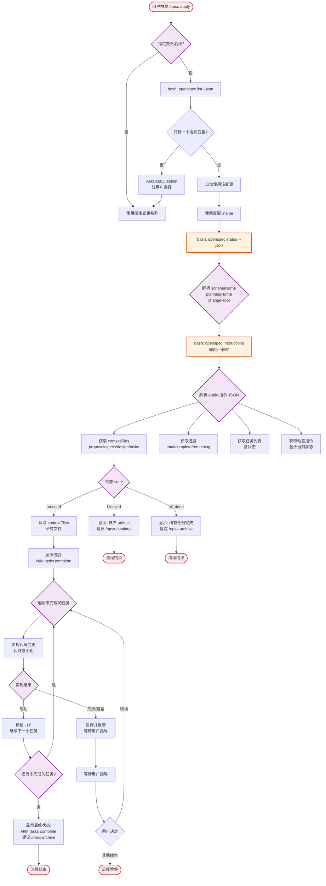
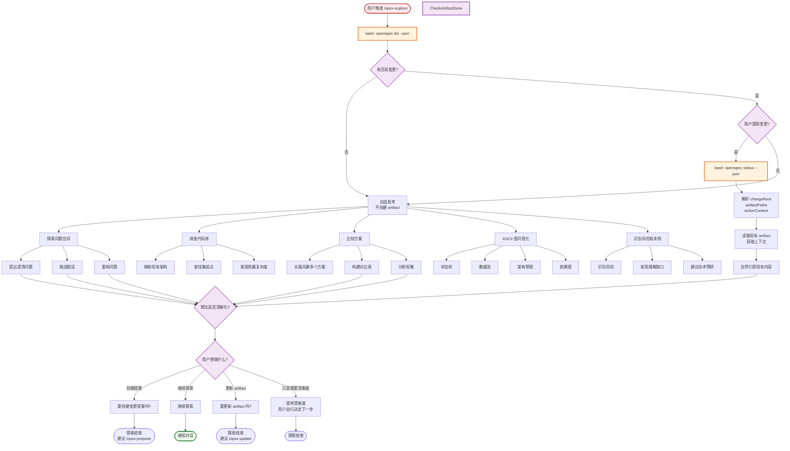

# OpenSpec 使用指南

## 一、什么是 OpenSpec

OpenSpec 是由 Fission 开发的**轻量级规格驱动（spec-driven）框架**，用于在 AI 辅助开发过程中管理需求、设计和任务。

### 核心理念

1. **Review intent, not just code** — 每个变更产生 spec delta，记录需求变化，让审查者快速理解变更意图
2. **Context that persists** — 规格文件与代码共存于仓库，作为持久化文档
3. **Something to review in seconds** — 生成提案、任务分解、设计决策，在写代码前就能审查

### 设计原则

- **Lightweight** — 最小步骤、最小流程，快速开始编码
- **Brownfield-first** — 专注于成熟代码库
- **Specs live in your code** — 规格作为活的文档随代码一起维护

---

## 二、项目目录结构

```
openspec/
├── config.yaml                          # 全局配置 (schema: spec-driven)
├── specs/                               # 主规格文件（系统能力定义）
│   ├── app-routing/spec.md
│   ├── login-auth/spec.md
│   ├── time-tracking-app/spec.md
│   └── ...
└── changes/                             # 变更提案
    ├── week3-import-export-and-perf/    # 当前活跃变更
    │   ├── .openspec.yaml
    │   ├── proposal.md
    │   ├── design.md
    │   ├── tasks.md
    │   └── specs/                       # Delta specs（规格差异）
    └── archive/                         # 已归档的变更
        ├── 2026-08-04-time-tracking-app/
        ├── 2026-08-04-decouple-timesheet-app/
        └── ...
```

---

## 三、从零开始使用 OpenSpec

### 3.1 安装

```bash
# 全局安装 openspec CLI
npm install -g @fission-ai/openspec@latest

# 验证安装
openspec --version
```

### 3.2 初始化配置

在项目的根目录创建 `openspec/` 目录和配置文件：

```bash
# 创建配置
mkdir -p openspec

# 创建全局配置文件
cat > openspec/config.yaml << EOF
schema: spec-driven
EOF
```

`schema: spec-driven` 是默认的规格驱动工作流模式，定义了 artifact 的构建顺序和依赖关系。

### 3.3 创建第一个变更

```bash
# 方式1: 直接命令行
openspec new change "add-login-page"

# 方式2: 通过 Opencode（推荐）
# 在 Opencode 对话中输入 /opsx-propose，然后描述你要做什么
```

创建后会自动生成目录结构：

```
openspec/changes/add-login-page/
├── .openspec.yaml          # 变更元数据
├── proposal.md             # 待填写：变更内容
├── design.md               # 待填写：技术设计
├── tasks.md                # 待填写：任务清单
└── specs/                  # 待填写：规格差异
```

### 3.4 填写 Artifact

每个 artifact 都有对应的模板，通过 CLI 获取：

```bash
# 获取 proposal 的模板和规则
openspec instructions proposal --change "add-login-page" --json

# 获取 design 的模板和规则
openspec instructions design --change "add-login-page" --json

# 获取 tasks 的模板和规则
openspec instructions tasks --change "add-login-page" --json
```

或者直接使用 `/opsx-propose` 让 AI 自动生成。

### 3.5 实施变更

```bash
# 获取实施指令（任务列表 + 上下文文件）
openspec instructions apply --change "add-login-page" --json

# 按 tasks.md 逐条实现代码
```

### 3.6 归档变更

```bash
# 归档已完成变更
openspec archive "add-login-page"

# 变更会被移动到 openspec/changes/archive/2026-08-21-add-login-page/
```

### 3.7 完整示例

```bash
# 1. 创建变更
openspec new change "add-user-auth"

# 2. 查看状态
openspec status --change "add-user-auth" --json

# 3. 获取各 artifact 指令并填写
openspec instructions proposal --change "add-user-auth" --json
openspec instructions design --change "add-user-auth" --json
openspec instructions tasks --change "add-user-auth" --json

# 4. 实施
openspec instructions apply --change "add-user-auth" --json

# 5. 归档
openspec archive "add-user-auth"
```

---

## 四、与 Opencode 协同使用

Opencode 通过 **Skill 机制** 将 OpenSpec CLI 命令封装为 AI agent 可执行的完整工作流，实现自然语言驱动的开发流程。

### 4.1 集成原理

| 组件 | 作用 |
|------|------|
| **CLI 工具** | 提供结构化数据和模板（`--json` 输出、`instructions` 返回模板） |
| **Opencode Skill** | 让 AI agent 按流程调用 CLI 命令，填充 artifact 内容 |
| **`allowed-tools`** | 每个 Skill 声明只允许调用 `openspec` 开头的 bash 命令 |

### 4.2 6 个 Skill 对应 6 个工作流阶段

| 阶段 | Opencode 命令 | Skill 文件 | 作用 |
|------|--------------|-----------|------|
| **探索** | `/opsx-explore` | `openspec-explore/SKILL.md` | 思考问题、调查代码，不写代码 |
| **提案** | `/opsx-propose` | `openspec-propose/SKILL.md` | 一键生成 proposal + design + tasks + specs |
| **实施** | `/opsx-apply` | `openspec-apply-change/SKILL.md` | 按任务清单逐步实现代码 |
| **更新** | `/opsx-update` | `openspec-update-change/SKILL.md` | 修订已有 artifact，保持一致性 |
| **同步** | `/opsx-sync-specs` | `openspec-sync-specs/SKILL.md` | 将 delta specs 合并到主 specs |
| **归档** | `/opsx-archive` | `openspec-archive-change/SKILL.md` | 归档变更，可选择同步 specs |

### 4.3 典型使用场景

#### 场景1: 快速创建并实施功能

```
用户: /opsx-propose 添加用户记住我功能，支持30天会话

AI 自动执行:
1. openspec new change "add-remember-me"
2. openspec status --change "add-remember-me" --json
3. 按依赖顺序生成 proposal.md, design.md, tasks.md, specs/
4. 提示: 运行 /opsx-apply 开始实施

用户: /opsx-apply

AI 自动执行:
1. openspec instructions apply --change "add-remember-me" --json
2. 读取 contextFiles (proposal, design, tasks, specs)
3. 按 tasks.md 逐条实现代码
4. 完成后标记 - [x]
```

#### 场景2: 探索复杂问题

```
用户: /opsx-explore 认证系统太乱了，怎么重构？

AI 自动执行:
1. openspec list --json  # 查看现有变更
2. 阅读代码库，分析认证架构
3. 用 ASCII 图展示当前流程
4. 提出重构方案，但不写代码
5. 用户确认后: 要创建变更提案吗？
```

#### 场景3: 变更中途修订

```
用户: /opsx-update add-remember-me

AI 自动执行:
1. openspec status --change "add-remember-me" --json
2. 读取现有 artifact
3. 检查一致性（proposal vs design vs tasks）
4. 提出修订建议，用户确认后更新
```

#### 场景4: 完成归档

```
用户: /opsx-archive

AI 自动执行:
1. openspec list --json  # 列出活跃变更
2. 用户选择要归档的变更
3. openspec status --change "<name>" --json  # 检查完成状态
4. 检查 tasks.md 完成状态
5. 同步 delta specs 到主 specs（可选）
6. 移动到 archive/ 目录
```

### 4.4 关键协作机制

**1. `--json` 结构化输出**

所有 CLI 命令支持 JSON 格式，AI agent 可以解析：

```bash
openspec status --change "add-remember-me" --json
```

返回：
```json
{
  "schemaName": "spec-driven",
  "planningHome": { "changesDir": "openspec/changes" },
  "changeRoot": "openspec/changes/add-remember-me",
  "applyRequires": ["tasks"],
  "artifacts": [
    { "id": "proposal", "status": "done" },
    { "id": "design", "status": "done" },
    { "id": "tasks", "status": "done" }
  ]
}
```

**2. `instructions` 模板机制**

AI 获取每个 artifact 的生成指令：

```bash
openspec instructions proposal --change "add-remember-me" --json
```

返回：
```json
{
  "context": "项目约束...",
  "rules": "artifact 规则...",
  "template": "## 变更名称\n## 动机\n## 范围",
  "resolvedOutputPath": "openspec/changes/add-remember-me/proposal.md",
  "dependencies": []
}
```

AI 按 `template` 填充内容，遵守 `context` 和 `rules` 约束。

**3. Artifact 依赖图**

`status --json` 返回 `applyRequires` 数组，告诉 AI 必须完成哪些 artifact 才能实施：

```
proposal.md (无依赖)
    ↓
design.md (依赖 proposal)
    ↓
tasks.md (依赖 proposal + design)
    ↓
specs/*/spec.md (依赖 proposal)
    ↓
applyRequires: [tasks] → 可以开始 /opsx-apply
```

**4. Delta Spec 智能合并**

`/opsx-sync-specs` 让 AI 智能合并规格差异：

```
Delta Spec (changes/add-remember-me/specs/)
    ↓
AI 分析 ADDED/MODIFIED/REMOVED/RENAMED
    ↓
智能合并到主 specs (openspec/specs/)
    ↓
preserves 未提及的现有内容
```

### 4.5 与纯 CLI 方式对比

| 方面 | 纯 CLI | Opencode + Skill |
|------|--------|-----------------|
| 创建变更 | `openspec new change` + 手动填写 | `/opsx-propose` 自动生成 |
| 获取模板 | `openspec instructions` + 手动复制 | AI 自动解析并填充 |
| 实施代码 | 手动阅读 tasks.md 实现 | `/opsx-apply` 自动逐条实现 |
| 一致性检查 | 人工对比各文件 | `/opsx-update` 自动检查 |
| 归档 | `openspec archive` + 手动同步 | `/opsx-archive` 自动同步 specs |

### 4.6 最佳实践

1. **先用 `/opsx-explore` 思考** — 复杂功能先探索再提案
2. **用 `/opsx-propose` 快速生成** — 让 AI 生成初始 artifact，再手动调整
3. **用 `/opsx-apply` 逐步实施** — AI 按任务清单执行，保持变更可控
4. **用 `/opsx-update` 保持同步** — 实施中发现设计问题，及时更新 artifact
5. **用 `/opsx-archive` 完成闭环** — 归档时自动同步 specs 到主规格

---

## 五、/opsx-propose 完整流程

### 5.1 流程说明

`/opsx-propose` 用于快速创建一个新的变更提案，AI agent 会按依赖顺序自动生成所有必要的 artifact 文件。

### 5.2 流程图

```mermaid
graph TD
    Start(["用户触发 /opsx-propose"]) --> Step1["Step 1: 获取变更名称"]

    Step1 --> HasName{"用户是否提供了变更名称/描述?"}
    HasName -->|"否"| AskUser["使用 AskUserQuestion 询问用户"]
    AskUser --> DeriveName["从描述派生 kebab-case 名称\n如 add-user-auth"]
    DeriveName --> Step2

    HasName -->|"是"| Step2["Step 2: 创建变更目录"]

    Step2 --> CLI_New["bash: openspec new change"]
    CLI_New --> Scaffold["创建目录结构:\nchanges/<name>/"]
    Scaffold --> Step3

    Step3["Step 3: 获取 Artifact 依赖图"]
    Step3 --> CLI_Status["bash: openspec status --change --json"]

    CLI_Status --> ParseJSON{"解析 JSON 响应"}
    ParseJSON --> GetApplyRequires["获取 applyRequires\n确定需要完成的 artifact"]
    ParseJSON --> GetArtifactPaths["获取 artifactPaths\n确定文件输出路径"]
    ParseJSON --> GetPlanningHome["获取 planningHome\n确定作用域"]

    GetApplyRequires --> Step4
    GetArtifactPaths --> Step4
    GetPlanningHome --> Step4

    Step4["Step 4: 按依赖顺序创建 Artifact"]

    Step4 --> LoopStart{"遍历 artifact 依赖顺序"}
    LoopStart --> CheckStatus{"artifact 状态为 ready?"}
    CheckStatus -->|"否"| CheckAllDone{"所有 artifact 处理完毕?"}
    CheckStatus -->|"是"| GetInstructions["bash: openspec instructions\n--change --json"]

    GetInstructions --> ParseInstructions{"解析指令 JSON"}
    ParseInstructions --> GetContext["获取 context\n项目约束"]
    ParseInstructions --> GetRules["获取 rules\nartifact 规则"]
    ParseInstructions --> GetTemplate["获取 template\n输出模板"]
    ParseInstructions --> GetResolvedPath["获取 resolvedOutputPath\n输出文件路径"]
    ParseInstructions --> GetDependencies["获取 dependencies\n依赖的已完成 artifact"]

    GetContext --> ReadDeps
    GetRules --> ReadDeps
    GetTemplate --> ReadDeps
    GetResolvedPath --> ReadDeps
    GetDependencies --> ReadDeps

    ReadDeps["读取依赖 artifact 文件\n获取上下文"] --> CreateFile["按 template 生成内容\n写入 resolvedOutputPath"]

    CreateFile --> ShowProgress["Created artifact-id"]
    ShowProgress --> ReCheckStatus["bash: openspec status --json"]

    ReCheckStatus --> CheckApplyReady{"applyRequires 全部完成?"}
    CheckApplyReady -->|"否"| LoopStart
    CheckApplyReady -->|"是"| CheckAllDone

    CheckAllDone -->|"否"| LoopStart
    CheckAllDone -->|"是"| Step5

    Step5["Step 5: 显示最终状态"]
    Step5 --> CLI_Final["bash: openspec status"]

    CLI_Final --> Summary["总结: 变更名称、位置、\n创建的 artifact 列表"]
    Summary --> PromptReady["提示: 所有 artifact 已创建!\n运行 /opsx-apply 开始实施"]
    PromptReady --> End(["流程结束"])

    CreateFile -.-> Files["生成的文件:\nproposal.md - 描述变更内容\ndesign.md - 技术设计决策\ntasks.md - 实施任务清单\nspecs/spec.md - 规格差异"]

    style Start fill:#ffebee,stroke:#c62828,stroke-width:2px,color:#333
    style End fill:#ffebee,stroke:#c62828,stroke-width:2px,color:#333
    style Step1 fill:#e1f5fe,stroke:#01579b,stroke-width:2px,color:#333
    style Step2 fill:#e1f5fe,stroke:#01579b,stroke-width:2px,color:#333
    style Step3 fill:#e1f5fe,stroke:#01579b,stroke-width:2px,color:#333
    style Step4 fill:#e1f5fe,stroke:#01579b,stroke-width:2px,color:#333
    style Step5 fill:#e1f5fe,stroke:#01579b,stroke-width:2px,color:#333
    style CLI_New fill:#fff3e0,stroke:#e65100,stroke-width:2px,color:#333
    style CLI_Status fill:#fff3e0,stroke:#e65100,stroke-width:2px,color:#333
    style CLI_Final fill:#fff3e0,stroke:#e65100,stroke-width:2px,color:#333
    style GetInstructions fill:#fff3e0,stroke:#e65100,stroke-width:2px,color:#333
    style ReCheckStatus fill:#fff3e0,stroke:#e65100,stroke-width:2px,color:#333
    style HasName fill:#f3e5f5,stroke:#7b1fa2,stroke-width:2px,color:#333
    style CheckStatus fill:#f3e5f5,stroke:#7b1fa2,stroke-width:2px,color:#333
    style CheckAllDone fill:#f3e5f5,stroke:#7b1fa2,stroke-width:2px,color:#333
    style CheckApplyReady fill:#f3e5f5,stroke:#7b1fa2,stroke-width:2px,color:#333
    style ParseJSON fill:#f3e5f5,stroke:#7b1fa2,stroke-width:2px,color:#333
    style ParseInstructions fill:#f3e5f5,stroke:#7b1fa2,stroke-width:2px,color:#333
    style Files fill:#e8f5e9,stroke:#2e7d32,stroke-width:2px,color:#333
```

<div style="background:#fff;padding:20px;border-radius:8px;display:inline-block;width:100%">



</div>

### 5.3 流程图说明

| 颜色 | 含义 | 节点示例 |
|------|------|---------|
| 🔴 红色 | 流程起点/终点 | 用户触发、流程结束 |
| 🔵 蓝色 | 主要步骤 | Step 1~5 |
| 🟠 橙色 | CLI 命令调用 | `openspec new change`、`openspec status --json` |
| 🟣 紫色 | 判断/决策 | 是否提供名称、artifact 状态检查 |
| 🟢 绿色 | 生成的文件 | proposal.md、design.md、tasks.md、specs |

### 5.4 涉及的文件

#### 创建的文件结构

```
openspec/changes/<change-name>/
├── .openspec.yaml              # 变更元数据（schema, created date）
├── proposal.md                 # 变更提案
│   ├── 变更名称
│   ├── 为什么做这个变更（动机）
│   └── 变更范围
├── design.md                   # 技术设计
│   ├── 技术方案
│   ├── 技术决策及理由
│   └── 替代方案考虑
├── tasks.md                    # 实施任务清单
│   ├── [ ] 任务 1
│   ├── [ ] 任务 2
│   └── ...
└── specs/
    └── <capability>/
        └── spec.md             # 规格差异（Delta Spec）
            ├── ADDED Requirements
            ├── MODIFIED Requirements
            ├── REMOVED Requirements
            └── RENAMED Requirements
```

#### 各文件作用

| 文件 | 作用 | 由谁生成 |
|------|------|---------|
| `.openspec.yaml` | 变更元数据（schema、创建日期） | `openspec new change` 命令 |
| `proposal.md` | 描述"做什么"和"为什么" | AI agent（基于 template） |
| `design.md` | 描述"怎么做"，技术决策 | AI agent（基于 template） |
| `tasks.md` | 分解为可执行的任务清单 | AI agent（基于 template） |
| `specs/*/spec.md` | 记录需求变化（delta） | AI agent（基于 template） |

### 5.5 Artifact 依赖关系

```
openspec new change          →  .openspec.yaml
                                 ↓
                         proposal.md (无依赖)
                                 ↓
                         design.md (依赖 proposal)
                                 ↓
                         tasks.md (依赖 proposal + design)
                                 ↓
                         specs/*/spec.md (依赖 proposal)
                                 ↓
                     applyRequires: [tasks]
                     (tasks 完成后才能开始实施)
```

### 5.6 完整工作流（propose → apply → archive）

```mermaid
graph TD
    Start(["用户: 需要新功能"]) --> Explore{"先用 /opsx-explore 探索问题?"}
    Explore -->|"是"| ExploreStep["AI 分析代码库\n用 ASCII 图展示\n当前架构"]
    ExploreStep --> Propose{"用户决定创建变更?"}
    Explore -->|"否"| Propose

    Propose -->|"是"| ProposeStep["用户: /opsx-propose\n描述功能"]
    ProposeStep --> ProposeFlow["AI 自动生成:\nproposal.md\ndesign.md\ntasks.md\nspecs/spec.md"]
    ProposeFlow --> Review{"用户审查提案?"}

    Review -->|"需要修改"| UpdateStep["用户: /opsx-update\nAI 检查一致性\n提出修订建议"]
    UpdateStep --> Review

    Review -->|"确认"| ApplyStep["用户: /opsx-apply"]
    ApplyStep --> GetTasks["AI 执行:\nopenspec instructions apply --json"]
    GetTasks --> ReadContext["读取 contextFiles\nproposal/design/tasks/specs"]
    ReadContext --> LoopTasks{"遍历 tasks.md\n逐条实现"}
    LoopTasks --> DoTask["实现代码变更\n标记 - [x]"]
    DoTask --> CheckMore{"还有未完成的任务?"}
    CheckMore -->|"是"| LoopTasks
    CheckMore -->|"否"| AllDone["所有任务完成"]

    AllDone --> ArchiveStep["用户: /opsx-archive"]
    ArchiveStep --> CheckComplete{"检查 artifact 完成状态"}
    CheckComplete --> CheckTasks{"检查 tasks.md 完成状态"}
    CheckTasks --> SyncSpecs{"有 delta specs?\n同步到主 specs?"}
    SyncSpecs -->|"是"| SyncStep["AI 智能合并\ndelta 到主 specs"]
    SyncSpecs -->|"否"| MoveDir
    SyncStep --> MoveDir["移动到 archive/\nYYYY-MM-DD-name/"]
    MoveDir --> End(["变更归档完成"])

    style Start fill:#ffebee,stroke:#c62828,stroke-width:2px,color:#333
    style End fill:#ffebee,stroke:#c62828,stroke-width:2px,color:#333
    style ProposeStep fill:#e1f5fe,stroke:#01579b,stroke-width:2px,color:#333
    style ProposeFlow fill:#e8f5e9,stroke:#2e7d32,stroke-width:2px,color:#333
    style ApplyStep fill:#e1f5fe,stroke:#01579b,stroke-width:2px,color:#333
    style GetTasks fill:#fff3e0,stroke:#e65100,stroke-width:2px,color:#333
    style UpdateStep fill:#f3e5f5,stroke:#7b1fa2,stroke-width:2px,color:#333
    style ArchiveStep fill:#e1f5fe,stroke:#01579b,stroke-width:2px,color:#333
    style SyncStep fill:#e8f5e9,stroke:#2e7d32,stroke-width:2px,color:#333
```

<div style="background:#fff;padding:20px;border-radius:8px;display:inline-block;width:100%">



</div>

### 5.7 /opsx-apply 实施流程

<div style="background:#fff;padding:20px;border-radius:8px;display:inline-block;width:100%">



</div>

### 5.8 /opsx-archive 归档流程

```mermaid
graph TD
    Start(["用户触发 /opsx-archive"]) --> ProvideName{"指定变更名称?"}
    ProvideName -->|"否"| ListActive["bash: openspec list --json"]
    ListActive --> ShowActive["显示活跃变更\n含 schema 和状态"]
    ShowActive --> AskArchive["AskUserQuestion\n选择要归档的变更"]
    ProvideName -->|"是"| UseArchive["使用指定变更名称"]
    AskArchive --> UseArchive

    UseArchive --> CheckStatus["bash: openspec status --json"]
    CheckStatus --> ParseStatus{"解析 status JSON"}
    ParseStatus --> GetArtifacts["获取 artifacts\n检查完成状态"]
    ParseStatus --> GetPlanningHome["获取 planningHome\nchangesDir"]
    ParseStatus --> GetArtifactPaths["获取 artifactPaths\n检查 delta specs"]

    GetArtifacts --> CheckArtifactDone{"所有 artifacts\n状态为 done?"}
    CheckArtifactDone -->|"否"| WarnArtifact["警告: 列出未完成 artifact\nAskUserQuestion 确认继续"]
    CheckArtifactDone -->|"是"| CheckTasksFile

    WarnArtifact --> CheckTasksFile["读取 tasks.md\n检查任务完成状态"]
    CheckTasksFile --> CountTasks["统计 - [ ] vs - [x]"]
    CountTasks --> HasIncomplete{"有未完成任务?"}
    HasIncomplete -->|"是"| WarnTasks["警告: 显示未完成数量\nAskUserQuestion 确认继续"]
    HasIncomplete -->|"否"| CheckDeltaSpecs

    WarnTasks --> CheckDeltaSpecs{"artifactPaths.specs\n有 delta specs?"}
    CheckDeltaSpecs -->|"否"| PerformArchive
    CheckDeltaSpecs -->|"是"| CompareSpecs["对比 delta spec\n与主 spec"]
    CompareSpecs --> ShowSyncPrompt["显示同步摘要\nPrompt options:"]
    ShowSyncPrompt --> SyncOptions{"用户选择"}
    SyncOptions -->|"Sync now"| SyncSpecs["调用 openspec-sync-specs\n智能合并 delta 到主 specs"]
    SyncOptions -->|"Archive without"| SkipSync["跳过同步"]
    SyncOptions -->|"Sync anyway"| SyncSpecs

    SyncSpecs --> PerformArchive["创建 archive 目录\nmv changeRoot\n到 archive/YYYY-MM-DD-name/"]
    SkipSync --> PerformArchive

    PerformArchive --> ShowSummary["显示归档摘要:\n变更名称 / schema /\n归档位置 / specs 同步状态"]
    ShowSummary --> End(["归档完成"])

    style Start fill:#ffebee,stroke:#c62828,stroke-width:2px,color:#333
    style End fill:#ffebee,stroke:#c62828,stroke-width:2px,color:#333
    style ProvideName fill:#f3e5f5,stroke:#7b1fa2,stroke-width:2px,color:#333
    style CheckStatus fill:#fff3e0,stroke:#e65100,stroke-width:2px,color:#333
    style ParseStatus fill:#f3e5f5,stroke:#7b1fa2,stroke-width:2px,color:#333
    style CheckArtifactDone fill:#f3e5f5,stroke:#7b1fa2,stroke-width:2px,color:#333
    style HasIncomplete fill:#f3e5f5,stroke:#7b1fa2,stroke-width:2px,color:#333
    style CheckDeltaSpecs fill:#f3e5f5,stroke:#7b1fa2,stroke-width:2px,color:#333
    style SyncOptions fill:#f3e5f5,stroke:#7b1fa2,stroke-width:2px,color:#333
```

<div style="background:#fff;padding:20px;border-radius:8px;display:inline-block;width:100%">



</div>

### 5.9 /opsx-explore 探索流程

<div style="background:#fff;padding:20px;border-radius:8px;display:inline-block;width:100%">



</div>

---

## 六、完整工作流示例

### 6.1 创建变更

```bash
# 触发 /opsx-propose
# 用户描述: "添加用户记住我功能，支持30天会话"

# AI 自动执行:
openspec new change "add-remember-me"
openspec status --change "add-remember-me" --json
openspec instructions proposal --change "add-remember-me" --json
openspec instructions design --change "add-remember-me" --json
openspec instructions tasks --change "add-remember-me" --json
```

### 6.2 实施变更

```bash
# 触发 /opsx-apply
# AI 自动执行:
openspec status --change "add-remember-me" --json
openspec instructions apply --change "add-remember-me" --json
# 按 tasks.md 逐条实现代码，完成后标记 - [x]
```

### 6.3 归档变更

```bash
# 触发 /opsx-archive
# AI 自动执行:
openspec status --change "add-remember-me" --json
# 检查任务完成状态 → 同步 specs → 移动到 archive/
mv openspec/changes/add-remember-me openspec/changes/archive/2026-08-21-add-remember-me
```

---

## 七、Delta Spec 格式

```markdown
## ADDED Requirements

### Requirement: 记住我会话
系统应支持可配置的"记住我"会话超时。

#### Scenario: 默认会话超时
- **GIVEN** 用户已认证
- **WHEN** 24小时无活动且未勾选"记住我"
- **THEN** 使会话令牌失效

#### Scenario: 延长会话
- **GIVEN** 用户登录时勾选"记住我"
- **WHEN** 30天已过
- **THEN** 使会话令牌失效
- **AND** 清除持久化 Cookie

## MODIFIED Requirements

### Requirement: 会话过期
（修改现有需求的场景）

## REMOVED Requirements

### Requirement: 已废弃功能

## RENAMED Requirements

- FROM: `### Requirement: 旧名称`
- TO: `### Requirement: 新名称`
```

---

## 八、与 Waterfall 的区别

| 瀑布式 | OpenSpec |
|--------|---------|
| 僵化的计划，数月前期规划 | 最小努力，10分钟理清思路就开始编码 |
| 前期完整规划所有细节 | 达到"足够好"的计划就开始 |
| 变更困难 | 变更时更新规格即可 |
| 文档与代码分离 | 规格与代码共存于仓库 |

---

## 九、FAQ

**Q: 可以在现有代码库上使用吗？**
A: 可以。边构建边创建规格，不需要一次性生成所有规格。

**Q: 切换 AI 编码工具时规格会丢失吗？**
A: 不会。OpenSpec 目标是成为通用规划层，规格在代码仓库中，不绑定特定工具。

**Q: 团队如何协作？**
A: 通过 Git 工作流（PR、Review）协作。正在开发多仓库、微服务等更深入的团队功能。

**Q: 适合"vibe coding"吗？**
A: 取决于你。如果你愿意阅读规格、思考清楚再构建，它会帮助你构建正确的东西。