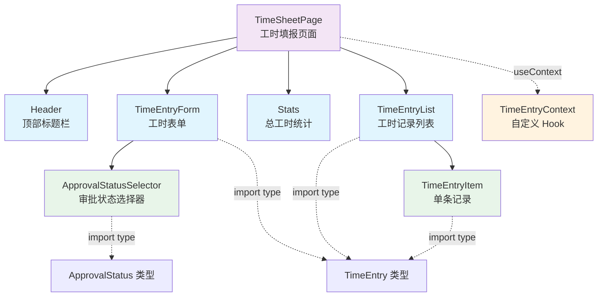

# React 工时填报应用 — 技术栈详解

## 一、页面架构

```
TimeSheetPage (工时填报页面)
├── Header (图标 + 标题)
├── TimeEntryForm (工时表单)
│   └── ApprovalStatusSelector (审批状态选择器)
├── Stats (总工时统计)
└── TimeEntryList (工时记录列表)
    └── TimeEntryItem (单条记录)
```

**数据流向：**

```
TimeEntryContext (全局状态)
    ↓ useContext 消费
TimeSheetPage → 传递给子组件 (Props)
    ↓
TimeEntryForm / TimeEntryList / Stats
```

---

## 二、技术栈使用详解

### 1. JSX

JSX 是 JavaScript 的语法扩展，允许在 JS 中直接编写类似 HTML 的结构。

**示例 — `TimeEntryItem.tsx`：**

```tsx
return (
  <div style={styles.item}>
    <div style={styles.itemContent}>
      <div style={styles.itemHeader}>
        <h3 style={styles.itemTitle}>{entry.projectName}</h3>
        <span style={styles.itemHours}>{entry.hours} 小时</span>
      </div>
      <p style={styles.itemDesc}>{entry.description}</p>
    </div>
    <button onClick={onDelete}>删除</button>
  </div>
)
```

JSX 中通过 `{}` 嵌入 JavaScript 表达式，如 `entry.projectName` 和 `entry.hours`。

**使用效果：** 将 UI 结构与数据绑定在一起，避免了传统 DOM 操作中「获取元素 → 修改内容 → 插入 DOM」的繁琐步骤。当 `entry` 数据变化时，React 自动更新对应的 DOM 节点，无需手动操作 DOM。

---

### 2. 函数组件

函数组件是用普通 JavaScript 函数定义的 React 组件，比类组件更简洁。

**示例 — `Stats.tsx`：**

```tsx
function Stats({ totalHours }: StatsProps) {
  return (
    <div style={styles.stats}>
      <h3>总工时</h3>
      <p>{totalHours} 小时</p>
    </div>
  )
}
```

TimeSheetPage 页面共组合了 5 个函数组件：`Header`、`TimeEntryForm`、`Stats`、`TimeEntryList`、`TimeEntryItem`。

**使用效果：** 每个组件独立管理自己的 UI 片段，通过组合小组件构建复杂页面。`TimeSheetPage` 组合了 `Header`、`TimeEntryForm`、`Stats`、`TimeEntryList` 四个子组件，代码结构清晰，每个组件职责单一，便于独立开发和测试。

---

### 3. Props

Props 是父组件向子组件传递数据的机制，子组件通过 Props 接收参数。

**示例 — `TimeEntryList.tsx`：**

```tsx
interface TimeEntryListProps {
  entries: TimeEntry[]
  onEdit: (entry: TimeEntry) => void
  onDelete: (id: string) => void
}

function TimeEntryList({ entries, onEdit, onDelete }: TimeEntryListProps) {
  return (
    <div style={styles.list}>
      {entries.map((entry) => (
        <TimeEntryItem
          key={entry.id}
          entry={entry}
          onEdit={() => onEdit(entry)}
          onDelete={() => onDelete(entry.id)}
        />
      ))}
    </div>
  )
}
```

**数据传递链：**

```
TimeSheetPage (entries)
    ↓ props: entries, onEdit, onDelete
TimeEntryList
    ↓ props: entry, onEdit, onDelete
TimeEntryItem
```

**使用效果：** Props 实现了组件之间的数据通信，父组件（`TimeSheetPage`）将数据和操作回调作为 Props 传递给子组件，子组件只负责展示，不关心数据来源。这种「数据从父到子、事件从子到父」的模式让组件完全可复用，`TimeEntryItem` 不依赖任何全局状态，只需传入 `entry` 和回调即可独立工作。

---

### 4. State

State 是组件的内部状态，通过 `useState` Hook 管理。状态变化时组件自动重新渲染。

**示例 — `TimeSheetPage.tsx`（编辑模式状态）：**

```tsx
const [editingEntry, setEditingEntry] = useState<TimeEntry | null>(null)
```

**示例 — `TimeEntryForm.tsx`（表单状态）：**

```tsx
const [projectName, setProjectName] = useState('')
const [description, setDescription] = useState('')
const [hours, setHours] = useState(1)
const [approvalStatus, setApprovalStatus] = useState<ApprovalStatus>('待审批')
const [errors, setErrors] = useState<Record<string, string>>({})
```

**使用效果：** State 让组件具备「记忆」能力。`TimeEntryForm` 通过 5 个 state 变量管理表单输入，用户每输入一个字符，React 自动重新渲染表单显示最新值；`TimeSheetPage` 通过 `editingEntry` 状态在「新增」和「编辑」两种模式间切换，UI 自动适配。状态变化驱动 UI 实时更新，无需手动操作 DOM。

---

### 5. 事件处理

React 中通过 `onXxx` 属性绑定事件处理器，如 `onClick`、`onChange`、`onSubmit`。

**表单提交事件 — `TimeEntryForm.tsx`：**

```tsx
const handleSubmit = async (e: FormEvent) => {
  e.preventDefault()
  if (!validate()) return
  await onSubmit({
    projectName: projectName.trim(),
    description: description.trim(),
    hours,
    approvalStatus,
  })
}

// 使用
<form onSubmit={handleSubmit}>
```

**输入变化事件：**

```tsx
<input
  value={projectName}
  onChange={(e) => setProjectName(e.target.value)}
/>
```

**点击事件：**

```tsx
<button onClick={onDelete}>删除</button>
```

**使用效果：** 事件处理将用户交互与状态更新连接起来。用户点击「删除」按钮触发 `onDelete`，调用 `TimeEntryContext` 中的删除方法，状态更新后列表自动刷新；表单提交后调用 `onSubmit` 回调将数据回传给 `TimeSheetPage`。所有交互无需手动操作 DOM，只需声明「点击时做什么」。

---

### 6. 条件渲染

条件渲染根据状态决定显示不同的 UI。

**空状态 — `TimeEntryList.tsx`：**

```tsx
if (entries.length === 0) {
  return <p style={styles.empty}>暂无工时记录</p>
}
```

**编辑/新增切换 — `TimeEntryForm.tsx`：**

```tsx
<h2>{initialData ? '编辑工时' : '新增工时'}</h2>
```

**审批状态高亮 — `ApprovalStatusSelector.tsx`：**

```tsx
{STATUS_OPTIONS.map((option) => {
  const isSelected = value === option.value
  return (
    <button
      style={{
        ...styles.option,
        ...(isSelected ? { background: option.bg, color: option.color } : {}),
      }}
    >
      {option.label}
    </button>
  )
})}
```

**使用效果：** 条件渲染根据数据状态动态显示不同的 UI。当列表为空时显示「暂无工时记录」提示用户操作；表单在编辑模式下预填数据并显示「编辑工时」标题，新增模式下显示空白表单和「新增工时」标题。用户无需关心显示逻辑，数据状态决定了 UI 呈现。

---

### 7. 列表渲染

列表渲染使用 `Array.map()` 遍历数据生成列表，每个元素需要设置唯一的 `key`。

**工时记录列表 — `TimeEntryList.tsx`：**

```tsx
{entries.map((entry) => (
  <TimeEntryItem
    key={entry.id}
    entry={entry}
    onEdit={() => onEdit(entry)}
    onDelete={() => onDelete(entry.id)}
  />
))}
```

**审批状态选项 — `ApprovalStatusSelector.tsx`：**

```tsx
{STATUS_OPTIONS.map((option) => (
  <button key={option.value} onClick={() => onChange(option.value)}>
    {option.label}
  </button>
))}
```

**使用效果：** 列表渲染将数据数组自动映射为 UI 列表。`TimeEntryList` 接收 `entries` 数组后，通过 `map` 为每条记录生成 `TimeEntryItem` 组件，数据增删时 React 通过 `key` 高效更新列表，无需手动创建/销毁 DOM 元素。

---

### 8. React Hooks

#### useState — 状态管理

```tsx
// TimeSheetPage.tsx — 编辑模式状态
const [editingEntry, setEditingEntry] = useState<TimeEntry | null>(null)

// TimeEntryForm.tsx — 表单状态
const [projectName, setProjectName] = useState('')
const [hours, setHours] = useState(1)
```

**使用效果：** `useState` 是 React 状态管理的核心，每个 state 变量对应一个 setter 函数，调用 setter 触发组件重新渲染。`TimeEntryForm` 中 5 个 state 分别管理不同表单项，用户输入时实时更新；`TimeSheetPage` 通过 `editingEntry` 控制编辑模式，状态变化驱动 UI 自动更新。

#### useEffect — 副作用处理

```tsx
// TimeEntryForm.tsx — 编辑模式预填充表单
useEffect(() => {
  if (initialData) {
    setProjectName(initialData.projectName)
    setDescription(initialData.description)
    setHours(initialData.hours)
    setApprovalStatus(initialData.approvalStatus)
  }
}, [initialData])
```

**使用效果：** `useEffect` 处理组件生命周期中的副作用操作。`TimeEntryForm` 在 `initialData` 变化时自动预填充表单，用户点击编辑按钮后表单立即显示已有数据。依赖数组 `[initialData]` 控制副作用的触发时机，仅在 `initialData` 变化时执行。

#### useContext — 消费 Context

```tsx
// TimeSheetPage.tsx — 使用自定义 Hook
const { entries, addEntry, updateEntry, deleteEntry } = useTimeEntries()
```

**使用效果：** `useContext` 让组件无需通过 Props 逐层传递即可访问全局状态。`TimeSheetPage` 只需调用 `useTimeEntries()` 即可获取所有数据和操作方法，无需层层传递。这种模式避免了「Props Drilling」问题，当组件嵌套层级加深时优势明显。

#### useRef — DOM 引用

```tsx
// TimeEntryForm.tsx — 聚焦输入框
const nameRef = useRef<HTMLInputElement>(null)

// 绑定到输入框
<input ref={nameRef} type="text" />

// 提交后聚焦
if (nameRef.current) {
  nameRef.current.focus()
}
```

**使用效果：** `useRef` 提供了直接访问 DOM 节点的能力。`TimeEntryForm` 提交表单后通过 `nameRef.current.focus()` 自动聚焦项目名称输入框，提升用户体验。

---

## 三、TimeSheetPage 组件依赖关系图



**组件说明：**

| 组件 | 层级 | 职责 |
|------|------|------|
| `TimeSheetPage` | 页面组件 | 组合所有业务组件，管理编辑模式状态 |
| `Header` | 展示组件 | 显示应用标题和图标 |
| `TimeEntryForm` | 表单组件 | 工时新增/编辑表单，含表单验证 |
| `Stats` | 展示组件 | 显示总工时统计 |
| `TimeEntryList` | 列表组件 | 遍历渲染工时记录列表 |
| `TimeEntryItem` | 原子组件 | 单条工时记录的展示与操作按钮 |
| `ApprovalStatusSelector` | 原子组件 | 审批状态单选按钮组 |
| `TimeEntryContext` | 状态层 | 全局数据管理，提供 CRUD 操作 |

**数据流方向：**

```
TimeEntryContext → TimeSheetPage → 子组件 (Props)
                                ↓
                          事件回调 (onXxx) → 逆向回传
```

---

## 四、文件结构

```
src/
├── api/
│   └── mockApi.ts              # 模拟 API 层（数据源）
├── context/
│   └── TimeEntryContext.tsx    # 全局状态管理（Context + 自定义 Hook）
├── components/
│   ├── ApprovalStatusSelector.tsx  # 审批状态选择器
│   ├── Header.tsx              # 顶部标题栏
│   ├── Stats.tsx               # 统计组件
│   ├── TimeEntryForm.tsx       # 工时表单
│   ├── TimeEntryItem.tsx       # 工时单项
│   └── TimeEntryList.tsx       # 工时列表
├── pages/
│   └── TimeSheetPage.tsx       # 工时填报页面（独立页面组件）
```