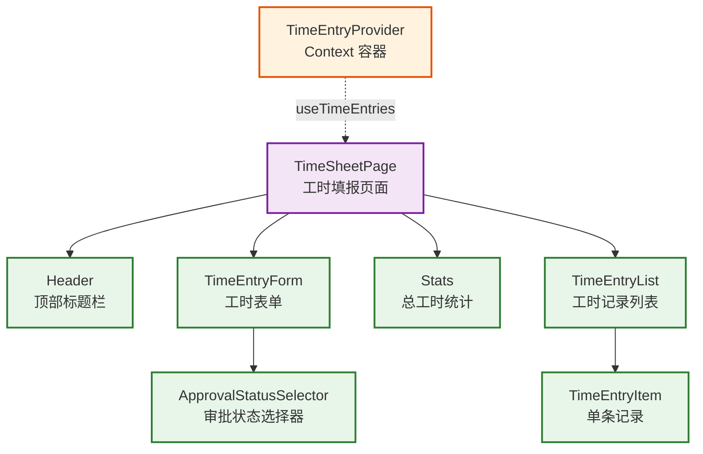

# React 工时填报应用 — 技术栈详解

> 本文按照从易到难的顺序，结合 React 工时填报应用的真实代码，逐一讲解项目中使用的 React 核心知识点。每个知识点均参考 `学习资料/2 React 核心基础/` 的编写格式，包含定义、示例、使用效果和注意事项。

---

## 一、组件依赖关系图

<div style="background:#fff;padding:20px;border-radius:8px;display:inline-block;width:100%">



</div>

### 组件说明

| 组件 | 层级 | 职责 | 使用的知识点 |
|------|------|------|-------------|
| `TimeEntryProvider` | 状态层 | 全局数据管理 | useState、useEffect |
| `TimeSheetPage` | 页面组件 | 组合所有业务组件，管理编辑模式 | useState、事件处理、useContext |
| `Header` | 展示组件 | 显示应用标题 | 函数组件、JSX |
| `TimeEntryForm` | 表单组件 | 工时新增/编辑，含验证 | useState、useEffect、useRef、事件处理 |
| `Stats` | 展示组件 | 显示总工时 | Props、函数组件 |
| `TimeEntryList` | 列表组件 | 遍历渲染工时记录 | 条件渲染、列表渲染、Props |
| `TimeEntryItem` | 原子组件 | 单条记录展示与操作 | JSX、条件渲染、Props |
| `ApprovalStatusSelector` | 原子组件 | 审批状态单选 | 列表渲染、条件渲染、Props |
| `TimeEntryContext` | 状态层 | 全局数据 CRUD | useContext、自定义 Hook |

### 数据流方向

```
TimeEntryProvider → TimeSheetPage (useTimeEntries)
                  → 子组件 (Props)
                  ↓
            事件回调 (onXxx) → 逆向回传
                  ↓
            TimeEntryProvider (状态更新)
```

---

## 二、知识点详解（从易到难）

**目录**

- [1. JSX](#1-jsx)
- [2. 函数组件](#2-函数组件)
- [3. Props](#3-props)
- [4. 事件处理](#4-事件处理)
- [5. 条件渲染](#5-条件渲染)
- [6. 列表渲染](#6-列表渲染)
- [7. React Hooks](#7-react-hooks)
  - [7.1 useState — 状态管理](#71-usestate---状态管理)
  - [7.2 useEffect — 副作用处理](#72-useeffect---副作用处理)
  - [7.3 useContext — 消费 Context](#73-usecontext---消费-context)
  - [7.4 useRef — DOM 引用](#74-useref---dom-引用)
  - [Hooks 调用规则](#hooks-调用规则)
  - [Hooks 对比总结](#hooks-对比总结)
- [三、进阶知识点](#三进阶知识点)
- [四、学习路径建议](#四学习路径建议)

---

### 1. JSX

#### 定义

JSX 是 JavaScript 的语法扩展，允许在 JS 中直接编写类似 HTML 的结构。它会被编译为 `React.createElement()` 调用。

#### 示例 — `TimeEntryItem.tsx`

```tsx
return (
  <div className={styles.item}>
    <div className={styles.itemContent}>
      <div className={styles.itemHeader}>
        <h3 className={styles.itemTitle}>{entry.projectName}</h3>
        <div className={styles.itemBadges}>
          <span className={styles.itemHours}>{entry.hours} 小时</span>
          <span className={styles.statusBadge} style={statusColors[entry.approvalStatus]}>
            {entry.approvalStatus}
          </span>
        </div>
      </div>
      <p className={styles.itemDesc}>{entry.description}</p>
      <span className={styles.itemTime}>{formatDate(entry.createdAt)}</span>
    </div>
    <div className={styles.itemActions}>
      <button onClick={onEdit} className={styles.editBtn}>编辑</button>
      <button onClick={onDelete} className={styles.deleteBtn}>删除</button>
    </div>
  </div>
)
```

JSX 中通过 `{}` 嵌入 JavaScript 表达式，如 `entry.projectName` 和 `entry.hours`。

#### 使用效果

将 UI 结构与数据绑定在一起。当 `entry` 数据变化时，React 自动更新对应的 DOM 节点，无需手动操作 DOM。

#### 注意事项

- 属性使用驼峰命名（`className` 而非 `class`，`onClick` 而非 `onclick`）
- 自闭合标签必须闭合（`<input />` 而非 `<input>`）
- 多行 JSX 必须用括号 `()` 包裹

---

### 2. 函数组件

#### 定义

函数组件是用普通 JavaScript 函数定义的 React 组件，接收 `props` 作为参数，返回 JSX。

#### 示例 — `Stats.tsx`

```tsx
interface StatsProps {
  totalHours: number
}

function Stats({ totalHours }: StatsProps) {
  return (
    <div className={styles.stats}>
      <h3 className={styles.statsTitle}>总工时</h3>
      <p className={styles.statsValue}>{totalHours} 小时</p>
    </div>
  )
}
```

#### 示例 — `Header.tsx`（无 Props 组件）

```tsx
function Header() {
  return (
    <header className={styles.header}>
      <span className={styles.headerIcon}>⚛️</span>
      <h1 className={styles.headerTitle}>React Learning App</h1>
    </header>
  )
}
```

#### 使用效果

每个组件独立管理自己的 UI 片段，通过组合小组件构建复杂页面。

#### 注意事项

- 组件名必须是大驼峰（PascalCase），如 `TimeEntryForm`
- 组件必须是「纯函数」：相同的 props 必须返回相同的 JSX
- 组件只能返回一个根元素（或使用 Fragment `<>...</>`）

---

### 3. Props

#### 定义

Props 是父组件向子组件传递数据的机制，通过 `interface` 定义类型约束，实现类型安全的组件通信。

#### 示例 — `TimeEntryList.tsx`

```tsx
interface TimeEntryListProps {
  entries: TimeEntry[]
  onEdit: (entry: TimeEntry) => void
  onDelete: (id: string) => void
}

function TimeEntryList({ entries, onEdit, onDelete }: TimeEntryListProps) {
  if (entries.length === 0) {
    return <p className={styles.empty}>暂无工时记录</p>
  }

  return (
    <div className={styles.list}>
      {entries.map((entry) => (
        <TimeEntryItem
          key={entry.id}
          entry={entry}
          onEdit={() => onEdit(entry)}
          onDelete={() => onDelete(entry.id)}
        />
      ))}
    </div>
  )
}
```

#### 示例 — `ApprovalStatusSelector.tsx`（回调 Props）

```tsx
function ApprovalStatusSelector({ value, onChange }: ApprovalStatusSelectorProps) {
  return (
    <div className={styles.container}>
      {STATUS_OPTIONS.map((option) => {
        const isSelected = value === option.value
        return (
          <button
            key={option.value}
            type="button"
            onClick={() => onChange(option.value)}
            className={styles.option}
            style={{
              background: isSelected ? option.bg : '#fff',
              color: isSelected ? option.color : '#6b7280',
              borderColor: isSelected ? option.color : 'transparent',
            }}
          >
            <span
              className={styles.dot}
              style={{ background: isSelected ? option.color : '#d1d5db' }}
            />
            {option.label}
          </button>
        )
      })}
    </div>
  )
}
```

#### 数据传递链

```
父组件 → 子组件 (数据 Props) → 子组件的子组件
子组件 → 父组件 (回调 Props onXxx)
```

#### 使用效果

Props 实现了组件之间的数据通信。父组件将数据和操作回调作为 Props 传递给子组件，子组件只负责展示，不关心数据来源。这种「数据从父到子、事件从子到父」的模式让组件完全可复用。

#### 注意事项

- Props 是只读的，子组件不能修改 Props
- 数据单向流动：父 → 子。子组件要通过回调函数将数据/事件回传给父组件

---

### 4. 事件处理

#### 定义

React 中通过 `onXxx` 属性绑定事件处理器，使用合成事件系统（SyntheticEvent）包装原生浏览器事件。

#### 表单提交 — `TimeEntryForm.tsx`

```tsx
const handleSubmit = async (e: FormEvent) => {
  e.preventDefault()
  if (!validate()) return

  await onSubmit({
    projectName: projectName.trim(),
    description: description.trim(),
    hours,
    approvalStatus,
  })

  // 提交后重置表单
  setProjectName('')
  setDescription('')
  setHours(1)
  setApprovalStatus('待审批')
  setErrors({})
}
```

#### 输入变化 — 受控组件

```tsx
<input
  type="text"
  value={projectName}
  onChange={(e) => setProjectName(e.target.value)}
/>
```

#### 点击事件 — 删除

```tsx
<button onClick={onDelete}>删除</button>
```

#### 使用效果

事件处理将用户交互与状态更新连接起来。用户点击「删除」按钮触发 `onDelete`，调用 `TimeEntryContext` 中的删除方法，状态更新后列表自动刷新。所有交互无需手动操作 DOM，只需声明「点击/输入/提交时做什么」。

#### 注意事项

- 事件处理器应传递函数引用（`onClick={handleClick}`），而非立即调用（`onClick={handleClick()}`）
- 表单输入推荐使用受控组件（`value` + `onChange`）

---

### 5. 条件渲染

#### 定义

条件渲染根据状态决定显示不同的 UI。

#### 空状态 — `TimeEntryList.tsx`

```tsx
if (entries.length === 0) {
  return <p className={styles.empty}>暂无工时记录</p>
}
```

#### 编辑/新增切换 — `TimeEntryForm.tsx`

```tsx
<h2 className={styles.formTitle}>{initialData ? '编辑工时' : '新增工时'}</h2>
```

#### 审批状态标签 — `TimeEntryItem.tsx`

```tsx
const statusColors: Record<ApprovalStatus, React.CSSProperties> = {
  '待审批': { background: '#fef3c7', color: '#d97706' },
  '已通过': { background: '#d1fae5', color: '#059669' },
  '已驳回': { background: '#fee2e2', color: '#dc2626' },
}

<span className={styles.statusBadge} style={statusColors[entry.approvalStatus]}>
  {entry.approvalStatus}
</span>
```

#### 使用效果

条件渲染根据数据状态动态显示不同的 UI。当列表为空时显示「暂无工时记录」提示用户操作；表单在编辑模式下显示「编辑工时」标题，新增模式下显示「新增工时」标题；审批状态通过不同颜色标签直观展示。

#### 注意事项

- 逻辑与（`&&`）左侧为 `0` 时会渲染 `0`，使用三元运算符更安全
- 列表为空时应显示友好的空状态提示

---

### 6. 列表渲染

#### 定义

列表渲染使用 `Array.map()` 遍历数据生成列表，每个元素需要设置唯一的 `key`。

#### 工时记录列表 — `TimeEntryList.tsx`

```tsx
{entries.map((entry) => (
  <TimeEntryItem
    key={entry.id}
    entry={entry}
    onEdit={() => onEdit(entry)}
    onDelete={() => onDelete(entry.id)}
  />
))}
```

#### 审批状态选项 — `ApprovalStatusSelector.tsx`

```tsx
{STATUS_OPTIONS.map((option) => (
  <button key={option.value} onClick={() => onChange(option.value)}>
    {option.label}
  </button>
))}
```

#### 使用效果

列表渲染将数据数组自动映射为 UI 列表。`TimeEntryList` 接收 `entries` 数组后，通过 `map` 为每条记录生成 `TimeEntryItem` 组件，数据增删时 React 通过 `key` 高效更新列表。

#### 注意事项

- `key` 必须是唯一且稳定的，优先使用数据的 ID（`entry.id`），不要用数组索引
- 避免使用 `Math.random()` 作为 key

---

### 7. React Hooks

#### 7.1 useState — 状态管理

##### 编辑模式切换 — `TimeSheetPage.tsx`

```tsx
const [editingEntry, setEditingEntry] = useState<TimeEntry | null>(null)

const handleEdit = (entry: TimeEntry) => {
  setEditingEntry(entry)
}

const handleCancel = () => {
  setEditingEntry(null)
}

const handleSubmit = async (entry: Omit<TimeEntry, 'id' | 'createdAt'>) => {
  if (editingEntry) {
    await updateEntry(editingEntry.id, entry)
    setEditingEntry(null)
  } else {
    await addEntry(entry)
  }
}
```

**使用效果：** `editingEntry` 为 `null` 时，表单显示「新增工时」标题；点击列表的「编辑」按钮后，`setEditingEntry(entry)` 更新状态，React 重新渲染，表单标题变为「编辑工时」并预填数据；点击「取消」时，`setEditingEntry(null)` 恢复新增模式。整个过程无需手动操作 DOM，只需声明「状态变化时 UI 如何响应」。

##### 表单输入 — `TimeEntryForm.tsx`

```tsx
const [projectName, setProjectName] = useState('')
const [description, setDescription] = useState('')
const [hours, setHours] = useState(1)
const [approvalStatus, setApprovalStatus] = useState('待审批')
```

**使用效果：** 每个表单字段对应一对 `[state, setState]`，`useState` 的初始值分别是空字符串或默认值。用户输入时，`onChange` 调用对应的 `setState` 更新状态，React 自动重新渲染组件并更新 DOM 显示最新值。这种「受控组件」模式让表单数据始终与状态同步。

##### 审批状态选项 — `ApprovalStatusSelector.tsx`

```tsx
<ApprovalStatusSelector
  value={approvalStatus}
  onChange={(status) => setApprovalStatus(status)}
/>
```

**使用效果：** `approvalStatus` 作为 `value` Props 传入子组件，子组件通过 `onChange` 回调将用户选择回传给父组件。父组件调用 `setApprovalStatus` 更新状态，状态更新后 React 自动重新渲染，子组件接收到新的 `value` Props 并高亮选中项。

##### 使用效果

`useState` 让函数组件拥有了「记忆」能力。每次状态更新，React 都会重新渲染组件，但只更新变化的 DOM 部分（虚拟 DOM diff 机制）。开发者只需关心「状态是什么」和「状态如何变化」，无需手动操作 DOM。

##### 注意事项

- `setState` 是异步的，调用后不会立即更新 `state`，需要在下一次渲染中读取最新值
- 对象/数组类型的 state 更新需要展开运算符创建新引用：`setEntries([...entries, newEntry])`
- `useState` 的初始值只在首次渲染时生效，后续渲染会被忽略；如果初始值计算成本高，可传入函数 `useState(() => computeExpensiveValue())`
- 多个 `useState` 调用顺序必须保持稳定，不能在条件或循环中使用

---

#### 7.2 useEffect — 副作用处理

##### 编辑模式预填充 — `TimeEntryForm.tsx`

```tsx
useEffect(() => {
  if (initialData) {
    setProjectName(initialData.projectName)
    setDescription(initialData.description)
    setHours(initialData.hours)
    setApprovalStatus(initialData.approvalStatus)
  } else {
    setProjectName('')
    setDescription('')
    setHours(1)
    setApprovalStatus('待审批')
  }
}, [initialData])
```

**使用效果：** 当父组件传入 `initialData` 时，`initialData` 变化触发 `useEffect`，表单自动预填已有数据。依赖数组 `[initialData]` 控制副作用的触发时机，仅在 `initialData` 变化时执行。

##### 数据加载 — `TimeEntryContext.tsx`

```tsx
useEffect(() => {
  getEntries()
    .then((data) => {
      setEntries(data)
      setLoading(false)
    })
    .catch(() => {
      setLoading(false)
    })
}, [])
```

**使用效果：** 组件挂载时调用 `getEntries()` 获取初始数据，`[]` 空依赖数组表示仅在组件挂载时执行一次（初始化），后续组件重新渲染不会重复触发。这适合一次性数据加载场景——只需要在组件首次渲染时从 API 拉取数据，之后通过 `addEntry`、`updateEntry`、`deleteEntry` 等方法直接更新 `entries` 状态即可，无需重复请求 API。

#### 7.3 useContext — 消费 Context

##### 什么是 Props Drilling

没有 Context 时，数据必须逐层传递：

```tsx
// 没有 Context 时，数据必须逐层传递
<TimeEntryProvider>
  <App>
    <Page entries={entries} />              // ← 第 1 层：父传子
      <TimeEntryForm entries={entries} />   // ← 第 2 层：父传子
        <TimeEntryList entries={entries} /> // ← 第 3 层：父传子
  </App>
</TimeEntryProvider>
```

如果嵌套更深（10 层），每一层都要写 `entries={entries}`，即使中间层根本不需要这个数据。这就是「Props Drilling」（Props 钻探）问题。

##### 三步使用 Context

**第 1 步：创建 Context（定义数据容器）**

```tsx
// TimeEntryContext.tsx
const TimeEntryContext = createContext<TimeEntryContextType | undefined>(undefined)
```

`createContext()` 创建一个容器，用于存放全局数据。此时还没有值，`undefined` 是默认值。

**第 2 步：提供数据（Provider 向下传递）**

```tsx
// TimeEntryContext.tsx
function TimeEntryProvider({ children }) {
  const value = useTimeEntriesProvider()  // 获取数据和方法
  return <TimeEntryContext.Provider value={value}>
    {children}  // 包裹所有子组件
  </TimeEntryContext.Provider>
}
```

**关键：** `value` 包含 `{ entries, addEntry, updateEntry, deleteEntry }`，通过 `Provider` 的 `value` 属性向下传递。

**Provider 是一个特殊的组件，它不渲染任何 UI，只是把 `value` 暴露给所有后代组件。**

**第 3 步：消费数据（任意后代组件直接获取）**

```tsx
// TimeSheetPage.tsx — 第 1 层
const { entries, addEntry, updateEntry, deleteEntry } = useTimeEntries()

// TimeEntryList.tsx — 第 2 层（如果直接消费 Context）
const { entries } = useTimeEntries()
```

**关键：** `useTimeEntries()` 内部调用 `useContext(TimeEntryContext)`，直接从 Context 获取 `value`，**不需要父组件通过 Props 传递**。

##### 有 Context 的情况

```tsx
<TimeEntryProvider>           // ← 提供数据
  <App>
    <Page>                    // ← 不需要传 entries
      <TimeEntryForm>         // ← 不需要传 entries
        <TimeEntryList />     // ← 不需要传 entries
      </TimeEntryForm>
    </Page>
  </App>
</TimeEntryProvider>
```

**任意深度的组件都可以直接调用 `useTimeEntries()` 获取数据。**

##### 实际代码链路

```tsx
// 1. App.tsx — 包裹 Provider
<TimeEntryProvider>
  <Routes>
    <Route path="*" element={<AppLayout ... />} />
  </Routes>
</TimeEntryProvider>

// 2. AppLayout.tsx — 中间层，不需要传任何数据
<AppLayout activeNav={activeNav} ... />

// 3. TimeSheetPage.tsx — 深层组件，直接获取
const { entries, addEntry } = useTimeEntries()  // ← 直接从 Context 获取

// 4. TimeEntryForm.tsx — 通过 Props 接收回调（不是数据）
<TimeEntryForm onSubmit={handleSubmit} />  // ← 只传操作回调，不传 entries
```

**关键点：** `TimeEntryForm` 不需要 `entries`，它只需要 `onSubmit` 回调。`onSubmit` 是 `TimeSheetPage` 定义的函数，通过 Props 传递。数据在 Context 中，操作通过 Props 回调，两者分工明确。

##### 使用效果

`useContext` 让组件无需通过 Props 逐层传递即可访问全局状态。任何组件只需调用 `useTimeEntries()` 即可获取所有数据和操作方法，无需层层传递。这种模式避免了「Props Drilling」问题。

**核心原理：** Context 像一根管道，Provider 在顶部注入数据，`useContext` 在任意深度抽取数据，中间组件不需要知道数据存在，也不需要逐层传递。

#### 8.4 useRef — DOM 引用

##### 聚焦输入框 — `TimeEntryForm.tsx`

```tsx
const nameRef = useRef<HTMLInputElement>(null)

// 绑定到输入框
<input ref={nameRef} type="text" className={styles.input} />

// 提交后聚焦
if (nameRef.current) {
  nameRef.current.focus()
}
```

**使用效果：** `useRef` 提供了直接访问 DOM 节点的能力。`TimeEntryForm` 提交表单后通过 `nameRef.current.focus()` 自动聚焦项目名称输入框，提升用户体验。

#### Hooks 调用规则

所有 Hook 必须遵循「Rules of Hooks」：

1. **只在最顶层调用**：不能在循环、条件或嵌套函数中调用 Hook
2. **只在 React 函数中调用**：只能在函数组件或自定义 Hook 中调用

```tsx
// ❌ 错误：在条件中调用 Hook
if (shouldLoad) {
  useEffect(() => { ... })  // 违反规则
}

// ❌ 错误：在循环中调用 Hook
entries.forEach(entry => {
  const [name, setName] = useState(entry.name)  // 违反规则
})

// ✅ 正确：在最顶层调用
function MyComponent() {
  const [name, setName] = useState('')
  useEffect(() => { ... })
  return <div>{name}</div>
}
```

**为什么这样设计？** React 依赖 Hook 的调用顺序来追踪状态。如果 Hook 在条件或循环中调用，每次渲染的调用顺序可能不同，React 就无法正确关联状态。

#### Hooks 对比总结

| Hook | 定义 | 区别 | 使用场景 |
|------|------|------|---------|
| `useState` | 在函数组件中声明状态变量，返回当前状态值和更新状态的函数 | 管理组件内部状态，触发重新渲染，状态值绑定到渲染周期 | 表单输入值、开关状态、选中项、编辑模式标记等需要在渲染间保持的数据 |
| `useEffect` | 在函数组件中声明副作用函数，接受副作用函数和依赖数组两个参数 | 处理组件与外部系统的交互，不触发重新渲染，在渲染完成后执行 | 数据获取、订阅、手动 DOM 操作、定时器设置与清理等需要与外部系统交互的操作 |
| `useContext` | 读取 Context 消费值，接受 Context 对象作为参数，返回当前 Context 值 | 获取跨组件共享的全局值，不触发重新渲染，无需 Props 逐层传递 | 主题、语言、用户认证信息、全局状态等需要跨多层组件传递的数据 |
| `useRef` | 创建一个 Ref 对象，返回一个持久的可变对象 `{ current: 初始值 }` | 保存跨渲染周期持久化的可变值，修改不触发重新渲染，与渲染周期无关 | 访问 DOM 元素、保存定时器 ID、保存上一次渲染的值等不需要触发渲染的场景 |

---

## 四、进阶知识点

以下知识点在工时填报应用中有实际使用，但属于进阶内容，放在最后补充讲解。

---

### 1. 自定义 Hook

#### 定义

自定义 Hook 是一个函数，函数名以 `use` 开头，内部可以调用其他 Hook（如 `useState`、`useEffect`、`useContext`）。它允许将可复用的状态逻辑提取到独立函数中，跨组件共享。

#### 示例 — `TimeEntryContext.tsx`

```tsx
function useTimeEntries(): TimeEntryContextType {
  const context = useContext(TimeEntryContext)
  if (context === undefined) {
    throw new Error('useTimeEntries must be used within a TimeEntryProvider')
  }
  return context
}
```

**为什么需要封装？** 直接使用 `useContext(TimeEntryContext)` 时，如果组件在 Provider 之外调用，会拿到 `undefined` 且没有明确错误提示。自定义 Hook 可以在使用时立即抛出有意义的错误，同时调用方只需 `useTimeEntries()` 而非 `useContext(TimeEntryContext)`，代码更简洁、意图更清晰。

#### 使用效果

`TimeSheetPage` 中只需一行代码即可获取所有全局数据和方法：

```tsx
const { entries, addEntry, updateEntry, deleteEntry } = useTimeEntries()
```

无需关心 Context 的创建和 Provider 的传递，直接消费数据。

#### 注意事项

- 函数名必须以 `use` 开头，否则 React 无法识别为 Hook
- 只能在函数组件或自定义 Hook 中调用
- 应在 Hook 内部处理边界情况（如 context 为 undefined 时抛错）

---

### 2. Fragment（片段）

#### 定义

Fragment 是 React 的 `<></>` 语法，允许组件返回多个根元素而不产生额外的 DOM 节点。

#### 示例 — `TimeSheetPage.tsx`

```tsx
return (
  <>
    <Header />
    <TimeEntryForm onSubmit={handleSubmit} initialData={editingEntry} onCancel={editingEntry ? handleCancel : undefined} />
    <Stats totalHours={totalHours} />
    <TimeEntryList entries={entries} onEdit={handleEdit} onDelete={handleDelete} />
  </>
)
```

**为什么使用 Fragment？** `TimeSheetPage` 需要同时渲染 Header、Form、Stats、List 四个同级组件。如果没有 Fragment，必须用一个 `<div>` 包裹，这会在 DOM 中产生多余的容器节点，可能影响 CSS 布局（如 Flexbox 子元素选择器）。Fragment 不产生额外 DOM，保持结构语义清晰。

#### 使用效果

渲染出的 DOM 结构为：

```html
<Header />
<TimeEntryForm />
<Stats />
<TimeEntryList />
```

没有多余的包裹 `<div>`。

#### 注意事项

- 多行 Fragment 必须使用完整语法 `<></>`，不能省略为 `<>` 单行
- Fragment 也可以接收 `key` 属性，用于列表渲染中的唯一标识
- 如果只需要单个根元素，不需要使用 Fragment

---

### 3. Array.prototype.reduce()

#### 定义

`reduce()` 遍历数组，将每个元素累加到一个累加器中，最终返回单个值。

#### 示例 — `TimeSheetPage.tsx`

```tsx
const totalHours = entries.reduce((sum, entry) => sum + entry.hours, 0)
```

- **reduce 方法**：`entries.reduce((sum, entry) => ..., 0)` 遍历 entries 数组
- **累加器**：`sum` 是累加器，初始值为 0，每次累加 `entry.hours`
- **回调函数**：`(sum, entry) => sum + entry.hours` 返回新的累加值

**为什么使用 reduce？** 需要从一个数组中提取汇总数据时，`reduce` 比 `forEach` 更简洁且不会产生副作用。它返回一个确定的值（总工时），而非修改外部变量。

#### 使用效果

将 `[{ hours: 2 }, { hours: 3 }, { hours: 1.5 }]` 累加为 `6.5`。

#### 注意事项

- 初始值（第二个参数 `0`）很重要，不传初始值时第一个元素会作为初始累加器值
- 回调函数应返回新的累加值，不要修改 `sum` 本身

---

### 4. 动态组件渲染

#### 定义

动态组件渲染通过对象映射将字符串键与组件关联，运行时根据动态值获取并渲染对应的组件。

#### 示例 — `AppLayout.tsx`

```tsx
interface AppLayoutProps {
  navPages: Record<string, React.ComponentType>
  // ...
}

{navPages[activeNav] && (() => {
  const Page = navPages[activeNav]
  return <Page />
})()}
```

- **Record 映射**：`Record<string, React.ComponentType>` 键为字符串、值为组件类型
- **动态获取组件**：`navPages[activeNav]` 根据当前激活的导航键获取组件
- **IIFE 执行**：`(() => { const Page = ...; return <Page /> })()` 立即执行函数在渲染时执行并返回 JSX 元素
- **组件赋值**：`const Page = navPages[activeNav]` 将组件类型赋值给变量
- **JSX 渲染组件**：`<Page />` 将变量作为组件标签名渲染

**为什么使用 IIFE？** 直接写 `<navPages[activeNav] />` 在 JSX 中语法不被支持。通过 IIFE 先获取组件类型到变量 `Page`，再用 `<Page />` 渲染，是动态组件渲染的标准写法。

#### 使用效果

点击导航栏切换 `activeNav` 时，`navPages[activeNav]` 获取不同组件并动态渲染，无需条件判断链（if/switch）。

#### 注意事项

- 渲染前需检查 `navPages[activeNav]` 是否存在，避免渲染 undefined
- 组件类型必须是 React 组件，不能是普通函数或值

---

### 5. CSS Modules 动态类名拼接

#### 定义

CSS Modules 中通过模板字符串拼接多个类名，实现条件样式切换。

#### 示例 — `TimeEntryForm.tsx`

```tsx
className={`${styles.input} ${errors.projectName ? styles.inputError : ''}`}
```

- **模板字符串**：`` `${styles.input} ${...}` `` 拼接多个类名
- **styles.input**：CSS Modules 生成的唯一类名，如 `TimeEntryForm_input__abc123`
- **条件类名**：`errors.projectName ? styles.inputError : ''` 有错误时添加错误样式

**为什么需要拼接？** 输入框默认使用 `styles.input` 样式，当验证失败时需要额外添加 `styles.inputError` 红色边框样式。模板字符串拼接确保两个类名同时生效，CSS 选择器优先级正确。

#### 使用效果

正常状态：`className="TimeEntryForm_input__abc123"`
验证失败：`className="TimeEntryForm_input__abc123 TimeEntryForm_inputError__def456"`

#### 注意事项

- 类名之间用空格分隔，不是逗号
- 条件为 false 时返回空字符串 `''`，避免产生多余空格

---

### 6. Event.preventDefault()

#### 定义

`preventDefault()` 阻止 HTML 元素的默认行为，如 `<a>` 标签的页面跳转、`<form>` 的表单提交。

#### 示例 — `AppLayout.tsx`

```tsx
<a
  href="#"
  onClick={(e) => {
    e.preventDefault()
    setActiveNav(item.key)
  }}
>
```

- **Event 对象**：`e` 是 React 合成事件对象，包装了原生浏览器事件
- **preventDefault**：`e.preventDefault()` 阻止 `<a>` 标签的页面跳转
- **setActiveNav**：阻止跳转后，通过状态更新切换导航，实现 SPA 路由切换

**为什么需要阻止默认行为？** `<a href="#">` 点击后浏览器会跳转到页面顶部（`#` 锚点）。在 SPA 应用中，我们通过状态管理导航切换，不需要页面跳转，因此阻止默认行为。

#### 使用效果

点击导航链接时页面不刷新、不跳转，仅通过 `setActiveNav` 切换内容区域。

#### 注意事项

- 必须在事件处理器中调用，不能在异步回调中调用
- 与 `return false` 不同，`preventDefault()` 是标准 API

---

### 7. Object.keys() 判断空对象

#### 定义

`Object.keys()` 返回对象所有键名组成的数组，通过 `length` 判断对象是否为空。

#### 示例 — `TimeEntryForm.tsx`

```tsx
const validate = (): boolean => {
  const newErrors: Record<string, string> = {}
  if (!projectName.trim()) {
    newErrors.projectName = '项目名称不能为空'
  }
  // ... 其他验证
  return Object.keys(newErrors).length === 0
}
```

- **Record 类型**：`Record<string, string>` 键值对都是字符串的对象，用于存储验证错误
- **Object.keys()**：`Object.keys(newErrors)` 返回 `['projectName', 'description']` 这样的键名数组
- **length 判断**：`length === 0` 表示没有错误，返回 `true`

**为什么使用 Object.keys？** 验证函数需要返回一个布尔值表示是否全部通过。通过收集错误到 `newErrors` 对象，最后用 `Object.keys().length` 判断是否为空，比逐个检查每个字段更简洁可扩展。

#### 使用效果

全部验证通过时 `Object.keys(newErrors).length === 0` 返回 `true`，表单允许提交。

#### 注意事项

- `Object.keys({})` 返回 `[]`，length 为 0
- 只检查自身可枚举属性，不包括原型链上的属性

---

### 8. String.prototype.trim()

#### 定义

`trim()` 去除字符串首尾空格，返回新字符串，不修改原字符串。

#### 示例 — `TimeEntryForm.tsx`

```tsx
if (!projectName.trim()) {
  newErrors.projectName = '项目名称不能为空'
}

await onSubmit({
  projectName: projectName.trim(),
  description: description.trim(),
  // ...
})
```

- **trim 方法**：`projectName.trim()` 去除首尾空格
- **空值判断**：`!projectName.trim()` 用户输入纯空格时，trim 后为 `''`，布尔值为 `false` 取反为 `true`
- **提交时清理**：`projectName.trim()` 提交前去除空格，避免存储无效数据

**为什么需要 trim？** 用户可能输入 "  React  " 这样的前后空格，直接存储会导致数据不整洁。`trim()` 确保存储的数据干净，同时防止用户输入纯空格绕过非空验证。

#### 使用效果

输入 `"  "` 时验证失败，输入 `" React "` 时存储为 `"React"`。

#### 注意事项

- `trim()` 不修改原字符串，返回新字符串
- 只去除首尾空格，中间空格保留
- 还有 `trimStart()` 和 `trimEnd()` 分别去除首/尾空格

---

### 9. Date.toLocaleString() 本地化时间格式化

#### 定义

`toLocaleString()` 按指定区域和格式输出本地化的时间字符串。

#### 示例 — `TimeEntryItem.tsx`

```tsx
const formatDate = (iso: string) => {
  const date = new Date(iso)
  return date.toLocaleString('zh-CN', {
    year: 'numeric',
    month: '2-digit',
    day: '2-digit',
    hour: '2-digit',
    minute: '2-digit',
  })
}
```

- **Date 构造函数**：`new Date(iso)` 将 ISO 时间字符串转换为 Date 对象
- **区域设置**：`'zh-CN'` 指定中文区域，使用 24 小时制
- **格式配置**：`year: 'numeric'` 完整年份，`month: '2-digit'` 两位月份

**为什么使用 toLocaleString？** 直接输出 Date 对象会得到类似 `"Fri Jul 31 2026 14:30:00 GMT+0800"` 的英文格式。`toLocaleString` 输出 `"2026/7/31 下午2:30"` 这样的本地化格式，用户体验更好。

#### 使用效果

输入 `"2026-07-31T14:30:00.000Z"` 输出 `"2026/7/31 下午2:30"`。

#### 注意事项

- 不同浏览器/系统的本地化格式可能略有差异
- `hour: '2-digit'` 配合 `'zh-CN'` 区域默认使用 24 小时制
- 如果需要 12 小时制，需使用 `'en-US'` 区域

---

### 10. type="button" 与 type="submit" 的区别

#### 定义

`<button>` 的 `type` 属性决定按钮行为：`submit` 触发表单提交，`button` 仅作为普通按钮。

#### 示例 — `TimeEntryForm.tsx`

```tsx
<button type="submit" className={styles.submitBtn}>
  {initialData ? '保存修改' : '提交'}
</button>
{onCancel && (
  <button type="button" onClick={onCancel} className={styles.cancelBtn}>
    取消
  </button>
)}
```

- **type="submit"**：`<button type="submit">` 点击后触发表单的 `onSubmit` 事件
- **type="button"**：`<button type="button">` 点击后不触发表单提交，仅执行 `onClick`
- **默认值**：`<button>` 不指定 type 时默认为 `submit`

**为什么取消按钮用 type="button"？** 取消按钮的 `onClick` 是 `onCancel`（取消编辑），如果省略 `type="button"`，默认 `type="submit"` 会触发表单提交，导致取消操作同时触发了提交逻辑。

#### 使用效果

点击"提交"按钮 → 触发 `onSubmit` → 验证 → 提交数据。
点击"取消"按钮 → 触发 `onCancel` → 退出编辑模式，不提交数据。

#### 注意事项

- 表单内的 `<button>` 不指定 type 时默认为 `submit`
- 表单外的 `<button>` 默认不触发表单提交，但仍建议显式指定 `type="button"`

---

### 11. parseFloat 与 isNaN 数字验证

#### 定义

`parseFloat` 将字符串转换为浮点数，`isNaN` 判断值是否为非数字（Not a Number）。

#### 示例 — `TimeEntryForm.tsx`

```tsx
const validateHours = (val: string): boolean => {
  if (!val) return true
  const num = parseFloat(val)
  if (isNaN(num) || num <= 0) return false
  return Math.round(num * 2) === num * 2
}
```

- **parseFloat**：`parseFloat(val)` 将字符串转为浮点数，如 `"3.5"` → `3.5`
- **isNaN**：`isNaN(num)` 判断是否为非数字，如 `parseFloat("abc")` 返回 `NaN`
- **浮点精度处理**：`Math.round(num * 2) === num * 2` 验证是否为整数或 0.5 的倍数

**为什么需要 parseFloat + isNaN？** 表单输入始终是字符串，需要转换为数字后才能进行比较和计算。`parseFloat` 会尝试解析字符串开头的数字部分，如 `"3.5abc"` 解析为 `3.5`，如果完全无法解析则返回 `NaN`，通过 `isNaN` 判断并拒绝无效输入。

#### 使用效果

输入 `"3.5"` → 通过验证，`hours` 值为 `3.5`。
输入 `"abc"` → `isNaN` 为 `true`，显示"工时必须大于 0"错误。

#### 注意事项

- `parseFloat("3.5abc")` 返回 `3.5`（只解析开头数字），如需严格验证应结合正则表达式
- `isNaN(NaN)` 返回 `true`，但 `typeof NaN === 'number'`，NaN 属于 number 类型
- 浮点数计算存在精度问题（`0.1 + 0.2 !== 0.3`），涉及金额计算建议使用整数或专用库

---

### 12. import type

#### 定义

`import type` 是 TypeScript 的类型导入语法，仅在编译时生效，不会生成运行时代码。

#### 示例 — `TimeSheetPage.tsx`

```tsx
import type { TimeEntry } from '../types/timeEntry'
```

- **import type**：`import type { TimeEntry }` 仅导入类型信息，编译后消除
- **与普通 import 的区别**：`import { TimeEntry }` 导入运行时值，`import type` 只导入类型

**为什么使用 import type？** 当只导入类型而不导入运行时值时，使用 `import type` 可以让打包工具（如 Vite、Webpack）在编译时移除这些导入，减小最终打包体积。虽然 TypeScript 编译器本身也会做同样的消除，但 `import type` 在语义上更明确，且能避免循环依赖问题。

#### 使用效果

编译后的 JavaScript 代码中不包含 `TimeEntry` 的导入语句，仅保留类型注解。

#### 注意事项

- 只能导入类型（interface、type alias），不能导入函数、常量等运行时值
- TypeScript 5.0+ 支持独立的 `import type` 语法，之前需要使用 `import { type X }`

---

### 13. React.CSSProperties 内联样式类型

#### 定义

`React.CSSProperties` 是 React 提供的内联样式对象的类型定义，确保样式属性的类型安全。

#### 示例 — `TimeEntryItem.tsx`

```tsx
const statusColors: Record<ApprovalStatus, React.CSSProperties> = {
  '待审批': { background: '#fef3c7', color: '#d97706' },
  '已通过': { background: '#d1fae5', color: '#059669' },
  '已驳回': { background: '#fee2e2', color: '#dc2626' },
}
```

- **React.CSSProperties**：内联样式对象的类型，要求属性名使用驼峰命名（`background` 而非 `background-color`）
- **Record 映射**：`Record<ApprovalStatus, React.CSSProperties>` 键为审批状态，值为样式对象
- **style 属性**：`<span style={statusColors[entry.approvalStatus]}>` 动态应用样式

**为什么需要类型定义？** 内联样式是 JavaScript 对象，没有类型检查时容易写错属性名（如 `backgroud` 拼写错误）。`React.CSSProperties` 提供完整的属性提示和类型校验，避免运行时样式失效。

#### 使用效果

根据 `entry.approvalStatus` 动态获取对应颜色的样式对象，应用到 `<span>` 元素上。

#### 注意事项

- 内联样式属性使用驼峰命名：`backgroundColor` 而非 CSS 的 `background-color`
- 数值型属性值不需要单位（`width: 100` 而非 `width: '100px'`），需要单位的值应写为字符串
- 内联样式优先级高于外部 CSS，`!important` 无效

---

### 14. React.ComponentType 泛型

#### 定义

`React.ComponentType` 是 React 提供的泛型类型，表示任意 React 组件类型。

#### 示例 — `AppLayout.tsx`

```tsx
interface AppLayoutProps {
  navPages: Record<string, React.ComponentType>
}
```

- **React.ComponentType**：表示任意 React 组件类型，等价于 `(props: any) => ReactNode`
- **Record 组合**：`Record<string, React.ComponentType>` 字符串键映射到组件类型
- **动态渲染**：`const Page = navPages[activeNav]; return <Page />` 从映射中获取组件并渲染

**为什么使用 ComponentType？** `AppLayout` 需要根据导航配置动态渲染不同页面组件。使用 `Record<string, React.ComponentType>` 定义 `navPages` Props，使得调用方可以传入一个对象，键为导航标识，值为页面组件。这种方式比条件判断链（if/switch）更灵活、更易扩展。

#### 使用效果

```tsx
<AppLayout
  navPages={{
    timesheet: TimeSheetPage,
    settings: SettingsPage,
  }}
  activeNav="timesheet"
/>
```

切换 `activeNav` 即可渲染不同页面，无需修改 `AppLayout` 组件。

#### 注意事项

- `React.ComponentType` 不接收泛型参数时，props 类型为 `any`
- 需要类型安全时可指定泛型：`React.ComponentType<PageProps>`
- 函数组件和类组件都符合 `ComponentType` 类型

---

## 四、学习路径建议

按照从易到难的顺序，建议按以下路径学习本项目：

1. **JSX**（第 1 节）→ 理解 UI 结构与数据绑定的关系
2. **函数组件**（第 2 节）→ 学会将 UI 拆分为独立组件
3. **Props**（第 3 节）→ 掌握组件间数据通信
4. **事件处理**（第 4 节）→ 学会响应用户交互
5. **条件渲染**（第 5 节）→ 学会根据数据状态显示不同 UI
6. **列表渲染**（第 6 节）→ 学会将数据数组映射为 UI 列表
7. **React Hooks**（第 7 节）→ useState 状态管理、useEffect 副作用处理、useContext 全局状态、useRef DOM 引用
8. **进阶知识点**（第三节）→ 自定义 Hook、Fragment、TypeScript 类型等

每个知识点均可对照 `学习资料/2 React 核心基础/` 中的对应文档深入学习。