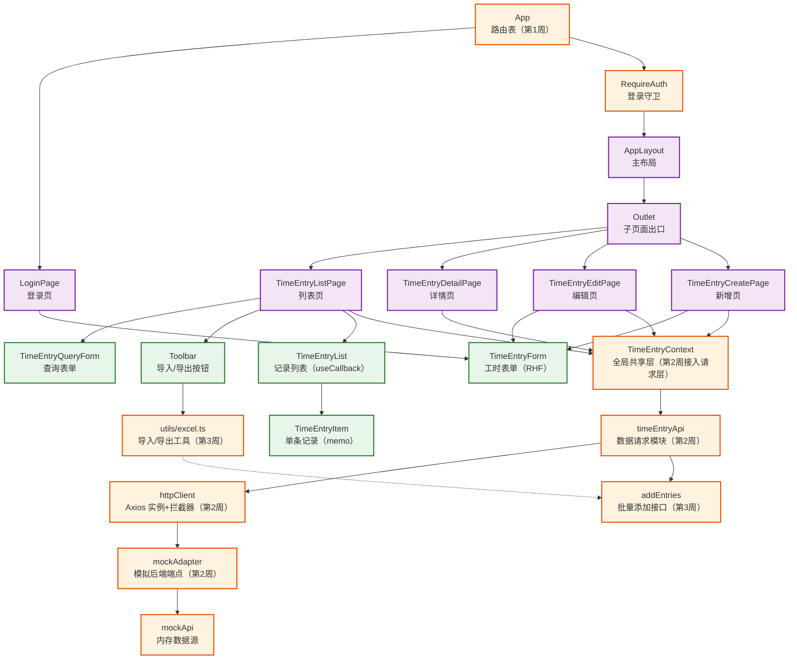

# React 工时填报应用（第1-3周）— 阶段讲稿：技术栈与开发进度

> 本讲稿面向初学者，串联「3 React生态与工程化」学习计划**第 1 ～ 3 周**的全部内容：每周做了什么功能、引入了什么技术栈、关键设计是什么、核心代码长什么样。写法沿用《React 工时填报应用 — 技术栈详解》的格式——每个知识点包含**定义、示例、使用效果、注意事项**四部分。
>
> **项目版本背景：** React `19.2.7` + TypeScript；第 1 周 `react-router-dom@^7.18.1`；第 2 周 `axios@1.19.0`、`react-hook-form@7.85.0`、`axios-mock-adapter@2.1.0`；第 3 周 `xlsx`。所有代码均来自项目真实实现，可对照 `react-app/src` 阅读。
>
> **阅读方式：** 先看「一、三周总览」建立全局认知，再按周阅读。每节末尾的「注意事项」是初学者最容易踩的坑。

---

## 一、三周总览：我们在做什么

### 1. 阶段目标

起点是一个用 Context + useState 管理、只有一个页面的工时填报应用。第 1 ～ 3 周要把它改造成一个**多页面、有真实数据链路、支持 Excel 导入导出的后台管理系统雏形**，对应阶段 8 个产出中的前 5 个：

| 产出序号 | 功能 | 实现周次 |
|---------|------|---------|
| ① | 登录 | 第 1 周 ✅ |
| ② | 列表页 | 第 1 周（结构）+ 第 2 周（数据）✅ |
| ③ | 详情页 | 第 1 周（结构）+ 第 2 周（数据）✅ |
| ④ | 增删改查 | 第 2 周 ✅ |
| ⑤ | 导入导出 | 第 3 周 ✅ |

### 2. 每周进度一览

| 周次 | 主题 | 引入的技术栈 | 完成情况 |
|------|------|-------------|---------|
| 第 1 周 | 路由与页面结构 | React Router | ✅ 登录页、列表页路由、详情页路由、主布局（导航高亮+退出登录）、登录守卫、404 页面 |
| 第 2 周 | 数据请求与增删改查 | Axios、axios-mock-adapter、React Hook Form | ✅ 请求统一封装（拦截器）、数据请求模块、增删改查全部完成、加载三态 |
| 第 3 周 | 导入导出与列表性能优化 | xlsx（SheetJS）、React.memo、useCallback | ✅ Excel 导出、Excel 导入（校验+批量写入+结果反馈）、前端分页、memo/useCallback 优化 |

### 3. 三周架构演进图

<div style="background:#fff;padding:20px;border-radius:8px;display:inline-block;width:100%">



</div>

**一句话看懂分层：**

- **紫色（页面层）**：第 1 周 React Router 搭建的页面骨架——URL 变了渲染哪个组件
- **橙色（基础设施层）**：第 2 周的数据链路与第 3 周的工具模块——数据从哪来、怎么出去
- **绿色（业务组件层)**：表单、列表等具体 UI，三周持续复用和增强

### 4. 贯穿三周的三条设计主线

理解这三条主线，比记住任何单个 API 都重要：

1. **先骨架后血肉**：第 1 周先把单页拆成多页面结构（路由），第 2 周再往骨架里填充真实数据（请求）。页面先行让每一周的改动都有明确落点。
2. **先 mock 后真实**：业务代码只依赖 `timeEntryApi` 的函数签名，不感知数据来自 mock 还是真实服务器。未来切真实后端 = 移除一行 mock 注册 + 配置代理，页面代码零改动。
3. **先功能后优化**：第 3 周先跑通导入导出，再对确认存在性能问题的列表项做 memo/useCallback 缓存。「先测量再优化」是性能工作的基本原则。

---

## 二、第 1 周：路由与页面结构（React Router）

### 本周开发进度

把「一个页面打天下」拆成多页面 SPA：

- ✅ **登录页** `/login`：表单 + 校验，成功后保存登录态并跳回来源页
- ✅ **主布局** `AppLayout`：侧边导航高亮（NavLink）+ 子页面出口（Outlet）+ 退出登录
- ✅ **列表页**（默认首页）：查询表单 + 总工时 + 记录列表（数据第 2 周接入）
- ✅ **详情页 / 编辑页**：动态路由 `/timesheet/:id(/edit)`，能读取 URL 标识
- ✅ **登录守卫** `RequireAuth`：未登录自动跳登录页，登录后返回原页面
- ✅ **404 兜底**：未匹配路径显示友好提示

### 知识点 1：SPA 与 BrowserRouter

#### 定义

SPA（单页应用）只有一张 HTML 页面，靠 JavaScript 改变 URL 并替换局部内容，不整页刷新。`BrowserRouter` 基于 HTML5 History API，是所有路由能力的「环境基础」，在入口文件配置一次即可。

#### 示例 — `src/main.tsx`

```tsx
import { BrowserRouter } from 'react-router-dom'

createRoot(document.getElementById('root')!).render(
  <StrictMode>
    <BrowserRouter>
      <App />
    </BrowserRouter>
  </StrictMode>,
)
```

#### 使用效果

访问 `http://localhost:5173/timesheet/1` 时地址栏显示真实路径，刷新后仍停留在同一路由。

#### 注意事项

- 只有被 `BrowserRouter` 包裹的组件才能使用 `useNavigate`、`Link` 等 API。
- 生产部署时 Web 服务器需将任意路径回退到 `index.html`（SPA 回退）；Vite dev/preview 默认支持。

---

### 知识点 2：路由表 Routes / Route

#### 定义

`Routes` 是路由表容器，`Route` 声明「路径 → 组件」映射。开发者只描述「什么路径渲染什么组件」，不需要 if/switch 判断——这就是**声明式**的含义。

#### 示例 — `App.tsx`（节选）

```tsx
<Routes>
  <Route path="/login" element={<LoginPage />} />
  <Route
    path="/"
    element={<RequireAuth><AppLayout /></RequireAuth>}
  >
    <Route index element={<TimeEntryListPage />} />
    <Route path="timesheet/create" element={<TimeEntryCreatePage />} />
    <Route path="timesheet/:id/edit" element={<TimeEntryEditPage />} />
    <Route path="timesheet/:id" element={<TimeEntryDetailPage />} />
  </Route>
  <Route path="*" element={<NotFoundPage />} />
</Routes>
```

#### 使用效果

URL 与页面一一对应；静态段优先级高于动态段——`/timesheet/create` 命中新增页，不会被误当成 id 匹配到详情页。

#### 注意事项

- 子路由 `path` 不要以 `/` 开头，否则会脱离父路由的嵌套关系。
- `*` 通配路由必须放在最后，否则会拦截正常路由。

---

### 知识点 3：嵌套路由与 Outlet（含 index 与 404）

#### 定义

嵌套路由让父路由渲染公共框架（侧边栏等），子路由渲染在父组件的占位区域 `<Outlet />` 中。`<Route index>` 是无路径的默认子路由；`path="*"` 是兜底路由。

#### 示例 — `AppLayout.tsx`

```tsx
function AppLayout() {
  return (
    <div className={styles.layout}>
      <nav className={styles.sidebar}>{/* NavLink 导航 */}</nav>
      <main className={styles.main}>
        <Outlet />
      </main>
    </div>
  )
}
```

#### 使用效果

导航、退出登录、布局样式只在 `AppLayout` 写一次，所有子页面自动复用；访问 `/` 时 index 路由自动渲染列表页作为落地页；访问未知路径渲染 404 页。

#### 注意事项

- 父组件必须渲染 `<Outlet />`，否则子页面无法显示。
- 一个父路由下只能有一个 `index` 路由。

---

### 知识点 4：三种导航方式 Link / NavLink / useNavigate

#### 定义

| 方式 | 类型 | 使用位置 | 适用场景 |
|------|------|---------|---------|
| `Link` | 声明式 | JSX 模板 | 固定入口：返回按钮、跳转链接 |
| `NavLink` | 声明式（增强） | JSX 模板 | 导航菜单，激活项自动高亮 |
| `useNavigate` | 编程式 | JS 逻辑中 | 动态去向：点击某条记录跳对应详情 |

#### 示例 — 高亮导航 `AppLayout.tsx`

```tsx
const navLinkClass = ({ isActive }: { isActive: boolean }) =>
  `${styles.navLink} ${isActive ? styles.navLinkActive : ''}`

<NavLink to="/" end className={navLinkClass}>工时列表</NavLink>
```

#### 示例 — 编程式跳转 `TimeEntryListPage.tsx`

```tsx
const navigate = useNavigate()

const handleViewDetail = (entry: TimeEntry) => {
  navigate(`/timesheet/${entry.id}`)   // 去向由点击的记录决定
}
```

#### 使用效果

在 `/` 时「工时列表」高亮；点某条记录的「详情」按钮跳到该记录的详情页，全程不刷新。

#### 注意事项

- `end` 表示精确匹配：不加时 `/timesheet/1` 也会让 `/timesheet` 的导航高亮（部分匹配）。
- 选择原则：**能用 `Link` 静态表达就用 `Link`；去向依赖运行时数据才用 `navigate`**。

---

### 知识点 5：动态路由参数 useParams

#### 定义

路由路径中的 `:id` 是动态参数，`useParams()` 返回 `{ id: 'xxx' }`，用于定位单条记录。

#### 示例 — `TimeEntryDetailPage.tsx`

```tsx
const { id } = useParams()
const entry = entries.find((e) => e.id === id)
```

#### 使用效果

访问 `/timesheet/2` 时 `id === '2'`，从数据中找出对应记录展示。

#### 注意事项

- 返回的是字符串；参数可能不存在，`find` 结果为空时要显示「未找到」而不是白屏。

---

### 知识点 6：路由守卫 RequireAuth + Navigate

#### 定义

路由守卫是一个包装组件：进入受保护页面前检查条件，不满足就用 `<Navigate>` 重定向。这是「组件化守卫」——用组合代替配置。

#### 示例 — `RequireAuth.tsx`

```tsx
function RequireAuth({ children }: { children: ReactNode }) {
  const location = useLocation()

  if (!isLoggedIn()) {
    return <Navigate to="/login" state={{ from: location.pathname }} replace />
  }
  return children
}
```

#### 使用效果

未登录访问 `/timesheet/1` → 自动跳登录页并记下来源；登录成功 → 直接回到 `/timesheet/1`。守卫只需包裹父布局一次，所有子页面全部受保护。

#### 注意事项

- `replace` 用登录页替换历史记录，避免返回键退回被拦截页面。
- 登录页本身不能被守卫包裹，否则永远无法登录。

---

### 知识点 7：登录态持久化 localStorage 与页面间传参 state

#### 定义

localStorage 是浏览器持久存储（刷新不丢），用来保存登录标志；路由跳转可附带 `state` 对象（不出现在 URL、仅存内存），用来传递「用户本来想去哪」这类轻量上下文。

#### 示例 — `utils/auth.ts` 与登录成功回跳

```ts
const LOGIN_STORAGE_KEY = 'react-app:isLoggedIn'

export function isLoggedIn(): boolean {
  return localStorage.getItem(LOGIN_STORAGE_KEY) === 'true'
}
export function login(): void { localStorage.setItem(LOGIN_STORAGE_KEY, 'true') }
export function logout(): void { localStorage.removeItem(LOGIN_STORAGE_KEY) }
```

```tsx
// LoginPage.tsx — 登录成功后回到来源页
const location = useLocation()
const state = location.state as { from?: string } | null
navigate(state?.from ?? '/', { replace: true })
```

#### 使用效果

登录一次后刷新仍是登录态；从详情页被拦截去登录的用户，登录后直接回到那个详情页。

#### 注意事项

- localStorage 只能存字符串，布尔值存 `'true'` 再比较字符串。
- 当前是前端模拟登录，真实 token/角色鉴权在第 5、6 周引入。

---

## 三、第 2 周：数据请求与增删改查（Axios + React Hook Form）

### 本周开发进度

在第一周的页面骨架上接入真实「请求语义」，完成增删改查闭环：

- ✅ **统一请求封装** `httpClient`：Axios 实例 + 请求/响应拦截器
- ✅ **模拟后端** `mockAdapter`：浏览器内存中扮演 REST 接口（300ms 延迟模拟网络）
- ✅ **数据请求模块** `timeEntryApi`：列表/查询/详情/新增/编辑/删除 6 个函数
- ✅ **查**：列表加载三态（加载中/失败重试/空数据）+ 详情按 id 加载
- ✅ **增/改**：RHF 表单（必填+自定义规则）、新增编辑共用、异步预填、提交防重复
- ✅ **删**：二次确认 + 即时更新列表

### Axios 篇

### 知识点 1：axios.create 统一配置

#### 定义

项目接口通常有统一前缀。用 `axios.create` 创建请求实例，把公共配置集中一处，后续请求只写相对路径。

#### 示例 — `src/api/httpClient.ts`

```ts
const httpClient = axios.create({
  baseURL: '/api',     // 之后 get('/time-entries') 实际请求 /api/time-entries
  timeout: 10000,
})
export default httpClient
```

#### 注意事项

- 实例是单例：拦截器、mock 适配器都挂在它上面，全项目一份配置，便于整体替换。
- 不要在组件里散落 `axios.get(...)`，统一走实例 + 数据请求模块。

---

### 知识点 2：请求拦截器 — 统一附加登录凭证

#### 定义

拦截器是 axios 提供的「钩子」：请求拦截器在**发出前**执行，适合集中处理附加 token 等公共逻辑。

#### 示例 — `httpClient.ts`

```ts
httpClient.interceptors.request.use((config) => {
  if (isLoggedIn()) {
    config.headers.Authorization = 'Bearer mock-token'
  }
  return config   // 必须返回 config，否则请求不会继续发送
})
```

#### 使用效果

登录状态下任意请求自动带上凭证头，业务代码完全无感知；以后换真实 token 只改这一处。

---

### 知识点 3：响应拦截器 — 统一错误处理与登录失效

#### 定义

响应拦截器在**响应返回后**执行，失败回调做两件事：把 axios 原始错误转成「带可展示文案的 Error」；识别 401 统一清登录态并跳转登录页。

#### 示例 — `httpClient.ts`

```ts
httpClient.interceptors.response.use(
  (response) => response,
  (error) => {
    const status = error.response?.status
    if (status === 401) {
      logout()
      if (!window.location.pathname.startsWith('/login')) {
        window.location.href = '/login'
      }
    }
    const message = error.response?.data?.message ?? error.message ?? '请求失败'
    return Promise.reject(new Error(message))
  }
)
```

#### 使用效果

- 404 → 业务层 catch 到 `Error('记录不存在')`，页面直接展示友好提示
- 登录失效（401）→ 自动登出并跳登录页
- 网络异常 → 兜底文案「请求失败」，页面不白屏

#### 注意事项

- `?.` 可选链必不可少：网络异常时 `error.response` 是 undefined。
- 本实现成功回调**原样返回 response**，所以业务层取 `.data`；两者约定必须一致。

---

### 知识点 4：axios-mock-adapter 模拟后端 CRUD 接口

#### 定义

mock 适配器拦截指定 Axios 实例的请求，按「方法 + URL」匹配端点，返回模拟状态码与响应体——在没有真实服务器的阶段就能练习完整的请求语义。

#### 示例 — `src/api/mockAdapter.ts`（节选）

```ts
const mock = new MockAdapter(httpClient, { delayResponse: 300 })  // 模拟 300ms 延迟

// 列表
mock.onGet('/time-entries').reply((config) =>
  getEntries().then((data) => [200, data])
)

// 详情：正则匹配带 id 的路径
mock.onGet(/\/time-entries\/.+$/).reply((config) => {
  const id = (config.url ?? '').split('/').pop() ?? ''
  return getEntryById(id).then(
    (data) => [200, data],
    () => [404, { message: '记录不存在' }]
  )
})
```

#### 注意事项

- mock 是开发期替代品：Network 面板看不到真实请求属预期行为。
- 切真实后端时移除 `main.tsx` 里的一行 `import './api/mockAdapter'` 即可——这就是「先 mock 后真实」设计的切换成本。

---

### 知识点 5：timeEntryApi 数据请求模块（契约设计）

#### 定义

把所有数据操作整理为独立函数模块，页面统一从这里取数。**函数签名与旧 mockApi 完全一致**，因此业务层只换 import 来源即可，这就是「稳定契约」。

#### 示例 — `src/api/timeEntryApi.ts`（节选）

```ts
export async function getEntries(): Promise<TimeEntry[]> {
  const { data } = await httpClient.get<TimeEntry[]>('/time-entries')
  return data
}

export async function addEntry(entry: Omit<TimeEntry, 'id' | 'createdAt'>): Promise<TimeEntry> {
  const { data } = await httpClient.post<TimeEntry>('/time-entries', entry)
  return data
}

export async function deleteEntry(id: string): Promise<void> {
  await httpClient.delete(`/time-entries/${id}`)
}
```

#### 注意事项

- 泛型 `get<TimeEntry[]>` 让返回数据有完整类型提示。
- 业务层禁止直接 import mockApi——它是「模拟后端」，不是业务数据入口。

---

### React Hook Form 篇

### 知识点 6：useForm 与字段注册 register

#### 定义

`useForm<T>` 创建表单实例，`register('字段名')` 把输入框一次性注册进表单。字段值由 RHF 通过 ref 直接读取（**非受控**）：不用手写 value/onChange，输入过程也不触发组件重渲染。

#### 示例 — `TimeEntryForm.tsx`

```tsx
const {
  register,
  handleSubmit,
  formState: { errors },
} = useForm<TimeEntryFormValues>({
  defaultValues: { projectName: '', description: '', hours: 1, approvalStatus: '待审批' },
})

<form onSubmit={handleSubmit(handleFormSubmit)}>
  <input {...register('projectName', { required: '项目名称不能为空' })} />
</form>
```

#### 使用效果

对比第 1 周 4 个 useState + 手工 validate 的受控写法，代码量明显减少；登录页、工时表单、查询表单三个表单统一迁移到同一套写法。

#### 注意事项

- `{...register('projectName')}` 展开后不要再手动设置 `value`/`onChange`，否则冲突导致无法输入。

---

### 知识点 7：校验规则 required / valueAsNumber / validate

#### 定义

`register` 第二个参数是校验规则对象：值即错误文案；`validate` 自定义函数返回 `true` 或错误文案；`valueAsNumber` 把字符串转成数字再校验。

#### 示例 — 工时字段（必填 + 数字 + 0.5 倍数）

```tsx
{...register('hours', {
  required: '工时必须大于 0',
  valueAsNumber: true,
  validate: (value) => {
    if (!value || Number.isNaN(value) || value <= 0) return '工时必须大于 0'
    return Math.round(value * 2) === value * 2 || '工时必须是 0.5 的倍数'
  },
})}

{errors.hours && <span className={styles.error}>{errors.hours.message}</span>}
```

#### 使用效果

空提交显示各字段的「不能为空」；工时填 `1.3` 显示「工时必须是 0.5 的倍数」；全部通过才调用提交回调。`Math.round(v*2)===v*2` 判断乘 2 后是否为整数，规避浮点精度问题。

---

### 知识点 8：Controller 桥接受控组件

#### 定义

`ApprovalStatusSelector` 是 `value + onChange` 的自定义受控组件，无法用 register 展开。`Controller` 把它与 RHF 桥接：RHF 管值存储与校验，render 回调把 `field` 交给组件。

#### 示例 — `TimeEntryForm.tsx`

```tsx
<Controller
  control={control}
  name="approvalStatus"
  render={({ field }) => (
    <ApprovalStatusSelector value={field.value} onChange={field.onChange} />
  )}
/>
```

#### 注意事项

原生输入优先 register（性能更好）；只有必须受控的自定义组件才用 Controller。

---

### 知识点 9：reset 编辑预填与提交后清空

#### 定义

`defaultValues` 只在首次挂载生效，**异步拿到的数据必须用 reset() 写入表单**。`reset(data)` 预填编辑数据；`reset()` 无参清空。

#### 示例 — `TimeEntryForm.tsx`

```tsx
useEffect(() => {
  if (initialData) {
    reset({
      projectName: initialData.projectName,
      hours: initialData.hours,
      // ...其余字段
    })
  } else {
    reset({ projectName: '', description: '', hours: 1, approvalStatus: '待审批' })
  }
}, [initialData, reset])
```

#### 使用效果

新增与编辑复用同一表单组件：编辑页异步加载完记录后自动预填；新增提交成功后表单恢复默认值方便连续录入。

---

### 知识点 10：isSubmitting 提交中禁用按钮

#### 定义

`formState.isSubmitting` 在 onSubmit 回调返回的 Promise 完成前为 true，用于禁用按钮防止重复提交。

#### 示例

```tsx
<button type="submit" disabled={isSubmitting}>
  {isSubmitting ? '提交中...' : initialData ? '保存修改' : '提交'}
</button>
```

#### 注意事项

onSubmit 必须是 `async` 函数并 `await` 请求，isSubmitting 才会正确复位；失败同样会复位，不会卡死。

---

### 页面层配套设计

**① Context 接入请求层（error + retry）：** `loadEntries` 用 `useCallback` 包装保证引用稳定，`try/catch/finally` 分别处理 成功写 entries / 失败写 error / 无论成败结束 loading：

```tsx
const loadEntries = useCallback(async () => {
  setLoading(true); setError(null)
  try {
    setEntries(await getEntries())
  } catch (e) {
    setError(e instanceof Error ? e.message : '加载失败')
  } finally {
    setLoading(false)
  }
}, [])
```

**② 列表三态渲染：** 加载中 → 失败（含重试按钮）→ 就绪，三元链顺序不可乱：

```tsx
{loading ? <p>加载中...</p>
 : error ? <div><p>加载失败：{error}</p><button onClick={retry}>重试</button></div>
 : <TimeEntryList entries={visibleEntries} ... />}
```

**③ 详情/编辑页按 id 加载：** 从「在全局 entries 里 find」升级为 `getEntryById(id)` 单独请求（`useEffect` 依赖 `[id]`）。即使列表加载失败，详情页也能独立工作，并为第 4 周 Redux 异步流做形态预演。

---

## 四、第 3 周：导入导出与列表性能优化（xlsx + memo/useCallback）

### 本周开发进度

在数据链路上增加文件能力，并做第一次有原则的性能优化：

- ✅ **导出**：列表数据 → 带中文表头的 `.xlsx` → 浏览器下载
- ✅ **导入**：选择文件 → 解析 → 逐条校验 → 批量写入 → 反馈成功/失败条数 → 刷新列表
- ✅ **批量接口** `addEntries`：API + mockApi + mock 端点三层扩展
- ✅ **前端分页**：每页 5 条，翻页/查询重置页码/删除末条自动回退
- ✅ **性能优化**：`TimeEntryItem` 包 memo、`TimeEntryList` 回调 useCallback

### 性能优化篇

### 知识点 1：React.memo 组件缓存与浅比较

#### 定义

`React.memo` 包裹组件后，React 会浅比较 props：引用未变则**跳过整个组件函数的执行**，直接复用上次输出。适用于「渲染成本较高、props 变化频率低」的列表项。

#### 示例 — `TimeEntryItem.tsx`

```tsx
function TimeEntryItem({ entry, onEdit, onDelete }: TimeEntryItemProps) {
  /* 渲染一条记录 */
}
export default memo(TimeEntryItem)
```

#### 使用效果

父组件因无关状态（翻页、导入中标记）重渲染时，`entry` 未变的列表项不再重新执行函数体；React DevTools Profiler 可观察到渲染次数下降。

#### 注意事项

浅比较对对象/函数比的是**引用地址**——内联箭头函数每次渲染都是新引用，会直接击穿 memo。这正是需要 useCallback 的原因 ↓

---

### 知识点 2：useCallback 回调引用稳定化

#### 定义

`useCallback(fn, deps)` 返回引用稳定的函数：仅当 deps 变化才产生新引用。它是 memo 生效的**必要前提**。

#### 示例 — `TimeEntryList.tsx`

```tsx
const handleEdit = useCallback((entry: TimeEntry) => onEdit(entry), [onEdit])

{entries.map((entry) => (
  <TimeEntryItem key={entry.id} entry={entry} onEdit={() => handleEdit(entry)} />
))}
```

#### 注意事项

- deps 必须列全回调内用到的外部变量，否则闭包捕获过期值。
- 不要过度使用：useCallback 自身有缓存开销，只用于「传给 memo 子组件」的回调。

---

### 知识点 3：memo + useCallback 配合原理与适用判断

#### 配合链路

```
TimeEntryListPage 重渲染（如翻页）
  → handleEdit 等 useCallback 引用稳定
  → TimeEntryList 内部 handleXxx 也稳定
  → TimeEntryItem 全部 props 浅比较通过
  → 跳过渲染 ✔（只有 entry 数据真变了的那几条才重新渲染）
```

#### 该不该优化？先测量再动手

| 适合 memo | 不适合 memo |
|-----------|------------|
| 列表项：渲染成本高、props 稳定 | 简单小组件：比较开销可能大于收益 |
| 父组件频繁重渲染 | props 每次都变（内联对象等） |
| 配合 useCallback 引用稳定 | 只在自身数据变化时渲染 |

验证方法：React DevTools → Profiler 录制 → 触发翻页 → 对比 TimeEntryItem 渲染次数。

---

### xlsx 篇

### 知识点 4：导出 Excel — json_to_sheet + write + Blob

#### 定义

导出四步：对象数组转工作表 → 写入 workbook 得二进制 buffer → 包装 Blob → 触发浏览器下载。Blob 是「内存二进制 → 可下载文件」之间的桥梁。

#### 示例 — `utils/excel.ts`（节选）

```ts
export function exportToExcel(entries: TimeEntry[], filename = '工时记录.xlsx') {
  // ① 英文字段 → 中文表头的对象数组
  const data = entries.map(/* headerMap 映射，见知识点 6 */)

  // ② 对象数组 → 工作表 → 工作簿
  const worksheet = XLSX.utils.json_to_sheet(data)
  const workbook = XLSX.utils.book_new()
  XLSX.utils.book_append_sheet(workbook, worksheet, '工时记录')

  // ③ 工作簿 → 二进制 → Blob
  const excelBuffer = XLSX.write(workbook, { bookType: 'xlsx', type: 'array' })
  const blob = new Blob([excelBuffer], {
    type: 'application/vnd.openxmlformats-officedocument.spreadsheetml.sheet',
  })

  // ④ 临时 URL + 模拟点击下载 + 清理
  const url = URL.createObjectURL(blob)
  const link = document.createElement('a')
  link.href = url
  link.download = filename
  document.body.appendChild(link)
  link.click()
  document.body.removeChild(link)
  URL.revokeObjectURL(url)
}
```

#### 使用效果

点击「导出」→ 浏览器立即下载 `工时记录.xlsx`，首行中文表头（ID/项目名称/工作内容/工时数/审批状态/创建时间），每行一条记录。导出的是当前可见数据（查询过滤后的结果）。

#### 类比理解 Blob 流程

| 步骤 | 类比 |
|------|------|
| `Uint8Array` buffer | 散装字节（原材料） |
| `new Blob([...])` | 贴好 MIME 标签的包裹 |
| `URL.createObjectURL` | 临时快递单号 |
| `<a download>` + click() | 收件人凭单号取件（下载） |
| `revokeObjectURL` | 用完销毁单号释放内存 |

---

### 知识点 5：导入 Excel — FileReader + read + sheet_to_json

#### 定义

导入四步：FileReader 把文件读为 ArrayBuffer → `XLSX.read` 解析为 workbook → `sheet_to_json` 转对象数组 → 逐条校验收集合法行。

#### 示例 — `utils/excel.ts`（节选）

```ts
export function importFromExcel(file: File): Promise<ImportResult> {
  return new Promise((resolve, reject) => {
    if (!file.name.endsWith('.xlsx')) {
      return reject(new Error('请选择 .xlsx 格式的文件'))  // accept 只是提示，代码需二次校验
    }

    const reader = new FileReader()
    reader.onload = (e) => {
      try {
        const data = new Uint8Array(e.target?.result as ArrayBuffer)
        const workbook = XLSX.read(data, { type: 'array' })
        const worksheet = workbook.Sheets[workbook.SheetNames[0]]
        const rawData = XLSX.utils.sheet_to_json(worksheet)  // 中文键名数组
        // ... 反向映射 + 逐条校验（见知识点 6、7）
        resolve({ validRows, invalidCount })
      } catch {
        reject(new Error('文件解析失败，请检查文件格式'))
      }
    }
    reader.readAsArrayBuffer(file)
  })
}
```

#### 注意事项

- FileReader 是异步回调风格，用 Promise 包装后调用方才能 `await`。

---

### 知识点 6：字段映射 — 正向与反向表头转换

#### 定义

导出要把英文字段名转中文列名（正向 `headerMap`）；导入反过来把中文列名转回英文字段（反向 `reverseHeaderMap`）。导出与导入互为逆操作。

#### 示例 — `utils/excel.ts`

```ts
const headerMap: Record<keyof TimeEntry, string> = {
  id: 'ID', projectName: '项目名称', description: '工作内容',
  hours: '工时数', approvalStatus: '审批状态', createdAt: '创建时间',
}

// 一行代码反转键值得到反向映射
const reverseHeaderMap = Object.fromEntries(
  Object.entries(headerMap).map(([k, v]) => [v, k as keyof TimeEntry])
)
```

#### 使用效果

用户修改 Excel 列名（如「项目名称」改成「项目名」）时，反向映射返回 undefined、该列被忽略 → projectName 为空计为非法行，不会静默写入脏数据。`id`/`createdAt` 在导入时被显式排除，防止覆盖系统字段。

---

### 知识点 7：导入数据校验与结果反馈

#### 定义

对每行做类型守卫校验：非法行计数而不是抛错（「尽量多导入」语义），最终返回合法行 + 失败计数。

#### 示例 — 校验核心逻辑

```ts
if (
  typeof projectName === 'string' && projectName.trim() !== '' &&
  typeof hours === 'number' && hours > 0
) {
  validRows.push({ projectName: projectName.trim(), /* ... */ })
} else {
  invalidCount++
}
```

#### 示例 — 调用方串联完整流程 `TimeEntryListPage.tsx`

```tsx
setImporting(true)
try {
  const result = await importFromExcel(file)
  if (result.validRows.length > 0) {
    await addEntries(result.validRows)  // 批量写入
    retry()                              // 刷新列表
  }
  alert(`成功导入 ${result.validRows.length} 条，失败 ${result.invalidCount} 条`)
} finally {
  setImporting(false)
  event.target.value = ''  // 关键！否则重复选同一文件不触发 change
}
```

#### 使用效果

5 行数据的 Excel（3 合法、1 空名、1 工时为 0）→ 弹窗提示「成功导入 3 条，失败 2 条」，列表自动刷新。

---

## 五、三周需求与技术栈对照检查（汇总）

| 技术 | 周次 | 用途 | 实现情况 |
|------|------|------|---------|
| React Router | 第 1 周 | 路由表、嵌套布局、三种导航、动态参数、守卫 | ✅ `react-router-dom@^7.18.1` 全量使用 |
| localStorage | 第 1 周 | 登录态持久化 | ✅ `utils/auth.ts` 独立模块 |
| Axios | 第 2 周 | HTTP 客户端 + 双拦截器 + 错误归一 | ✅ `httpClient.ts` 统一封装 |
| axios-mock-adapter | 第 2 周 | 模拟 REST 后端（含延迟/404） | ✅ 六个 CRUD 端点 + 第 3 周 batch 端点 |
| React Hook Form | 第 2 周 | 表单管理：register/校验/Controller/reset/isSubmitting | ✅ 三个表单统一迁移 |
| 数据请求模块 | 第 2 周 | 稳定契约层 | ✅ `timeEntryApi.ts`，切真实后端零页面改动 |
| 加载三态 | 第 2 周 | loading/error/empty + retry | ✅ Context + 列表页条件渲染 |
| xlsx（SheetJS） | 第 3 周 | Excel 读取与生成 | ✅ `utils/excel.ts` 纯函数工具 |
| FileReader/Blob | 第 3 周 | 浏览器文件读/写 | ✅ 导入读 ArrayBuffer、导出 Blob 下载 |
| React.memo + useCallback | 第 3 周 | 列表项缓存 + 回调稳定 | ✅ 仅用于 `TimeEntryItem` 及其回调链 |

**未引入（符合计划）：** Redux Toolkit、Ant Design（第 4 周）；真实后端与 Vite 代理（第 4 周）；ESLint/Prettier/Vite 构建优化（第 6 周）。

**验证结果：** 第 2、3 周改造后 `npm run typecheck` / `lint` / `build` 全部通过。

---

## 六、学习路径建议与下一步展望

### 复习路径（由易到难）

1. **路由骨架**（第 1 周知识 1-3）→ BrowserRouter、Routes/Route、嵌套 Outlet
2. **导航与参数**（第 1 周知识 4-5）→ Link/NavLink/useNavigate 场景区分、useParams
3. **访问控制**（第 1 周知识 6-7）→ RequireAuth、localStorage、state 传参
4. **统一请求层**（第 2 周知识 1-5）→ 实例、双拦截器、mock、契约模块——这是三周最核心的设计
5. **表单库**（第 2 周知识 6-10）→ register 非受控、校验规则、Controller、reset、isSubmitting
6. **性能入门**（第 3 周知识 1-3）→ memo 浅比较、useCallback、先测量再优化
7. **文件读写**（第 3 周知识 4-7）→ 导出/导入两条完整链路、正反向映射

每个知识点均可对照 `学习资料/3 React生态与工程化/` 下对应的 `3.x` 文档深入学习。

### 第 4 周预告（难度峰值，预留弹性）

- **Redux Toolkit**：跨页面共享的全局状态新范式，取代 Context 承担审批流转（⑥ 提交-审批-驳回-重填）
- **Ant Design**：企业级组件库统一界面
- **真实后端接入**：移除 mock 注册 + 配置 Vite 代理——得益于契约设计，页面代码零改动

> 三周下来，你已经完成了「单页应用 → 多页面系统 → 有真实数据链路 → 有文件交换能力」的全部演进。带着这套架构心智模型进入第 4 周的状态管理与组件库，会顺畅得多。
