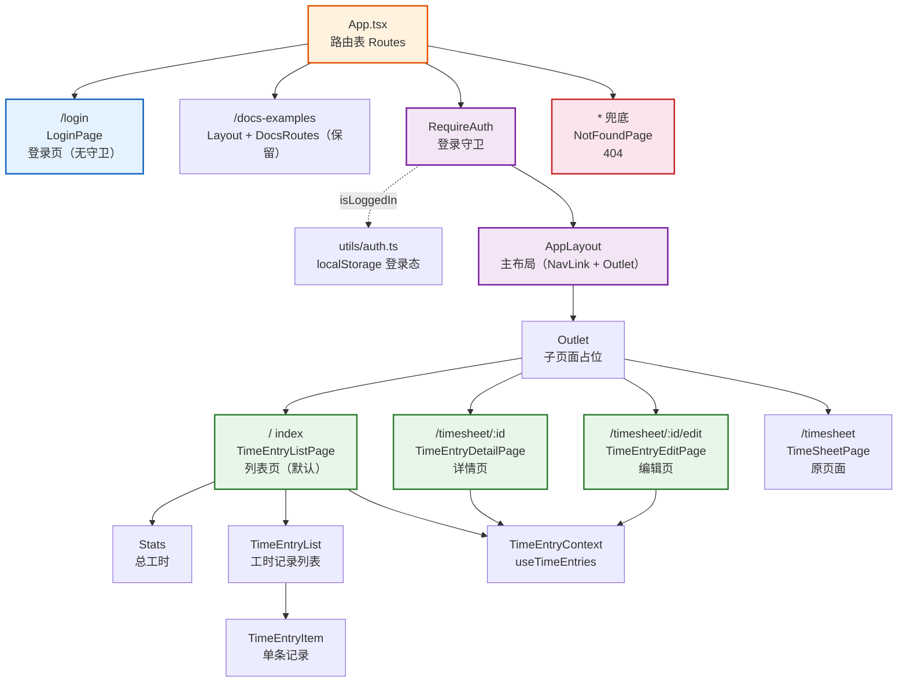

# React 工时填报应用（第1周：路由与页面）— 技术栈详解

> 本文按照从易到难的顺序，结合第 1 周「路由与页面结构」改造后的真实代码，逐一讲解登录页、列表页、详情页涉及的 React Router 与相关知识点。每个知识点均参考 `学习资料/3 React生态与工程化/` 的编写格式，包含定义、示例、使用效果和注意事项，文末附「第 1 周需求与技术栈对照检查」。
>
> **当前项目版本：** React `19.2.7`、React Router 使用 `react-router-dom@^7.18.1`（React Router v7，声明式模式）。v7 已合并 `react-router` 与 `react-router-dom`，本教程采用 v7 兼容的 `BrowserRouter + Routes + Route` 声明式写法，v6 语法可无缝迁移。各版本差异详见 `学习资料/3 React生态与工程化/3.1 React Router.md` 的「版本差异」章节。
>
> **前置准备（本项目已完成）：** `react-router-dom@^7.18.1` 已在脚手架阶段随 `package.json` 安装，无需重复执行；若在全新项目复现，安装命令为 `npm install react-router-dom`（详见 `3.1 React Router.md` 的「前置准备」章节）。

---

## 一、页面与组件依赖关系图



### 组件说明

| 组件 | 职责 | 使用的知识点 |
|------|------|-------------|
| `App.tsx` | 路由表：登录 / 受保护主布局 / 404 兜底 | Routes、Route、嵌套路由 |
| `LoginPage` | 登录表单 + 必填校验，成功后保存登录态并跳转来源页 | 受控组件、useState、useNavigate、useLocation、state |
| `RequireAuth` | 未登录重定向到登录页并记录来源路径 | useLocation、Navigate、组件组合 |
| `AppLayout` | 主布局：侧边导航 + 子页面出口 + 退出登录 | NavLink、Outlet、useNavigate、useCallback 类名回调 |
| `TimeEntryListPage` | 默认列表页：总工时 + 记录列表 + 页面跳转 | 编程式导航、Props 回调、reduce |
| `TimeEntryDetailPage` | 详情页：读取动态参数、find 单条记录、只读展示 | useParams、find、条件渲染、Link |
| `TimeEntryEditPage` | 编辑页：预填表单、更新后跳转 | useParams、Context、编程式导航 |
| `NotFoundPage` | 404 提示 + 返回入口 | Link、函数组件 |
| `utils/auth.ts` | 登录态读写（localStorage） | localStorage API、模块化导出 |

### 数据流方向

```
URL 变化 → 路由匹配 → 渲染对应页面组件（嵌套布局内）
   ↓
页面组件 → useNavigate / Link / NavLink → 触发新的 URL
   ↓
RequireAuth → isLoggedIn() → 未登录重定向 /login（记录 from）
   ↓
登录成功 → navigate(from ?? '/', { replace: true }) → 回到目标页
```

---

## 二、知识点详解（从易到难）

**目录**

- [1. 浏览器路由与 SPA](#1-浏览器路由与-spa)
- [2. 路由表配置：Routes / Route](#2-路由表配置routes--route)
- [3. 嵌套路由与 Outlet](#3-嵌套路由与-outlet)
- [4. index 默认路由](#4-index-默认路由)
- [5. 404 兜底路由](#5-404-兜底路由)
- [6. 声明式导航：Link](#6-声明式导航link)
- [7. 声明式导航：NavLink 激活高亮](#7-声明式导航navlink-激活高亮)
- [8. 编程式导航：useNavigate](#8-编程式导航usenavigate)
- [9. 动态路由参数：useParams](#9-动态路由参数useparams)
- [10. 路由守卫：RequireAuth + Navigate](#10-路由守卫requireauth--navigate)
- [11. 登录状态持久化：localStorage](#11-登录状态持久化localstorage)
- [12. 页面间状态传递：useLocation 的 state](#12-页面间状态传递uselocation-的-state)
- [13. 受控组件与表单校验（登录页）](#13-受控组件与表单校验登录页)
- [14. 详情页数据查找：find + loading](#14-详情页数据查找find--loading)
- [15. 向后兼容的可选 Props](#15-向后兼容的可选-props)
- [三、第 1 周需求与技术栈对照检查](#三第-1-周需求与技术栈对照检查)
- [四、学习路径建议](#四学习路径建议)

---

### 1. 浏览器路由与 SPA

#### 定义

SPA（单页应用）只有一个 HTML 页面，通过 JavaScript 改变 URL 并替换局部内容，页面不整页刷新。浏览器路由（BrowserRouter）基于 HTML5 History API，让 URL 形态与普通路径一致（如 `/timesheet/1`），无需后端配合即可实现「URL 与页面组件映射」。

#### 示例 — `src/main.tsx`

```tsx
import { BrowserRouter } from 'react-router-dom'

createRoot(document.getElementById('root')!).render(
  <StrictMode>
    <BrowserRouter>
      <App />
    </BrowserRouter>
  </StrictMode>,
)
```

`BrowserRouter` 是路由环境的根容器，只有被它包裹的组件才能使用路由相关 Hook 与组件（`useNavigate`、`Link`、`NavLink` 等）。

#### 使用效果

访问 `http://localhost:5173/timesheet/1` 时，浏览器地址栏显示真实路径；页面刷新后仍停留在同一路由，不会跳到 404。

#### 注意事项

- 生产环境部署时，Web 服务器需将任意路径回退到 `index.html`（SPA 回退）。Vite dev/preview 默认开启。
- `BrowserRouter` 需要根节点包裹，通常在入口文件 `main.tsx` 配置一次即可。

---

### 2. 路由表配置：Routes / Route

#### 定义

`Routes` 是路由表的容器，`Route` 声明「路径 → 组件」的映射。React Router 会按路由的优先级自动匹配当前 URL，渲染命中的组件。

#### 示例 — `App.tsx`

```tsx
import { Routes, Route, Navigate } from 'react-router-dom'

<Routes>
  <Route path="/login" element={<LoginPage />} />
  <Route path="/docs-examples" element={<Layout />}>
    <Route index element={<Navigate to="components" replace />} />
    <Route path="*" element={<DocsRoutes />} />
  </Route>
  <Route
    path="/"
    element={
      <RequireAuth>
        <AppLayout />
      </RequireAuth>
    }
  >
    <Route index element={<TimeEntryListPage />} />
    <Route path="timesheet/:id/edit" element={<TimeEntryEditPage />} />
    <Route path="timesheet/:id" element={<TimeEntryDetailPage />} />
    <Route path="timesheet" element={<TimeSheetPage />} />
  </Route>
  <Route path="*" element={<NotFoundPage />} />
</Routes>
```

- **`path`**：匹配的 URL 片段，`/login` 绝对路径、`timesheet/:id` 相对路径
- **`element`**：该路径渲染的 JSX 元素
- **`index`**：无路径的默认子路由（详见第 4 节）
- **`*`**：通配符，匹配所有未定义路径（详见第 5 节）

#### 使用效果

URL 与页面一一对应，路由匹配是「声明式」的：开发者只需要描述「什么路径渲染什么组件」，不需要写 if/switch 判断。

#### 注意事项

- 子路由的 `path` 不要以 `/` 开头（以 `/` 开头会变成绝对路径，脱离父路由嵌套关系）。
- `Routes` 内部只渲染一个匹配的路由，多个同级 `Route` 不会同时渲染。

---

### 3. 嵌套路由与 Outlet

#### 定义

嵌套路由让父路由渲染公共框架（如侧边栏），子路由在父组件的占位区域 `<Outlet />` 中渲染。这样「登录 → 主布局 → 子页面」三层结构只需配置一次父布局。

#### 示例 — `AppLayout.tsx`

```tsx
import { NavLink, Outlet, useNavigate } from 'react-router-dom'

function AppLayout() {
  // 公共框架：侧边导航 + 子页面出口
  return (
    <div className={styles.layout}>
      <nav className={styles.sidebar}>
        {/* NavLink 导航项 */}
      </nav>
      <main className={styles.main}>
        <Outlet />
      </main>
    </div>
  )
}
```

`<Outlet />` 是路由的「插槽」，渲染当前 URL 匹配到的子路由组件。访问 `/timesheet/1` 时，`AppLayout` 渲染侧边栏，`<Outlet />` 位置渲染 `TimeEntryDetailPage`。

#### 使用效果

导航高亮、退出登录、布局样式只需在 `AppLayout` 写一次，所有子页面自动复用，页面间跳转时框架不会重新加载。

#### 注意事项

- 父路由必须有子路由，且父组件必须渲染 `<Outlet />`，否则子页面无法显示。
- 子页面组件通过 Props 或 Context 拿到数据，不需要在 `AppLayout` 中转交——这正是 Context 与路由结合带来的好处。

---

### 4. index 默认路由

#### 定义

`<Route index>` 是无路径的子路由，当 URL 恰好等于父路由路径（如 `/`）时渲染，充当「默认页」。

#### 示例 — `App.tsx`

```tsx
<Route path="/" element={<RequireAuth><AppLayout /></RequireAuth>}>
  <Route index element={<TimeEntryListPage />} />
  {/* ...其他子路由 */}
</Route>
```

#### 使用效果

访问根路径 `/` 时，主布局自动渲染 `TimeEntryListPage` 作为默认落地页，无需显式配置 `/` 的跳转。

#### 注意事项

- 一个父路由下只能有一个 `index` 路由。
- `index` 路由的优先级高于其他子路由：`/` 命中 index，`/timesheet` 命中普通子路由，互不干扰。

---

### 5. 404 兜底路由

#### 定义

`path="*"` 的通配路由会匹配所有未被其他路由命中的路径，通常放在路由表**最后**作为 404 兜底。

#### 示例 — `App.tsx`

```tsx
<Route path="*" element={<NotFoundPage />} />
```

`NotFoundPage` 提示页面不存在并提供返回入口：

```tsx
import { Link } from 'react-router-dom'

function NotFoundPage() {
  return (
    <div className={styles.container}>
      <h1 className={styles.code}>404</h1>
      <p className={styles.message}>页面不存在</p>
      <Link to="/" className={styles.homeLink}>返回首页</Link>
    </div>
  )
}
```

#### 使用效果

访问 `/unknown` 等未定义路径时渲染 404 页面；已定义的 `/login`、`/timesheet/1` 等路径不受影响（React Router 按优先级匹配，`*` 优先级最低）。

#### 注意事项

- `*` 路由必须声明在所有正常路由之后，否则会拦截正常路由。
- 兜底路由属于路由表，不在某个父路由内部声明，才能覆盖全局。

---

### 6. 声明式导航：Link

#### 定义

`Link` 渲染一个 `<a>` 标签，点击时由 React Router 拦截并切换路由，页面不刷新。适用于「用户点击链接跳转」的场景。

#### 示例 — `TimeEntryDetailPage.tsx`

```tsx
import { Link } from 'react-router-dom'

<Link to={`/timesheet/${entry.id}/edit`} className={styles.submitBtn}>
  编辑
</Link>
<Link to="/" className={styles.cancelBtn}>
  返回列表
</Link>
```

#### 使用效果

点击「返回列表」跳转到 `/`，点击「编辑」跳转到对应记录的编辑页，全程不刷新页面，SPA 体验流畅。

#### 注意事项

- `Link` 是声明式导航：把「去哪」写在模板里，适合导航菜单、返回按钮等固定入口。
- 需要携带动态参数时用模板字符串拼接 `to={`/timesheet/${entry.id}`}`。

---

### 7. 声明式导航：NavLink 激活高亮

#### 定义

`NavLink` 是增强版 `Link`，能感知当前路由是否激活，通过回调类名实现「高亮当前导航项」的效果。

#### 示例 — `AppLayout.tsx`

```tsx
import { NavLink, Outlet, useNavigate } from 'react-router-dom'

const navLinkClass = ({ isActive }: { isActive: boolean }) =>
  `${styles.navLink} ${isActive ? styles.navLinkActive : ''}`

<NavLink to="/" end className={navLinkClass}>
  <span className={styles.navIcon}>📋</span>
  <span>工时列表</span>
</NavLink>

<NavLink to="/timesheet" className={navLinkClass}>
  <span className={styles.navIcon}>🕐</span>
  <span>工时填报</span>
</NavLink>
```

- **className 回调**：`NavLink` 把 `{ isActive }` 传给类名函数，激活时返回 `styles.navLinkActive` 高亮类
- **`end`**：精确匹配，仅当 URL **完全等于** `/` 时才高亮「工时列表」。不加 `end` 时 `/timesheet/1` 也会让「工时填报」高亮（部分匹配）

#### 使用效果

在 `/` 时「工时列表」高亮；在 `/timesheet/1` 时「工时填报」高亮且「工时列表」不高亮，导航状态随 URL 自动同步。

#### 注意事项

- 默认 `NavLink` 是「部分匹配」，嵌套路径（如 `/timesheet/1`）也会命中 `/timesheet`；列表/首页类导航用 `end` 避免误高亮。
- 类名回调必须返回字符串；要复用基础样式时用模板字符串拼接。

---

### 8. 编程式导航：useNavigate

#### 定义

`useNavigate` 返回一个导航函数，在事件处理、异步回调等代码逻辑中触发跳转，与声明式 `Link` 互补。

#### 示例 — `TimeEntryListPage.tsx`

```tsx
import { useNavigate } from 'react-router-dom'

const navigate = useNavigate()

const handleViewDetail = (entry: TimeEntry) => {
  navigate(`/timesheet/${entry.id}`)
}

const handleEdit = (entry: TimeEntry) => {
  navigate(`/timesheet/${entry.id}/edit`)
}
```

#### 使用效果

点击列表项上的「详情」按钮时，`navigate` 携带记录 id 跳转到对应详情页；「编辑」跳转到编辑页。跳转路径由点击的记录动态决定，这是 `Link` 在模板里不好表达的场景，适合编程式导航。

#### 注意事项

- `navigate` 是函数引用，可传给子组件或放进异步流程（如 `await updateEntry(...)` 之后）。
- 需要替换历史记录（不产生返回记录）时传第二个参数：`navigate('/login', { replace: true })`。

---

### 9. 动态路由参数：useParams

#### 定义

路由路径中的 `:id` 是动态参数（可变标识），`useParams()` 返回 `{ id: 'xxx' }`，用于定位单条记录。

#### 示例 — `TimeEntryDetailPage.tsx`

```tsx
import { useParams } from 'react-router-dom'

const { id } = useParams()

const entry = entries.find((e) => e.id === id)
```

路由表 `timesheet/:id` 与 `timesheet/:id/edit` 共用同一个参数模式，分别渲染详情页与编辑页。

#### 使用效果

访问 `/timesheet/2` 时 `id === '2'`，从 `entries` 中 `find` 出对应记录并展示；列表页的「详情」按钮正是通过 `navigate('/timesheet/' + id)` 跳转而来。

#### 注意事项

- `useParams()` 返回的是**字符串**，与 id 比较时无需转换（id 本身就是字符串）。
- 参数可能不存在（`undefined`），`find` 前要处理「记录不存在」的情况。

---

### 10. 路由守卫：RequireAuth + Navigate

#### 定义

路由守卫是在进入受保护页面**之前**做条件判断的组件：不符合条件（如未登录）就用 `<Navigate>` 重定向，符合则渲染子内容。这是一种「组件化守卫」。

#### 示例 — `RequireAuth.tsx`

```tsx
import { Navigate, useLocation } from 'react-router-dom'
import { isLoggedIn } from '../../utils/auth'

function RequireAuth({ children }: { children: ReactNode }) {
  const location = useLocation()

  if (!isLoggedIn()) {
    return <Navigate to="/login" state={{ from: location.pathname }} replace />
  }

  return children
}
```

在 `App.tsx` 中用 `RequireAuth` 包裹主布局：

```tsx
<Route
  path="/"
  element={
    <RequireAuth>
      <AppLayout />
    </RequireAuth>
  }
>
  {/* 列表 / 详情 / 编辑 / 原页面 */}
</Route>
```

- **`<Navigate to="/login">`**：渲染时立即执行重定向
- **`state={{ from }}`**：把用户原本想访问的路径通过路由 state 传递（见第 12 节）
- **`replace`**：用登录页替换当前历史记录，避免返回键回到被拦截的页面

#### 使用效果

未登录访问 `/timesheet/1` → 自动跳到 `/login` 并记录 `from: '/timesheet/1'`；登录成功后跳回 `/timesheet/1`。受保护的子页面（列表、详情、编辑）全部被守卫覆盖，只需包裹父布局一次。

#### 注意事项

- 守卫返回 `children` 而不是 `<Outlet />`：守卫只负责「放行与否」，布局仍由被包裹的组件渲染。
- 登录页 `login` 不应被守卫包裹（否则无法访问登录页）。
- `children` 必须用类型 `ReactNode` 导入（`import type { ReactNode } from 'react'`）。

---

### 11. 登录状态持久化：localStorage

#### 定义

localStorage 是浏览器提供的持久化存储，数据以键值对字符串形式保存，页面刷新后仍保留。用它保存登录态，实现「刷新后仍为已登录」。

#### 示例 — `src/utils/auth.ts`

```ts
const LOGIN_STORAGE_KEY = 'react-app:isLoggedIn'

export function isLoggedIn(): boolean {
  return localStorage.getItem(LOGIN_STORAGE_KEY) === 'true'
}

export function login(): void {
  localStorage.setItem(LOGIN_STORAGE_KEY, 'true')
}

export function logout(): void {
  localStorage.removeItem(LOGIN_STORAGE_KEY)
}
```

`LoginPage` 登录成功后调用 `login()`，`AppLayout` 的退出按钮调用 `logout()` 后跳转登录页：

```tsx
const handleLogout = () => {
  logout()
  navigate('/login', { replace: true })
}
```

#### 使用效果

登录一次后刷新页面仍处于登录态；点击「退出登录」清除标志并回到登录页。登录态与业务数据（工时记录，存于 Context）生命周期不同，独立成模块职责更清晰。

#### 注意事项

- `localStorage` 只能存字符串，布尔值要存成 `'true'` 并比较字符串。
- 这是**前端模拟登录**，仅做演示；真实鉴权（token、过期、角色权限）在第 6 周引入。

---

### 12. 页面间状态传递：useLocation 的 state

#### 定义

路由跳转时可以附带一个 `state` 对象，通过 `useLocation()` 读取。它不会出现在 URL 中，用于在页面间传递「轻量上下文」。

#### 示例 — 守卫 → 登录页

`RequireAuth` 写入：

```tsx
return <Navigate to="/login" state={{ from: location.pathname }} replace />
```

`LoginPage` 读取：

```tsx
import { useLocation, useNavigate } from 'react-router-dom'

const location = useLocation()
const state = location.state as { from?: string } | null
navigate(state?.from ?? '/', { replace: true })
```

#### 使用效果

从详情页被拦截跳转登录时，登录成功直接回到详情页；直接访问登录页时 `state` 为 `null`，回退到默认 `/`。`state?.from ?? '/'` 中 `??`（空值合并）表示 `from` 为空时取 `/`。

#### 注意事项

- `location.state` 类型为 `unknown`，读取时需要类型断言 `as { from?: string } | null`。
- `state` 仅存在于内存中，刷新登录页后丢失（此时走 `?? '/'` 默认分支，符合预期）。

---

### 13. 受控组件与表单校验（登录页）

#### 定义

受控组件用 React state 作为输入框的唯一数据源：`value={state}` + `onChange` 更新 state。表单校验在提交时收集错误并展示，错误对象通过 `Object.keys().length` 判断是否为空。

#### 示例 — `LoginPage.tsx`

```tsx
const [username, setUsername] = useState('')
const [password, setPassword] = useState('')
const [errors, setErrors] = useState<Record<string, string>>({})

const validate = (): boolean => {
  const newErrors: Record<string, string> = {}
  if (!username.trim()) newErrors.username = '用户名不能为空'
  if (!password.trim()) newErrors.password = '密码不能为空'
  setErrors(newErrors)
  return Object.keys(newErrors).length === 0
}

const handleSubmit = (e: FormEvent) => {
  e.preventDefault()
  if (!validate()) return
  login()
  navigate(state?.from ?? '/', { replace: true })
}
```

- **受控输入**：`<input value={username} onChange={(e) => setUsername(e.target.value)} />`
- **`trim()`**：去除首尾空格，输入纯空格时 `!username.trim()` 为真，判定为空
- **`Object.keys(newErrors).length === 0`**：错误对象无键即校验通过
- **`noValidate`**：关闭浏览器原生校验，统一走自定义错误提示

#### 使用效果

空提交时两个字段下方显示「不能为空」红色提示，不执行登录；填写后提交保存登录态并跳转来源页。

#### 注意事项

- 受控组件的 `value` 必须与 `onChange` 成对出现，否则输入框会变「只读」。
- 提交处理函数必须调用 `e.preventDefault()` 阻止表单默认刷新。
- 校验错误用对象键区分字段（`errors.username`、`errors.password`），比数组更易定位。

---

### 14. 详情页数据查找：find + loading

#### 定义

详情页拿到路由参数 `id` 后，用 `Array.prototype.find()` 从记录数组中找出目标记录；在数据未加载完成时用 `loading` 状态避免误判「记录不存在」。

#### 示例 — `TimeEntryDetailPage.tsx`

```tsx
const { id } = useParams()
const { entries, loading } = useTimeEntries()

if (loading) {
  return <p>加载中...</p>
}

const entry = entries.find((e) => e.id === id)

if (!entry) {
  return (
    <div>
      <p>未找到该工时记录</p>
      <Link to="/">返回列表</Link>
    </div>
  )
}
```

#### 使用效果

进入 `/timesheet/1` 时先显示「加载中」，数据就绪后渲染 `id === '1'` 的记录；访问不存在的 id（如 `/timesheet/999`）显示「未找到」+ 返回列表入口，不会白屏或误报。

#### 注意事项

- 三个条件分支（加载中 / 未找到 / 正常）按顺序判断，`find` 在 `loading` 之后执行，避免数据为空时误判。
- 详情页只读展示，直接复用 `TimeEntryForm.module.css` 的布局类（`form`、`field`、`label`、`input`），用 `<div>` 替代输入框呈现值。

---

### 15. 向后兼容的可选 Props

#### 定义

通过可选 Props（`onViewDetail?: () => void`）给列表项注入「详情」跳转能力：回调存在时渲染「详情」按钮，不存在时保持原有内联编辑行为。

#### 示例 — `TimeEntryItem.tsx`

```tsx
interface TimeEntryItemProps {
  entry: TimeEntry
  onEdit: () => void
  onDelete: () => void
  onViewDetail?: () => void
}

{onViewDetail && (
  <button onClick={onViewDetail} className={styles.detailBtn}>详情</button>
)}
```

`TimeEntryList.tsx` 同步透传：

```tsx
<TimeEntryItem
  key={entry.id}
  entry={entry}
  onEdit={() => onEdit(entry)}
  onDelete={() => onDelete(entry.id)}
  onViewDetail={onViewDetail ? () => onViewDetail(entry) : undefined}
/>
```

#### 使用效果

- **路由化列表页**（`TimeEntryListPage`）传 `onViewDetail` → 显示「详情」按钮，点击跳详情页；`onEdit` 跳编辑页
- **原 `TimeSheetPage`** 不传 `onViewDetail` → 无「详情」按钮，编辑仍走内联模式，功能与改造前一致

#### 注意事项

- 用 `onViewDetail && (...)` 条件渲染，避免渲染出 `undefined` 按钮。
- 「新增可选 Props + 不传则保持原行为」是向后兼容的最小侵入方案，比在组件内部硬编码 `useNavigate` 更安全。

---

## 三、第 1 周需求与技术栈对照检查

### 技术栈覆盖

| 技术 | 计划要求 | 实现情况 |
|------|---------|---------|
| React Router | 第 1 周唯一引入的技术栈 | ✅ `react-router-dom@^7.18.1`，全部路由能力基于它实现 |
| 浏览器路由 | History 路径管理 | ✅ `main.tsx` 的 `BrowserRouter` |
| 声明式导航 | 不刷新跳转 | ✅ `Link`（详情/404）、`NavLink`（侧边栏） |
| 编程式导航 | 业务逻辑中跳转 | ✅ `useNavigate`（列表页跳详情/编辑、退出登录） |
| 嵌套路由 | 子页面在占位区域渲染 | ✅ 受保护 `/` 嵌套主布局 + `<Outlet />` |
| 动态路由参数 | URL 可变标识定位单条记录 | ✅ `/timesheet/:id` + `useParams` |
| 路由守卫 | 进入页面前条件拦截 | ✅ `RequireAuth` 包裹主布局 |
| 登录状态持久化 | 刷新后仍保留 | ✅ `utils/auth.ts`（localStorage） |

> **未引入（符合计划）：** 第 2 周的 Axios、React Hook Form 本周不引入；列表/详情数据仍来自 Context + mock（第 1 周允许静态占位，数据请求在第 2 周接入）。

### 第 1 周产出确认

| 计划产出 | 完成情况 |
|---------|---------|
| ① 登录页：表单、校验，成功后保存登录状态并跳转列表页 | ✅ 见「第 13、11、12 节」 |
| ② 列表页路由：主页面路由配置完成，页面框架搭建 | ✅ index 默认路由 = `TimeEntryListPage` |
| ③ 详情页路由：动态路由配置完成，能读取标识 | ✅ `/timesheet/:id` + `useParams` + `find` |
| 带统一框架的主布局（导航高亮 + 退出登录） | ✅ `AppLayout`：`NavLink` 高亮 + 退出登录按钮 |
| 登录守卫（未登录跳登录页，登录后返回原页面） | ✅ `RequireAuth` + `state.from` 回跳 |
| 404 页面 | ✅ 路由表末尾 `*` 兜底 + `NotFoundPage` |

### 边界与说明

- 登录为前端模拟（localStorage 布尔标志），真实用户/鉴权在第 5、6 周（用户管理、权限守卫）引入。
- 列表/详情数据加载在第 2 周切换为真实接口；当前 `loading` 状态已为第 2 周的数据请求预留了界面状态。
- 原 `TimeSheetPage` 功能保持不变，以 `/timesheet` 子路由共存；`/docs-examples` 路由未改动。

---

## 四、学习路径建议

按照从易到难的顺序，建议按以下路径学习第 1 周代码：

1. **浏览器路由与路由表**（第 1-2 节）→ 理解「URL 与页面组件映射」
2. **嵌套路由与 index、404**（第 3-5 节）→ 理解页面分层与兜底
3. **三种导航方式**（第 6-8 节）→ `Link` / `NavLink` / `useNavigate` 各自场景
4. **动态路由参数**（第 9 节）→ 单条记录定位
5. **路由守卫与登录态**（第 10-12 节）→ 访问控制 + 持久化 + 页面间传参
6. **页面内 React 细节**（第 13-15 节）→ 受控表单、find、可选 Props 向后兼容

每个知识点均可对照 `学习资料/3 React生态与工程化/3.1 React Router.md` 深入学习；第 2 周（Axios、React Hook Form）将在此页面骨架上接入真实数据请求。
