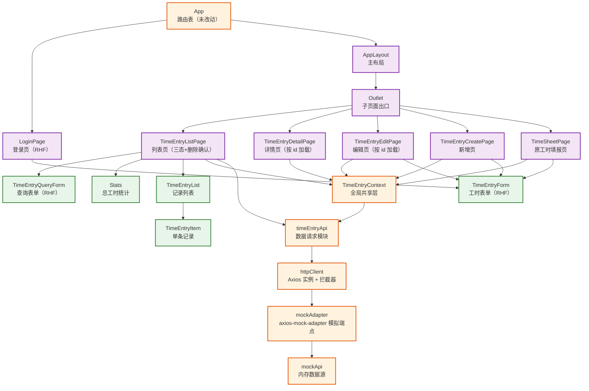

# React 工时填报应用（第2周：数据请求与增删改查）— 技术栈详解

> 本文按照从易到难的顺序，结合第 2 周「数据请求与增删改查」改造后的真实代码，逐一讲解数据请求层（Axios + axios-mock-adapter）与表单管理（React Hook Form）相关的知识点。每个知识点均参考 `学习资料/3 React生态与工程化/` 的编写格式，包含定义、示例、使用效果和注意事项。与 Axios、React Hook Form 核心知识点关系不大或超纲的内容（Context 错误状态与重试、列表三态、删除确认、按 id 加载、真实后端接入规划）分别归入「三、其他重构」「四、知识进阶点」，文末附「第 2 周需求与技术栈对照检查」与「学习路径建议」。
>
> **当前项目版本：** React `19.2.7`，TypeScript `~6.0.2`（`tsc --noEmit` 严格校验），新增 Axios `1.19.0`、React Hook Form `7.85.0`、`axios-mock-adapter` `2.1.0`。路由结构沿用第 1 周 `react-router-dom@^7.18.1`，本次未改动 `App.tsx` 路由表与既有页面路由。
>
> **前置准备（本项目已完成）：** 第 2 周三个依赖已在本次改造中安装。若在全新项目复现，安装命令为 `npm i axios react-hook-form` 与 `npm i -D axios-mock-adapter`（详见 `3.2 Axios.md` 的「创建请求实例」与 `3.3 React Hook Form.md` 的「表单 Hook 与字段注册」）。
>
> **当前项目范围说明：** 第 1 周已用现有技术栈（受控组件 + mockApi + Context）提前实现了独立新增页与列表查询；本次在第 1 周基础上引入真实「请求语义」——页面数据统一经 Axios 请求实例发起，由 `axios-mock-adapter` 在浏览器端模拟后端 REST 接口（`/api/time-entries/*`），业务代码只依赖数据请求模块 `timeEntryApi` 的函数签名。**真实后端接入点定在第 4 周**（随 Redux 异步数据流一并引入，届时移除 mock 注册即可，页面代码零改动），详见「四、知识进阶点」。

---

## 一、组件与模块依赖关系图

<div style="background:#fff;padding:20px;border-radius:8px;display:inline-block;width:100%">



</div>

### 组件与模块说明

| 组件 / 模块 | 职责 | 使用的知识点 |
|------|------|-------------|
| `src/api/httpClient.ts` | 统一请求实例：`baseURL: '/api'`、超时、请求/响应拦截器 | Axios 实例、拦截器 |
| `src/api/mockAdapter.ts` | 用 `axios-mock-adapter` 模拟后端 CRUD 端点，复用 `mockApi` 内存数据源 | mock 端点注册、正则匹配、状态码 |
| `src/api/timeEntryApi.ts` | CRUD 数据请求模块：列表/查询/详情/新增/编辑/删除，签名与 `mockApi` 一致 | 请求方法封装、类型契约 |
| `src/api/mockApi.ts` | 内存数据源（保留，不再被业务层直接调用） | 模块化数据源 |
| `TimeEntryContext` | 全局共享层：改消费请求模块，新增 `error` / `retry` | useCallback、try/catch/finally |
| `TimeEntryForm` | 工时表单：RHF 字段注册 + 校验 + 编辑预填 + 提交禁用 | useForm、register、Controller、reset、isSubmitting |
| `LoginPage` | 登录表单：RHF 必填校验 + 提交禁用 | useForm、register、isSubmitting |
| `TimeEntryQueryForm` | 查询表单：RHF 管理查询条件 + 查询/清空 | useForm、reset |
| `TimeEntryListPage` | 列表页：加载三态 + 重试 + 删除确认 | loading / error 条件渲染、window.confirm |
| `TimeEntryDetailPage` | 详情页：按 `useParams` 的 id 经请求模块加载 | useEffect、getEntryById |
| `TimeEntryEditPage` | 编辑页：按 id 加载并预填表单 | useEffect、getEntryById、reset |

### 数据流方向

```
页面组件 → timeEntryApi 函数（列表/查询/详情/新增/编辑/删除）
   ↓
httpClient（Axios 实例）
   ↓ 请求拦截器：已登录则附加 Authorization 头
mockAdapter（axios-mock-adapter 模拟 REST 端点）
   ↓ 匹配端点 + 状态码（200 / 201 / 404）
mockApi（内存数据源增删改查）
   ↓ 响应返回
httpClient 响应拦截器：成功原样返回；业务错误抛带提示文案的 Error；401 清登录态并跳转登录页
   ↓
业务数据回到页面 → 更新 Context 全局 entries / 本地展示
```

---

## 二、知识点详解（从易到难）

**目录**

- [Axios 篇](#axios-篇)
  - [1. 请求实例：axios.create 统一配置](#1-请求实例axioscreate-统一配置)
  - [2. 请求拦截器：统一附加登录凭证](#2-请求拦截器统一附加登录凭证)
  - [3. 响应拦截器：统一错误处理与登录失效](#3-响应拦截器统一错误处理与登录失效)
  - [4. axios-mock-adapter：模拟后端 CRUD 接口](#4-axios-mock-adapter模拟后端-crud-接口)
  - [5. 数据请求模块：封装统一 API](#5-数据请求模块封装统一-api)
- [React Hook Form 篇](#react-hook-form-篇)
  - [6. useForm 与字段注册：register](#6-useform-与字段注册register)
  - [7. 校验规则：required / valueAsNumber / validate](#7-校验规则required--valueasnumber--validate)
  - [8. Controller：桥接受控组件](#8-controller桥接受控组件)
  - [9. reset：编辑预填与提交后清空](#9-reset编辑预填与提交后清空)
  - [10. isSubmitting：提交中禁用按钮](#10-issubmitting提交中禁用按钮)
- [三、其他重构](#三其他重构)
  - [1. Context 接入请求层：error 与 retry](#1-context-接入请求层error-与-retry)
  - [2. 列表页三态与删除二次确认](#2-列表页三态与删除二次确认)
  - [3. 详情页 / 编辑页按 id 加载](#3-详情页--编辑页按-id-加载)
- [四、知识进阶点](#四知识进阶点)
  - [1. 从 mock 适配器到真实 WebAPI 的切换](#1-从-mock-适配器到真实-webapi-的切换)
- [五、第 2 周需求与技术栈对照检查](#五第-2-周需求与技术栈对照检查)
- [六、学习路径建议](#六学习路径建议)

---

## Axios 篇

### 1. 请求实例：axios.create 统一配置

#### 定义

项目接口通常有统一前缀（如 `/api`）。用 `axios.create` 创建一个请求实例，把 `baseURL`、超时时间等公共配置集中到一处，后续所有请求只写相对路径，避免每个请求重复书写前缀与配置。

#### 示例 — `src/api/httpClient.ts`

```ts
import axios from 'axios'

const httpClient = axios.create({
  baseURL: '/api',
  timeout: 10000,
})

export default httpClient
```

- **`baseURL: '/api'`**：统一拼接地址前缀，后续请求只需写 `/time-entries` 等相对路径，实际请求地址为 `/api/time-entries`
- **`timeout: 10000`**：请求超时 10 秒，超时自动中断并抛出错误
- **模块导出**：实例作为模块默认导出，请求模块、mock 适配器共用同一个实例，保证拦截器只注册一次

#### 使用效果

`httpClient.get('/time-entries')` 实际请求 `/api/time-entries`；超时、公共头等全局参数只需在实例创建处配置一次，所有请求自动生效。

#### 注意事项

- 实例是**单例**：拦截器、mock 适配器都挂在同一个实例上，全项目只有一份配置，便于整体替换（如第 4 周移除 mock）。
- 不要在业务组件里直接 `axios.get(...)` 散落请求，统一走实例（详见第 5 节「数据请求模块」）。

---

### 2. 请求拦截器：统一附加登录凭证

#### 定义

请求拦截器在**请求发出前**执行，可以把公共逻辑（附加 token、修改请求头）集中处理。本应用在登录后统一附加 `Authorization` 请求头，未登录时不附加。

#### 示例 — `src/api/httpClient.ts`

```ts
import { isLoggedIn, logout } from '../utils/auth'

httpClient.interceptors.request.use((config) => {
  if (isLoggedIn()) {
    config.headers.Authorization = 'Bearer mock-token'
  }
  return config
})
```

- **`interceptors.request.use`**：注册请求拦截器，传入 `config`（请求配置），处理后必须返回它
- **`isLoggedIn()`**：读取 `utils/auth.ts` 中的登录标志（localStorage）
- **`config.headers.Authorization`**：给请求头写入凭证字段；第 1 周登录态只用于路由守卫，本次起同时用于模拟「登录后才能请求数据」
- **未登录不附加**：`if` 判断保证未登录时请求头保持原样，不会出现空 token 头

#### 使用效果

登录状态下发起的任意请求都自动带上 `Authorization` 头；未登录时请求照常发起。所有请求凭证附加逻辑集中在一处，业务代码无感知。

#### 注意事项

- 拦截器是**集中管理**的体现：以后接真实后端，只需要把 token 的读取来源换成真实存储（如第 4 周引入的 token），业务代码不动。
- 拦截器必须 `return config`（或返回 `Promise.resolve(config)`），否则请求不会继续发送。

---

### 3. 响应拦截器：统一错误处理与登录失效

#### 定义

响应拦截器在**响应返回后**执行，分为成功与失败两个回调。失败回调可以统一做两件事：把「不可读的 axios 错误」转成「带可展示文案的 `Error`」，以及识别 `401`（登录失效）统一清除登录态并跳转登录页。

#### 示例 — `src/api/httpClient.ts`

```ts
httpClient.interceptors.response.use(
  (response) => response,
  (error) => {
    const status: number | undefined = error.response?.status
    if (status === 401) {
      logout()
      if (!window.location.pathname.startsWith('/login')) {
        window.location.href = '/login'
      }
    }
    const message: string = error.response?.data?.message ?? error.message ?? '请求失败'
    return Promise.reject(new Error(message))
  }
)
```

- **成功回调原样返回**：`(response) => response`——本次业务错误不依赖业务码，直接在失败回调里处理，成功响应原样交给业务层取 `response.data`
- **可选链安全访问**：`error.response?.status`——网络异常时 `error.response` 是 `undefined`，`?.` 避免直接访问属性报 TypeError（详见 `3.2 Axios.md` 第 4 节）
- **401 登录失效**：`logout()` 清除登录态；`pathname.startsWith('/login')` 判断避免已在登录页时重复跳转
- **错误信息归一**：优先取响应体 `data.message`（mock 端点 404 时返回的 `{ message: '记录不存在' }`），其次取 axios 原始 `error.message`，最后兜底 `'请求失败'`；统一用 `Promise.reject(new Error(message))` 抛出**带可展示文案**的异常

#### 使用效果

- 访问不存在的 id（mock 返回 404 + `{ message: '记录不存在' }`）→ 业务层 `catch` 到 `new Error('记录不存在')`，页面直接展示「未找到该工时记录」
- 登录失效（401）→ 自动清除登录态并跳转登录页
- 网络异常 → 抛出「请求失败」等兜底文案，页面展示加载失败而不白屏

#### 注意事项

- 拦截器「取过一次数据」后，业务层不要再重复取：本实现成功回调**原样返回 response**，因此业务层必须 `const { data } = await httpClient.get(...)` 取 `.data`；若改为拦截器返回 `response.data`，业务层就不能再取 `.data`（详见 `3.2 Axios.md` 常见陷阱 2）。本应用选择原样返回，与官方示例形态一致、语义清晰。
- `window.location.href = '/login'` 是全页跳转：在 SPA 中属于兜底手段（拦截器无法使用路由 Hook），第 4 周接入真实鉴权时可换成更精细的处理。

---

### 4. axios-mock-adapter：模拟后端 CRUD 接口

#### 定义

`axios-mock-adapter` 拦截指定 Axios 实例的请求，按「请求方法与 URL（支持字符串/正则）」匹配端点，返回模拟的 HTTP 状态码与响应体。它在浏览器内存中扮演「后端」，让第 2 周就能练习真实的请求语义（异步、状态码、错误响应），而无需真实服务器。

#### 示例 — `src/api/mockAdapter.ts`

```ts
import MockAdapter from 'axios-mock-adapter'
import httpClient from './httpClient'
import { getEntries, queryEntries, getEntryById, addEntry, updateEntry, deleteEntry } from './mockApi'

const mock = new MockAdapter(httpClient, { delayResponse: 300 })

// 列表 / 查询：带查询条件走过滤，否则返回全量
mock.onGet('/time-entries').reply((config) => {
  const params = config.params as TimeEntryQuery | undefined
  const hasQuery = Boolean(params && (params.projectName || params.description || params.approvalStatus))
  if (hasQuery) {
    return queryEntries(params as TimeEntryQuery).then((data) => [200, data])
  }
  return getEntries().then((data) => [200, data])
})

// 详情：正则匹配 /time-entries/任意id
mock.onGet(/\/time-entries\/.+$/).reply((config) => {
  const id = (config.url ?? '').split('/').pop() ?? ''
  return getEntryById(id).then(
    (data) => [200, data],
    (err) => [404, { message: err instanceof Error ? err.message : '记录不存在' }]
  )
})

// 新增
mock.onPost('/time-entries').reply((config) => {
  const body = JSON.parse(config.data) as Omit<TimeEntry, 'id' | 'createdAt'>
  return addEntry(body).then((data) => [201, data])
})

// 编辑 / 删除：正则匹配 id
mock.onPut(/\/time-entries\/.+$/).reply((config) => {
  const id = (config.url ?? '').split('/').pop() ?? ''
  const body = JSON.parse(config.data) as Partial<Omit<TimeEntry, 'id' | 'createdAt'>>
  return updateEntry(id, body).then(
    (data) => [200, data],
    (err) => [404, { message: err instanceof Error ? err.message : '记录不存在' }]
  )
})

mock.onDelete(/\/time-entries\/.+$/).reply((config) => {
  const id = (config.url ?? '').split('/').pop() ?? ''
  return deleteEntry(id).then(() => [200, { success: true }])
})

setupMockAdapter()
```

- **实例绑定**：`new MockAdapter(httpClient)`——只拦截传入的实例，与业务代码使用同一实例
- **`delayResponse: 300`**：模拟 300ms 网络延迟，让「加载中」状态可见（学习真实异步时序）
- **端点匹配**：`onGet` / `onPost` / `onPut` / `onDelete` 对应 GET / POST / PUT / DELETE；URL 既支持精确字符串（`/time-entries`），也支持正则（`/\/time-entries\/.+$/`）匹配带 id 的详情、编辑、删除端点
- **reply 回调**：`(config) => [status, data]` 返回「状态码 + 响应体」元组；支持返回 Promise（内部先经 mockApi 异步处理）
- **列表 vs 详情**：`/time-entries` 精确串注册在前、正则注册在后，匹配顺序不冲突（列表不带 id）
- **业务错误**：详情/编辑用 `Promise` 的失败分支返回 `[404, { message: '记录不存在' }]`，该响应经 httpClient 响应拦截器变成抛出的 `Error`（见第 3 节）

#### 使用效果

页面发起 `GET /api/time-entries` → 300ms 后返回内存中的 3 条记录；`POST` 新增返回 201 + 新记录；对不存在 id 的 `GET` 返回 404 + 「记录不存在」。Network 面板看不到真实网络请求（请求被 mock 拦截在内存层），这是**预期行为**，不是缺陷。

#### 注意事项

- mock 是「开发期替代品」：无真实延迟分布、CORS、状态码全貌，这些差异由真实接入（第 4 周）验证。
- `JSON.parse(config.data)`：`config.data` 是 axios 序列化后的请求体字符串，需手动解析；真实后端会自动反序列化，此处是 mock 层的模拟成本。
- mock 适配器在 `main.tsx` 通过 `import './api/mockAdapter'` 引入即注册（副作用导入）；移除这一行即可切换真实后端。

---

### 5. 数据请求模块：封装统一 API

#### 定义

把「列表查询、详情、新增、编辑、删除」整理为独立的请求函数模块，页面统一从这里取数据。函数签名与第 1 周的 `mockApi.ts` 完全一致，因此页面与 Context 只需替换 import 来源，业务代码几乎无感知——这也为第 4 周切真实后端提供稳定契约。

#### 示例 — `src/api/timeEntryApi.ts`

```ts
import httpClient from './httpClient'
import type { TimeEntry } from '../types/timeEntry'
import type { TimeEntryQuery } from './mockApi'

export async function getEntries(): Promise<TimeEntry[]> {
  const { data } = await httpClient.get<TimeEntry[]>('/time-entries')
  return data
}

export async function queryEntries(query: TimeEntryQuery): Promise<TimeEntry[]> {
  const { data } = await httpClient.get<TimeEntry[]>('/time-entries', { params: query })
  return data
}

export async function getEntryById(id: string): Promise<TimeEntry> {
  const { data } = await httpClient.get<TimeEntry>(`/time-entries/${id}`)
  return data
}

export async function addEntry(entry: Omit<TimeEntry, 'id' | 'createdAt'>): Promise<TimeEntry> {
  const { data } = await httpClient.post<TimeEntry>('/time-entries', entry)
  return data
}

export async function updateEntry(
  id: string,
  updates: Partial<Omit<TimeEntry, 'id' | 'createdAt'>>
): Promise<TimeEntry> {
  const { data } = await httpClient.put<TimeEntry>(`/time-entries/${id}`, updates)
  return data
}

export async function deleteEntry(id: string): Promise<void> {
  await httpClient.delete(`/time-entries/${id}`)
}
```

- **请求方法对应**：`get` 查询、`post` 新增、`put` 修改、`delete` 删除（与 `3.2 Axios.md` 基本用法一致）
- **泛型响应**：`httpClient.get<TimeEntry[]>` / `get<TimeEntry>` 让 `data` 具备类型提示，返回 `Promise<TimeEntry[]>` 等与 `mockApi` 形状一致
- **查询参数**：`queryEntries` 用 `{ params: query }` 把 `TimeEntryQuery` 对象序列化为查询串
- **路径参数**：模板字符串 `/time-entries/${id}` 拼接动态 id，对应 mock 的正则端点
- **签名契约**：与 `mockApi.ts` 的函数签名一一对应（`getEntries` / `queryEntries` / `getEntryById` / `addEntry` / `updateEntry` / `deleteEntry`），业务层不感知数据来自 mock 还是真实后端

#### 使用效果

`TimeEntryContext` 把 `import ... from '../api/mockApi'` 改成 `from '../api/timeEntryApi'` 后，列表、增删改查全部走请求模块；详情页/编辑页按 id 调 `getEntryById(id)` 加载单条记录。未来切真实后端时只需移除 mock 注册、调整 `baseURL`。

#### 注意事项

- **返回类型与响应拦截器约定要一致**：本实现成功回调原样返回 `response`，所以这里 `const { data } = await ...`；若拦截器改成直接返回 `response.data`，此处就不能再取 `.data`。
- 业务层**禁止直接 import `mockApi`**：它现在只作为 mock 适配器的内存数据源，是「模拟后端」，不是业务数据入口。

---

## React Hook Form 篇

### 6. useForm 与字段注册：register

#### 定义

`useForm<T>` 创建表单实例，`register('字段名')` 把输入框的 ref 与 name 注册进表单。字段值由 React Hook Form 通过 ref 直接读取（**非受控**），不需要为每个输入框手写 `value` + `onChange`，也不触发每次输入的组件重渲染。

#### 示例 — `TimeEntryForm.tsx`

```tsx
import { useForm } from 'react-hook-form'

interface TimeEntryFormValues {
  projectName: string
  description: string
  hours: number
  approvalStatus: ApprovalStatus
}

// 【React Hook Form useForm】创建表单实例后按需解构，所有成员作用于同一个实例：字段绑定 / 提交包装 / 受控桥接 / 数据写入 / 状态
const {
  register, 
  handleSubmit,
  control, 
  reset,
  formState: { errors, isSubmitting }, 
} = useForm<TimeEntryFormValues>({
  defaultValues: { projectName: '', description: '', hours: 1, approvalStatus: '待审批' },
})
```

- **`register`**：字段注册函数，把 `ref`、`name`、`onChange`、`onBlur` 一次性展开到原生输入框，非受控绑定字段（见下方「字段绑定」）
- **`handleSubmit`**：提交处理包装器，先跑全部校验，通过后才调用回调，参数就是校验后的字段值对象
- **`control`**：表单控制器引用，交给 `Controller` 桥接受控组件 `ApprovalStatusSelector`（见第 8 节）
- **`reset`**：把数据写入表单；编辑预填用 `reset(initialData)`，提交后清空用 `reset()`（见第 9 节）
- **`formState.errors`**：逐字段校验错误，按字段名取文案（如 `errors.hours.message`），各字段相互独立（见下方错误展示）
- **`formState.isSubmitting`**：提交中 Promise 未完成时为 `true`，用于禁用按钮防止重复提交（见第 10 节）

字段绑定（项目名称 / 工作内容 / 工时）：

```tsx
<input type="text" {...register('projectName')} placeholder="请输入项目名称" />
<textarea {...register('description')} placeholder="请描述工作内容" rows={3} />
<input type="number" step="0.5" min="0.5" {...register('hours')} />
```

- **泛型**：`useForm<TimeEntryFormValues>` 让字段名、值都有类型提示
- **展开注册**：`{...register('projectName')}` 把 `ref`、`name`、`onChange`、`onBlur` 等一次性展开到输入框，字段即被管理
- **非受控**：不再写 `value={projectName}` 和 `onChange` 手动 setState；值是输入框自身的 DOM 值，提交时由 `handleSubmit` 收集
- **defaultValues**：表单初始值；仅在首次挂载时生效（异步回填要靠 `reset`，见第 9 节）
- **`<form onSubmit={handleSubmit(handleFormSubmit)}>`**：`handleSubmit` 内部先跑全部校验，通过后才调用回调，参数就是校验后的字段值对象

#### 使用效果

三个字段无需任何受控 state；输入「abc」不再触发组件重渲染。对比第 1 周 `TimeEntryForm` 的 4 个 `useState` + 手工 `validate()`，代码量明显减少，且登录页、查询表单复用同一套写法。

#### 注意事项

- **`register` 与手写受控 `value`/`onChange` 冲突**：注册后不要再手动设置 `value`/`onChange`，否则输入框无法输入（详见 `3.3 React Hook Form.md` 常见陷阱 1）。
- `register` 只适配原生输入组件；`ApprovalStatusSelector` 等自定义受控组件要用 `Controller`（见第 8 节）。

---

### 7. 校验规则：required / valueAsNumber / validate

#### 定义

`register('字段', 规则对象)` 的第二个参数是校验规则：`required` 做必填校验（值即错误文案），`validate` 自定义函数（返回 `true` 通过、返回字符串即错误文案），`valueAsNumber` 把输入字符串转成数字再校验。

#### 示例 — `TimeEntryForm.tsx` 的工时字段

```tsx
{...register('hours', {
  required: '工时必须大于 0',
  valueAsNumber: true,
  validate: (value) => {
    if (!value || Number.isNaN(value) || value <= 0) return '工时必须大于 0'
    return Math.round(value * 2) === value * 2 || '工时必须是 0.5 的倍数'
  },
})}
```

错误展示：

```tsx
{errors.hours && <span className={styles.error}>{errors.hours.message}</span>}
```

项目名称与工作内容：

```tsx
{...register('projectName', { required: '项目名称不能为空' })}
{...register('description', { required: '工作内容不能为空' })}
```

- **`required: '文案'`**：校验规则的值就是错误提示文案，空值时不通过
- **`valueAsNumber: true`**：`type="number"` 输入框的值转为数字，`validate` 拿到的就是 `number`（而非字符串）；空输入转出来是 `NaN`
- **自定义 `validate`**：`Number.isNaN` 排除空输入；`value <= 0` 拦截非正数；`Math.round(value * 2) === value * 2` 判断「乘以 2 后是否为整数」，从而只允许整数和 0.5 的倍数（避免浮点精度问题）
- **逐字段错误**：`errors.hours` / `errors.projectName` / `errors.description` 相互独立，各字段下方展示自己的文案

#### 使用效果

空提交时三个必填字段分别显示「不能为空」提示；工时填 `0` 或 `1.3` 显示「工时必须大于 0 / 工时必须是 0.5 的倍数」；全部通过才调用提交回调。登录页的「用户名/密码必填」、查询表单同构复用。

#### 注意事项

- `required` 与 `valueAsNumber` 的组合：空输入转成 `NaN` 后由 `validate` 兜底拦截（`Number.isNaN`），保证错误文案统一。
- 校验规则用**对象形式**并为每条配置 `message`，比手写 `if/else` 更声明式（详见 `3.3 React Hook Form.md` 最佳实践 2）。

---

### 8. Controller：桥接受控组件

#### 定义

`ApprovalStatusSelector` 是「值 + 回调」的受控组件（`value` / `onChange`），无法用 `register` 展开。`Controller` 把 RHF 表单与这类受控组件桥接起来：RHF 负责值存储与校验，`Controller` 的 `render` 回调把 `field`（含 `value`、`onChange`）交给组件。

#### 示例 — `TimeEntryForm.tsx`

```tsx
import { useForm, Controller } from 'react-hook-form'

<Controller
  control={control}
  name="approvalStatus"
  render={({ field }) => (
    <ApprovalStatusSelector value={field.value} onChange={field.onChange} />
  )}
/>
```

- **`control`**：`useForm` 返回的表单控制器，把字段值联动交给 `Controller`
- **`name`**：与 `TimeEntryFormValues` 中的 `approvalStatus` 字段对应
- **`render({ field })`**：`field.value` 是当前值，`field.onChange` 是更新函数；传给受控组件的 `value` / `onChange` props
- **作用**：用户点选审批状态按钮时，`onChange` 更新 RHF 内部值；提交时 `handleSubmit` 收集到的是最新选中值

#### 使用效果

审批状态三个按钮的选中样式、值读写与新增/编辑预填（`reset`）全部由 RHF 管理，与项目名、工时等 `register` 字段共享同一套 `formState`。

#### 注意事项

- 只对**必须受控**的组件用 `Controller`；原生输入优先 `register`（非受控、性能更好）。
- `Controller` 的 `name` 必须与表单类型字段名一致，否则类型与取值对不上（详见 `3.3 React Hook Form.md` 常见陷阱 4）。

---

### 9. reset：编辑预填与提交后清空

#### 定义

`useForm` 的 `defaultValues` 只在首次挂载生效，异步拿到的数据必须用 `reset()` 写入表单。`reset(数据)` 预填编辑数据；`reset()` 无参调用清空字段。

#### 示例 — `TimeEntryForm.tsx`

```tsx
useEffect(() => {
  if (initialData) {
    reset({
      projectName: initialData.projectName,
      description: initialData.description,
      hours: initialData.hours,
      approvalStatus: initialData.approvalStatus,
    })
  } else {
    reset({ projectName: '', description: '', hours: 1, approvalStatus: '待审批' })
  }
}, [initialData, reset])

const handleFormSubmit = async (values: TimeEntryFormValues) => {
  await onSubmit({ ... })
  if (!initialData) {
    reset({ projectName: '', description: '', hours: 1, approvalStatus: '待审批' })
  }
}
```

- **`useEffect` 依赖 `[initialData, reset]`**：编辑记录变化时重新预填；新增模式（`initialData` 为 `null`）恢复默认值
- **编辑预填**：`initialData` 是编辑页经 `getEntryById` 异步加载到的记录（或旧页面 `TimeSheetPage` 的 `editingEntry`），`reset` 把四个字段写进表单
- **提交后清空**：新增模式提交成功后 `reset()` 恢复默认值，方便连续录入；编辑模式不重置（提交后由父组件收起编辑态）
- **异步预填的正确姿势**：`reset` 而非依赖 `defaultValues` 或手动 setState——异步数据到来后组件已渲染，`defaultValues` 不会再生效（详见 `3.3 React Hook Form.md` 常见陷阱 2）

#### 使用效果

- 编辑页 `/timesheet/:id/edit`：记录加载完成后表单自动显示该项目名/内容/工时/审批状态，改后保存
- 新增页 / 旧页面新增：提交成功后表单清空、审批状态回到「待审批」
- 编辑→取消：`initialData` 变回 `null`，`useEffect` 触发 `reset` 恢复默认值

#### 注意事项

- `reset` 是**把数据写入表单**的唯一可靠方式（区别于 `setValue`），编辑/新增共用同一组件全靠它切换。
- `useEffect` 依赖数组要带上 `reset`（RHF 返回的函数引用稳定），避免 lint 告警。

---

### 10. isSubmitting：提交中禁用按钮

#### 定义

`formState.isSubmitting` 在 `onSubmit` 回调返回的 Promise **完成前**为 `true`。用它禁用提交按钮并切换文案，防止用户重复提交。

#### 示例 — `TimeEntryForm.tsx` 与 `LoginPage.tsx`

```tsx
const { formState: { errors, isSubmitting } } = useForm<TimeEntryFormValues>(...)

<button type="submit" className={styles.submitBtn} disabled={isSubmitting}>
  {isSubmitting ? '提交中...' : initialData ? '保存修改' : '提交'}
</button>
```

登录页同构：

```tsx
<button type="submit" className={styles.submitBtn} disabled={isSubmitting}>
  {isSubmitting ? '登录中...' : '登录'}
</button>
```

- **`isSubmitting` 语义**：`onSubmit` 是 `async`，其内 `await onSubmit(...)` 调用接口期间，`isSubmitting` 保持 `true`
- **`disabled={isSubmitting}`**：提交期间按钮不可点，从源头防止连点
- **文案切换**：三元表达式根据状态切换「提交中...」与「提交/保存修改/登录」

#### 使用效果

mock 适配器有 300ms 延迟，点「提交」后按钮立即变成「提交中...」且不可再点；请求完成后恢复。用户无法重复提交产生多条相同记录。

#### 注意事项

- 只有 `onSubmit` 返回 Promise 时 `isSubmitting` 才会自动恢复；异步提交必须写 `async` + `await`。
- 提交失败时按钮同样会恢复（Promise 结束即复位），不会卡在禁用态。

---

## 三、其他重构

> 以下内容与 Axios、React Hook Form 核心知识点关系不大，属于第 2 周「增删改查」功能在既有技术（React 状态 + Context + `window.confirm`）内的界面实现。为保持主章节聚焦「数据请求与表单」，统一归入本节；本节小章节独立编号（第 1-3 节），与「二、知识点详解」的编号互不干扰。

### 1. Context 接入请求层：error 与 retry

#### 定义

`TimeEntryContext` 从「直接调用内存 `mockApi`」改为「消费请求模块 `timeEntryApi`」，并补充列表加载失败的 `error` 状态与 `retry` 重试能力——列表加载失败的界面反馈由「静默失败」升级为「可见错误 + 可重试」。

#### 示例 — `TimeEntryContext.tsx`

```tsx
const [entries, setEntries] = useState<TimeEntry[]>([])
const [loading, setLoading] = useState(true)
const [error, setError] = useState<string | null>(null)

const loadEntries = useCallback(async () => {
  setLoading(true)
  setError(null)
  try {
    const data = await getEntries()
    setEntries(data)
  } catch (e) {
    setError(e instanceof Error ? e.message : '加载失败')
  } finally {
    setLoading(false)
  }
}, [])

useEffect(() => {
  loadEntries()
}, [loadEntries])

// 增删改操作：addEntry / updateEntry / deleteEntry 改为调用请求模块并同步全局 entries
return { entries, loading, error, retry: loadEntries, addEntry, updateEntry, deleteEntry, queryEntries }
```

- **import 替换**：`from '../api/mockApi'` → `from '../api/timeEntryApi'`，函数签名一致，调用点几乎无改动
- **`useCallback` 包装 `loadEntries`**：保证函数引用稳定，作为 `useEffect` 依赖不会每次渲染都重新执行
- **`try / catch / finally`**：成功更新 `entries`；失败把可展示文案写入 `error`；无论成败 `finally` 都结束 `loading`（避免卡在加载中）
- **`error` 类型**：`string | null`——`null` 表示无错误，与 `loading` 组合成「加载中 / 失败 / 就绪」三态
- **`retry: loadEntries`**：重试即重新执行初始加载；`useCallback` 让 `retry` 也可安全传给列表页按钮

#### 使用效果

列表页挂载 → `loading=true` 显示「加载中」；请求失败 → `error` 有值，列表页显示「加载失败：xxx + 重试」；点重试 → 重新请求。增删改操作与 `entries` 全局状态保持一致（新增前置、编辑替换、删除过滤）。

#### 注意事项

- `catch` 里用 `instanceof Error` 判型取 `message`——响应拦截器抛出的正是带文案的 `Error`（见「二、第 3 节」），保证 `error` 可直接展示。
- Context 保留为全局共享层是**临时结构**：第 4 周迁移 Redux 时移除，届时列表/详情加载改由 `createAsyncThunk` 承担（见「四、知识进阶点」）。

---

### 2. 列表页三态与删除二次确认

#### 定义

列表页按 Context 的 `loading` / `error` 渲染三种状态（加载中 / 加载失败 + 重试 / 空数据），并在删除前用 `window.confirm` 二次确认，取消则不删除。

#### 示例 — `TimeEntryListPage.tsx`

```tsx
const { entries, loading, error, retry, deleteEntry, queryEntries } = useTimeEntries()

{loading ? (
  <p className={styles.status}>加载中...</p>
) : error ? (
  <div className={styles.status}>
    <p className={styles.errorText}>加载失败：{error}</p>
    <button type="button" onClick={retry} className={styles.retryBtn}>重试</button>
  </div>
) : (
  <>
    <Stats totalHours={totalHours} />
    <TimeEntryList ... />
  </>
)}
```

删除确认：

```tsx
const handleDelete = async (id: string) => {
  if (!window.confirm('确定删除该工时记录吗？')) return
  await deleteEntry(id)
  setFiltered((prev) => (prev ? prev.filter((e) => e.id !== id) : prev))
}
```

- **三态顺序**：先判 `loading`（加载中），再判 `error`（失败），否则就绪（渲染列表；空数据由 `TimeEntryList` 内部显示「暂无工时记录」）
- **`window.confirm`**：返回 `true` 才继续删除；取消返回 `false` 直接 `return`，不调用 `deleteEntry`
- **删除后同步查询结果**：处于查询过滤状态时，本地 `filtered` 也过滤掉被删记录，保持可见列表一致

#### 使用效果

首次进入显示「加载中」（mock 300ms 延迟可见）；加载失败显示红色错误文案 + 重试按钮；无记录显示「暂无工时记录」；点删除弹出确认框，确认后记录即时消失。

#### 注意事项

- 三态只覆盖**初始列表加载**；查询、增删改的独立错误可按需另做反馈，本次保持最小实现。
- 删除确认用 `window.confirm` 满足 spec 且零依赖；设计文档已注明可换自绘弹层，不影响规格。

---

### 3. 详情页 / 编辑页按 id 加载

#### 定义

第 1 周详情/编辑页是从 Context 全局 `entries` 里 `find` 记录；本次改为**按路由标识经请求模块 `getEntryById(id)` 单独加载**——与「增删改查经统一请求层」的形态一致，并为第 4 周 Redux 异步数据流（`createAsyncThunk` 按 id 拉取）做铺垫。

#### 示例 — `TimeEntryDetailPage.tsx`

```tsx
const { id } = useParams()
const [entry, setEntry] = useState<TimeEntry | null>(null)
const [loading, setLoading] = useState(true)
const [error, setError] = useState<string | null>(null)

useEffect(() => {
  if (!id) return
  setLoading(true)
  setError(null)
  getEntryById(id)
    .then((data) => setEntry(data))
    .catch((err) => setError(err instanceof Error ? err.message : '加载失败'))
    .finally(() => setLoading(false))
}, [id])

if (loading) return <p className={styles.status}>加载中...</p>
if (error || !entry) {
  return (
    <div className={styles.status}>
      <p className={styles.errorText}>{error === '记录不存在' ? '未找到该工时记录' : '加载失败'}</p>
      <Link to="/" className={styles.backLink}>返回列表</Link>
    </div>
  )
}
```

编辑页同构：`getEntryById(id)` 加载后把记录作为 `initialData` 传给 `TimeEntryForm`（RHF `reset` 预填），并处理「加载中」「记录不存在」，取消/保存后返回列表。

- **`useEffect` 依赖 `[id]`**：id 变化时重新加载
- **错误文案复用**：响应拦截器把 404 转成 `Error('记录不存在')`，页面据此区分「未找到」与「加载失败」两种提示
- **三段式渲染**：加载中 → 不存在/失败 → 正常展示，`getEntryById` 在 `loading` 之后执行，避免数据未到时误判

#### 使用效果

访问 `/timesheet/2` 先显示「加载中」，随后展示 id=2 的记录详情；访问不存在的 id 显示「未找到该工时记录 + 返回列表」。编辑页加载完成后表单自动预填，改后保存返回列表。

#### 注意事项

- 详情页 / 编辑页不再依赖 Context 的 `entries` 是否已加载，两者解耦——即使列表加载失败，详情页仍可独立加载。
- 由「从全局 `find`」到「按 id 请求」是第 2 周 spec 的明确要求（数据经统一请求层加载），同时是第 4 周 Redux 异步数据流的形态预演。

---

## 四、知识进阶点

> 本节收录超纲/规划内容：mock 适配器与真实 WebAPI 的切换时机，属于第 4、6 周的学习规划，提前在此说明以明确当前设计的「可切换」边界。小章节独立编号，从 1 开始。

### 1. 从 mock 适配器到真实 WebAPI 的切换

#### 当前形态（第 2 周）

```
timeEntryApi（业务契约）→ httpClient（/api 前缀）→ mockAdapter（内存模拟）→ mockApi
```

业务代码只依赖 `timeEntryApi` 的函数签名与返回类型，不感知请求是真是假。mock 适配器在 `main.tsx` 通过 `import './api/mockAdapter'` 副作用注册。

#### 第 4 周切换（随 Redux 异步数据流）

- 引入真实后端与 Redux Toolkit：列表/详情加载改由 `createAsyncThunk` 经请求层衔接真实 HTTP 请求，练习「进行中 / 成功 / 失败」在全局状态下的真实流转（真实延迟、CORS、状态码）
- 移除 `main.tsx` 中的 `import './api/mockAdapter'` 并配置 Vite dev 代理（`/api` → 真实服务器）
- 由于业务代码只依赖 `timeEntryApi` 签名，切换时**页面代码零改动**；Context 全局层由 Redux 取代

#### 第 6 周收尾

- 用环境变量 `VITE_API_BASE_URL` 区分开发/生产后端地址，完成生产构建验证

#### 使用效果

「先 mock 后接真实」让第 2 周就能完整练习请求语义（拦截器、状态码、错误流），且不阻塞后续周次：切换成本被收敛为「移除一行 import + 配置代理」，业务契约稳定。

#### 注意事项

- 学习期 Network 面板看不到请求、无真实延迟/CORS 差异，**属预期**，由第 4 周真实接入验证，不算缺陷。
- 若某天接口返回结构变化，优先改 `timeEntryApi` 的解析层，保持页面契约稳定。

---

## 五、第 2 周需求与技术栈对照检查

### 技术栈覆盖

| 技术 | 计划要求 | 实现情况 |
|------|---------|---------|
| Axios | HTTP 客户端 + 拦截器 + 统一错误处理 | ✅ `axios@1.19.0`：`httpClient` 实例、请求拦截器附加凭证、响应拦截器错误归一与 401 跳转 |
| axios-mock-adapter | 开发期模拟后端接口 | ✅ `@2.1.0`：`mockAdapter` 注册列表/查询/详情/新增/编辑/删除端点，复用 `mockApi` 内存数据源 |
| React Hook Form | 表单库管理输入与验证 | ✅ `@7.85.0`：`useForm` / `register` / `Controller` / `reset` / `isSubmitting` |
| 数据请求模块 | 列表、详情、新增、编辑、删除统一 API | ✅ `src/api/timeEntryApi.ts`，签名与 `mockApi` 一致 |
| 加载状态管理 | 加载中 / 失败 / 空数据三态 | ✅ Context `loading` / `error` + 列表页三态渲染与重试 |

> **未引入（符合计划）：** 未引入 Redux（第 4 周）、Ant Design / xlsx（第 3、4 周）、真实后端（第 4 周）。第 4 周前数据仍来自 mock，但已具备真实请求语义。

### 第 2 周产出确认

| 计划产出 | 完成情况 |
|---------|---------|
| ④ **增**：新增表单（表单库 + 验证） | ✅ `TimeEntryForm` 用 RHF：必填 + 工时规则 + 提交中禁用；新增页 `/timesheet/create` 与旧页面共用 |
| ④ **删**：删除确认 + 成功后即时更新列表 | ✅ `window.confirm` 二次确认；`deleteEntry` 后全局/过滤视图即时移除 |
| ④ **改**：编辑表单（复用新增表单，预填数据） | ✅ 编辑页按 id 加载，`reset(initialData)` 预填；旧页面内联编辑兼容 |
| ④ **查**：列表数据加载 + 详情数据加载 | ✅ 列表经请求模块加载（三态）；详情/编辑按 id 经 `getEntryById` 加载 |
| 请求统一封装（拦截器 + 错误处理） | ✅ `httpClient.ts`：凭证附加、错误文案归一、401 清登录态跳登录页 |
| 数据请求模块（列表、详情、新增、编辑、删除） | ✅ `timeEntryApi.ts`：6 个函数，类型契约与 `mockApi` 一致 |

### 边界与说明

- 登录仍为前端模拟：本次请求拦截器附加的 `Authorization` 头是模拟凭证（`'Bearer mock-token'`），真实鉴权在第 5、6 周引入。
- 三个表单（`TimeEntryForm` / `LoginPage` / `TimeEntryQueryForm`）统一迁移至 React Hook Form，项目内不再存在第二套「手写 `useState` + 手工 `validate`」的表单范式。
- `TimeEntryForm` 的 `onSubmit` / `initialData` / `onCancel` props 接口保持不变；旧页面 `TimeSheetPage` 的既有增删改查交互不受影响（已手动回归通过）。
- `mockApi.ts` 保留作为 mock 适配器的内存数据源，不再被业务层直接引用；`TimeEntry` / `ApprovalStatus` 类型与路由结构未改动。
- 验证结果：`npm run typecheck` / `lint` / `build` 全部通过；请求层冒烟测试（列表/过滤/详情/新增/编辑/删除/404 错误文案）8 项全部通过。

---

## 六、学习路径建议

按照从易到难的顺序，建议按以下路径学习第 2 周代码：

1. **请求实例与拦截器**（Axios 第 1-3 节）→ 理解「统一请求层」：实例配置、凭证附加、错误归一、登录失效跳转
2. **mock 适配器**（Axios 第 4 节）→ 理解「无后端时的请求语义」：端点注册、正则匹配、状态码、业务错误
3. **数据请求模块**（Axios 第 5 节）→ 理解「业务契约」：函数签名稳定，为切真实后端铺路
4. **表单库三件套**（RHF 第 6-7 节）→ `useForm` / `register` + 校验规则，替换手写受控表单
5. **受控组件与编辑复用**（RHF 第 8-9 节）→ `Controller` 桥接、`reset` 预填/清空
6. **提交体验**（RHF 第 10 节）→ `isSubmitting` 禁用按钮，防止重复提交
7. **页面层功能**（「三、其他重构」第 1-3 节）→ Context 错误/重试、列表三态与删除确认、按 id 加载
8. **真实接入规划**（「四、知识进阶点」第 1 节）→ 理解「先 mock 后接真实」的切换点（第 4 周 Redux + Vite 代理）

每个知识点均可对照 `学习资料/3 React生态与工程化/3.2 Axios.md`、`3.3 React Hook Form.md` 深入学习；第 3 周将在此基础上接入 xlsx 导出，第 4 周迁移 Redux 异步数据流并接入真实后端。
