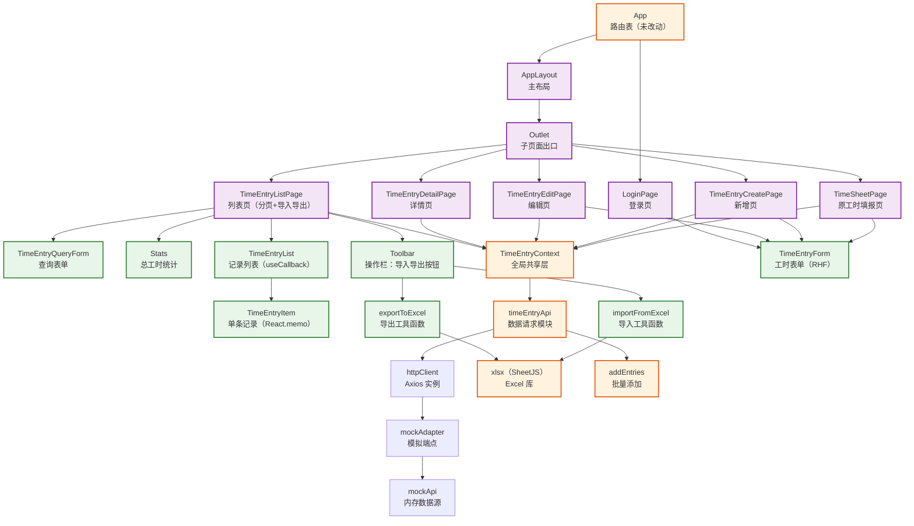

# React 工时填报应用（第3周：导入导出与列表性能优化）— 技术栈详解

> 本文按照从易到难的顺序，结合第 3 周「导入导出与列表性能优化」改造后的真实代码，逐一讲解 xlsx（SheetJS）Excel 导入导出与 React.memo / useCallback 列表性能优化相关的知识点。每个知识点均参考 `学习资料/3 React生态与工程化/` 的编写格式，包含定义、示例、使用效果和注意事项。与 xlsx、memo 核心知识点关系不大或超纲的内容（列表分页、操作栏布局、批量添加接口、导入流程集成）分别归入「三、其他重构」「四、知识进阶点」，文末附「第 3 周需求与技术栈对照检查」与「学习路径建议」。
>
> **当前项目版本：** React `19.2.7`，TypeScript `~6.0.2`（`tsc --noEmit` 严格校验），新增 `xlsx`（SheetJS）。路由结构沿用第 1 周 `react-router-dom@^7.18.1`，数据请求层沿用第 2 周 Axios + axios-mock-adapter。
>
> **前置准备（本项目已完成）：** `xlsx` 依赖已在本次改造中安装于 `react-app/package.json`。若在全新项目复现，安装命令为 `npm i xlsx`（详见 `3.4 xlsx（SheetJS）.md` 的「基本用法」章节）。
>
> **当前项目范围说明：** 本次在第 2 周数据请求层基础上新增 xlsx 导入导出能力，并对列表页进行前端分页与 `React.memo` / `useCallback` 性能优化。真实后端仍由 mock adapter 模拟，业务代码只依赖 `timeEntryApi` 函数签名与 `utils/excel.ts` 纯函数。

---

## 一、组件与模块依赖关系图

<div style="background:#fff;padding:20px;border-radius:8px;display:inline-block;width:100%">



</div>

### 组件与模块说明

| 组件 / 模块 | 职责 | 使用的知识点 |
|------|------|-------------|
| `src/utils/excel.ts` | 纯函数工具模块：导出 `exportToExcel` / `importFromExcel`，不涉及 React | xlsx 读写 API、FileReader、Blob 下载 |
| `src/api/timeEntryApi.ts` | 新增 `addEntries` 批量添加接口（第 2 周扩展） | 请求方法封装、类型契约 |
| `src/api/mockApi.ts` | 新增 `addEntries` 批量写入内存数据源 | 模块化数据源、for...of 逐条写入 |
| `src/api/mockAdapter.ts` | 新增 `/time-entries/batch` POST 端点 | 正则匹配、批量端点注册 |
| `TimeEntryListPage` | 列表页：操作栏（导入导出）+ 分页状态 + 切片数据 | useState、useCallback、Array.slice |
| `TimeEntryList` | 记录列表：useCallback 稳定回调引用 | useCallback、回调透传 |
| `TimeEntryItem` | 单条记录：React.memo 缓存，props 未变时跳过渲染 | memo、浅比较 |
| `TimeEntryQueryForm` | 查询表单（沿用第 2 周 RHF） | 查询条件变化重置分页 |

`src/utils/excel.ts` 是纯函数工具模块，**唯一调用方是 `src/pages/TimeEntryListPage.tsx`**。

- **导出**：`exportToExcel` 的调用关系详见「二、知识点详解 → xlsx（SheetJS）篇 → 2. 导出 Excel」
- **导入**：`importFromExcel` 的调用关系详见「二、知识点详解 → xlsx（SheetJS）篇 → 3. 导入 Excel」

### 数据流方向

```
列表渲染优化：
  TimeEntryListPage 重渲染 → handleEdit / handleDelete / onViewDetail（useCallback 稳定引用）
     |
  TimeEntryList 接收稳定回调 → TimeEntryItem（React.memo 浅比较 props）
     |
  entry 未变化 → 跳过渲染（复用上一次输出）
```

---

## 二、知识点详解（从易到难）

**目录**

- [xlsx（SheetJS）篇](#xlsxsheetjs篇)
  - [1. 依赖安装与导入方式](#1-依赖安装与导入方式)
  - [2. 导出 Excel：json_to_sheet + write + Blob 下载](#2-导出-exceljson_to_sheet--write--blob-下载)
  - [3. 导入 Excel：FileReader + read + sheet_to_json](#3-导入-excelfilereader--read--sheet_to_json)
  - [4. 字段映射：正向与反向表头转换](#4-字段映射正向与反向表头转换)
  - [5. 导入数据校验：逐条验证与结果反馈](#5-导入数据校验逐条验证与结果反馈)
- [React.memo / useCallback 篇](#reactmemo--usecallback-篇)
  - [6. React.memo：组件缓存与浅比较](#6-reactmemo组件缓存与浅比较)
  - [7. useCallback：回调函数引用稳定化](#7-usecallback回调函数引用稳定化)
  - [8. memo + useCallback 的配合原理](#8-memo--usecallback-的配合原理)
- [三、其他重构](#三其他重构)
  - [1. 列表前端分页](#1-列表前端分页)
  - [2. 操作栏布局：Stats 与导入导出按钮](#2-操作栏布局stats-与导入导出按钮)
  - [3. 批量添加接口与 mock 端点扩展](#3-批量添加接口与-mock-端点扩展)
  - [4. 导入流程集成：文件选择到列表刷新](#4-导入流程集成文件选择到列表刷新)
- [四、知识进阶点](#四知识进阶点)
  - [1. xlsx 库体积与按需加载](#1-xlsx-库体积与按需加载)
  - [2. 性能优化原则：先确认再优化](#2-性能优化原则先确认再优化)
  - [3. Blob：二进制数据的桥梁](#3-blob二进制数据的桥梁)
- [五、第 3 周需求与技术栈对照检查](#五第-3-周需求与技术栈对照检查)
- [六、学习路径建议](#六学习路径建议)

---

## xlsx（SheetJS）篇

### 1. 依赖安装与导入方式

#### 定义

xlsx（SheetJS）是前端最流行的表格文件处理库，支持在浏览器中读取与生成 `.xlsx`、`.xls`、`.csv` 等格式文件。它无需任何服务器支持，即可完成工作表数据的解析、转换与生成。本项目在 `react-app/package.json` 中安装，通过 `import * as XLSX from 'xlsx'` 导入全部 API。

#### 示例 — 安装与导入

```bash
# 在 react-app 目录下安装
npm i xlsx
```

```ts
// utils/excel.ts
import * as XLSX from 'xlsx'
import type { TimeEntry } from '../types/timeEntry'
```

- **`npm i xlsx`**：在 `react-app/package.json` 中添加 xlsx 依赖，根目录的 package.json 中已有但应用代码无法引用
- **`import * as XLSX`**：星号导入将 xlsx 的所有导出绑定到 `XLSX` 命名空间，后续通过 `XLSX.utils.*`、`XLSX.read`、`XLSX.write` 访问各 API

#### 使用效果

安装后 `import` 不报错，TypeScript 类型提示正常（xlsx 自带 `@types` 或内置类型声明），可直接使用 `XLSX.utils.json_to_sheet` 等 API。

#### 注意事项

- xlsx 包体积较大（约 500KB），可能影响首屏加载。当前为学习项目可接受；生产环境可考虑按需加载或使用更轻量的库（详见「四、知识进阶点」）。
- 安装位置必须在 `react-app/package.json` 而非根目录 package.json，否则应用代码无法引用。

---

### 2. 导出 Excel：json_to_sheet + write + Blob 下载

#### 定义

导出流程分为三步：① 将对象数组转为工作表（`json_to_sheet`）；② 将工作表写入 workbook 并生成二进制 buffer（`write`）；③ 创建 Blob 对象并触发浏览器下载。

#### 示例 — 调用方：`TimeEntryListPage.tsx` 的按钮与回调

```tsx
import { exportToExcel } from '../utils/excel'

// 导出按钮
<button onClick={handleExport} disabled={visibleEntries.length === 0}>
  导出
</button>

// 导出回调
const handleExport = useCallback(() => {
  exportToExcel(visibleEntries)   // 传入当前可见记录，触发浏览器下载
}, [visibleEntries])
```

#### 示例 — `src/utils/excel.ts` 的 `exportToExcel`

```ts
// 表头映射：英文字段 → 中文列名
const headerMap: Record<keyof TimeEntry, string> = {
  id: 'ID',
  projectName: '项目名称',
  description: '工作内容',
  hours: '工时数',
  approvalStatus: '审批状态',
  createdAt: '创建时间',
}

export function exportToExcel(entries: TimeEntry[], filename: string = '工时记录.xlsx') {
  // 将数据转换为带中文表头的对象数组
  const data = entries.map((entry) =>
    Object.fromEntries(
      Object.keys(headerMap).map((key) => [
        headerMap[key as keyof TimeEntry],
        entry[key as keyof TimeEntry],
      ])
    )
  )

  // 创建工作表
  const worksheet = XLSX.utils.json_to_sheet(data)

  // 创建工作簿并添加工作表
  const workbook = XLSX.utils.book_new()
  XLSX.utils.book_append_sheet(workbook, worksheet, '工时记录')

  // 生成 Excel 文件并转为 Blob
  const excelBuffer = XLSX.write(workbook, { bookType: 'xlsx', type: 'array' })
  const blob = new Blob([excelBuffer], {
    type: 'application/vnd.openxmlformats-officedocument.spreadsheetml.sheet',
  })

  // 创建临时下载链接触发浏览器下载
  const url = URL.createObjectURL(blob)
  const link = document.createElement('a')
  link.href = url
  link.download = filename
  document.body.appendChild(link)
  link.click()

  // 下载后清理链接
  document.body.removeChild(link)
  URL.revokeObjectURL(url)
}
```

- **`headerMap`**：定义英文字段名到中文列名的映射，`json_to_sheet` 接收的对象使用中文键名，Excel 中显示中文表头
- **`Object.fromEntries` + `Object.keys(headerMap).map`**：遍历所有字段，将每条记录转换为 `{ '项目名称': 'React 学习', '工作内容': '...' }` 形式的对象
- **`XLSX.utils.json_to_sheet(data)`**：将对象数组转为工作表对象，自动生成列标题（取所有对象键的并集）
- **`XLSX.utils.book_new()` + `book_append_sheet`**：创建空工作簿并把工作表放入，命名为「工时记录」
- **`XLSX.write(workbook, { bookType: 'xlsx', type: 'array' })**：将工作簿写入 ArrayBuffer（`type: 'array'` 返回 `Uint8Array`），`bookType` 指定输出格式
- **`new Blob([...], { type: '...' })`**：将二进制数据包装为 Blob 对象，MIME 类型为 Excel 文件的标准 MIME
- **`URL.createObjectURL(blob)`**：为 Blob 生成一个临时 URL（形如 `blob:http://localhost:5173/xxx`），赋给 `<a>` 标签的 `href`
- **`link.click()`**：模拟用户点击链接触发浏览器下载；下载完成后 `removeChild` 移除临时链接、`revokeObjectURL` 释放内存

#### 使用效果

点击列表页「导出」按钮 → 浏览器立即弹出下载对话框（或自动下载到默认目录），生成的 `工时记录.xlsx` 文件包含所有当前可见记录，打开后第一行为中文表头，后续每行为一条工时记录。

#### 注意事项

- 列表为空时仍可导出，生成的 Excel 仅包含表头行（数据行为空）。
- 导出的是**当前可见数据**（查询过滤后的结果），不是全量数据。
- `URL.revokeObjectURL` 必须在 `click()` 之后执行（同步代码中 `click()` 不会立即触发下载，但为保险起见放在清理前）。

---

### 3. 导入 Excel：FileReader + read + sheet_to_json

#### 定义

导入流程分为四步：① 用 FileReader 将用户选择的文件读取为 ArrayBuffer；② 用 `XLSX.read` 解析二进制数据为 workbook；③ 用 `sheet_to_json` 将工作表转为对象数组；④ 逐条校验数据并收集合法行。

#### 示例 — 调用方：`TimeEntryListPage.tsx` 的按钮与回调

```tsx
import { importFromExcel } from '../utils/excel'

// 按钮：label 包裹隐藏的 file input
<label className={styles.toolbarBtn}>
  {importing ? '导入中...' : '导入'}
  <input type="file" accept=".xlsx" onChange={handleImport}
         className={styles.hiddenInput} disabled={importing} />
</label>

// 回调
const handleImport = useCallback(async (event: React.ChangeEvent<HTMLInputElement>) => {
  const file = event.target.files?.[0]
  if (!file) return

  setImporting(true)
  try {
    const result = await importFromExcel(file)   // 解析 xlsx，返回 { validRows, invalidCount }
    if (result.validRows.length > 0) {
      await addEntries(result.validRows)        // 批量写入
      retry()                                   // 刷新列表
    }
    alert(`成功导入 ${result.validRows.length} 条`)
  } catch (err) {
    alert(err instanceof Error ? err.message : '导入失败')
  } finally {
    setImporting(false)
    event.target.value = ''                     // 清空 input，允许重复选同一文件
  }
}, [retry])
```

#### 示例 — `src/utils/excel.ts` 的 `importFromExcel`

```ts
export function importFromExcel(file: File): Promise<ImportResult> {
  return new Promise((resolve, reject) => {
    // 检查文件扩展名
    if (!file.name.endsWith('.xlsx')) {
      reject(new Error('请选择 .xlsx 格式的文件'))
      return
    }

    const reader = new FileReader()

    reader.onload = (e) => {
      try {
        const data = new Uint8Array(e.target?.result as ArrayBuffer)
        const workbook = XLSX.read(data, { type: 'array' })

        // 获取第一个工作表
        const firstSheetName = workbook.SheetNames[0]
        if (!firstSheetName) {
          resolve({ validRows: [], invalidCount: 0 })
          return
        }

        const worksheet = workbook.Sheets[firstSheetName]

        // 将工作表转换为对象数组（中文键名）
        const rawData = XLSX.utils.sheet_to_json<Record<string, unknown>>(worksheet)

        if (rawData.length === 0) {
          resolve({ validRows: [], invalidCount: 0 })
          return
        }

        // ... 逐条校验逻辑（见第 5 节）
        resolve({ validRows, invalidCount })
      } catch {
        reject(new Error('文件解析失败，请检查文件格式'))
      }
    }

    reader.onerror = () => {
      reject(new Error('文件读取失败'))
    }

    // 将文件读取为 ArrayBuffer
    reader.readAsArrayBuffer(file)
  })
}
```

- **`file.name.endsWith('.xlsx')`**：二次校验文件格式；`<input accept=".xlsx">` 仅为选择器提示，用户仍可手动选择其他格式文件，因此需要代码层校验
- **`FileReader`**：浏览器 API，用于异步读取本地文件内容；`readAsArrayBuffer` 将文件读为 `ArrayBuffer`（二进制数据）
- **`new Uint8Array(e.target?.result as ArrayBuffer)`**：`reader.onload` 的 `e.target.result` 类型为 `ArrayBuffer | null`，转为 `Uint8Array` 后传给 xlsx
- **`XLSX.read(data, { type: 'array' })`**：将二进制数据解析为 workbook 对象；`type: 'array'` 对应 `Uint8Array` 输入
- **`workbook.SheetNames[0]`**：取第一个工作表名称（xlsx 支持多工作表，本应用只用第一个）
- **`XLSX.utils.sheet_to_json<Record<string, unknown>>(worksheet)`**：将工作表转为对象数组，默认以中文表头为键名（如 `{ '项目名称': 'React 学习', '工时数': 3 }`）
- **返回 `Promise<ImportResult>`**：用 Promise 包装异步的 FileReader 回调，调用方用 `await` 等待结果

#### 使用效果

用户选择 `.xlsx` 文件 → FileReader 异步读取 → xlsx 解析出对象数组 → 校验后返回合法行与非法行计数。文件为空时直接返回空结果，格式错误时 reject 错误。

#### 注意事项

- `FileReader` 是浏览器 API，在 Node.js 环境中不可用；如果未来做 SSR 需换成 `file.arrayBuffer()`（现代浏览器 API）。
- `sheet_to_json` 默认用中文表头做键名；如果 Excel 列顺序变化，键名不变但值会错位。因此导入时使用反向映射（见第 4 节）保证字段正确对应。

---

### 4. 字段映射：正向与反向表头转换

#### 定义

导出时需要将英文字段名（`projectName`）转为中文列名（`项目名称`）；导入时反过来，需要将中文列名转回英文字段名。正向映射用于导出，反向映射用于导入。

#### 示例 — `src/utils/excel.ts`

```ts
// 正向映射：英文字段 → 中文列名
const headerMap: Record<keyof TimeEntry, string> = {
  id: 'ID',
  projectName: '项目名称',
  description: '工作内容',
  hours: '工时数',
  approvalStatus: '审批状态',
  createdAt: '创建时间',
}

// 反向映射：中文列名 → 英文字段（用于导入）
const reverseHeaderMap: Record<string, keyof TimeEntry> = Object.fromEntries(
  Object.entries(headerMap).map(([key, value]) => [value, key as keyof TimeEntry])
)
// 结果：{ 'ID': 'id', '项目名称': 'projectName', '工作内容': 'description', ... }
```

导入时使用反向映射逐行转换：

```ts
for (const row of rawData) {
  const mapped: Record<string, unknown> = {}
  for (const [chineseKey, value] of Object.entries(row)) {
    const englishKey = reverseHeaderMap[chineseKey]
    if (englishKey && englishKey !== 'id' && englishKey !== 'createdAt') {
      mapped[englishKey] = value
    }
  }
  // mapped 现在使用英文键名，可直接校验 projectName、hours 等字段
}
```

- **`Object.fromEntries(Object.entries(...).map(...))`**：先转为键值对数组，反转键值后重建对象，一行完成映射反转
- **`reverseHeaderMap[chineseKey]`**：以中文列名为键查找对应的英文字段名
- **排除 `id` 和 `createdAt`**：这两个字段由系统自动生成，用户不应从 Excel 导入覆盖

#### 正向映射实例（导出）

导出时，`exportToExcel` 接收的是 `TimeEntry[]`（英文键名对象），转为 Excel 需要的中文键名对象：

```
输入（TimeEntry 对象）：
{
  id: "1",
  projectName: "React 学习",
  description: "学习函数组件和 Hooks",
  hours: 3,
  approvalStatus: "已通过",
  createdAt: "2026-08-18T10:00:00.000Z"
}
        ↓ 正向映射 headerMap[englishKey] → chineseKey
输出（中文键名对象，传给 json_to_sheet）：
{
  "ID": "1",
  "项目名称": "React 学习",
  "工作内容": "学习函数组件和 Hooks",
  "工时数": 3,
  "审批状态": "已通过",
  "创建时间": "2026-08-18T10:00:00.000Z"
}
        ↓ json_to_sheet 生成 Excel
Excel 文件表头行：| ID | 项目名称 | 工作内容 | 工时数 | 审批状态 | 创建时间 |
Excel 文件数据行：| 1  | React 学习 | 学习函数组件和 Hooks | 3 | 已通过 | 2026/8/18 18:00 |
```

#### 反向映射实例（导入）

导入时，`sheet_to_json` 读出的是中文键名对象（与导出的表头对应），需要还原为 `TimeEntry` 的英文键名：

```
输入（sheet_to_json 输出，中文键名）：
{
  "项目名称": "React 学习",
  "工作内容": "学习函数组件和 Hooks",
  "工时数": 3,
  "审批状态": "已通过"
}
        ↓ 反向映射 reverseHeaderMap[chineseKey] → englishKey
输出（英文键名对象，可直接校验和写入）：
{
  projectName: "React 学习",
  description: "学习函数组件和 Hooks",
  hours: 3,
  approvalStatus: "已通过"
}
        ↓ 校验 projectName 非空、hours > 0
        ↓ 通过后传给 addEntries 写入
```

如果用户修改了 Excel 列名（如把「项目名称」改成「项目名」），`reverseHeaderMap["项目名"]` 返回 `undefined`，该字段被忽略，校验时 `projectName` 为空 → 计为非法行。

#### 使用效果

导出的 Excel 表头显示中文（「项目名称」「工作内容」等）；导入时用户使用相同格式的中文表头 Excel，程序自动将中文键名还原为英文字段名后校验和写入。导出和导入互为逆操作。

#### 注意事项

- 反向映射必须处理「Excel 列名与 headerMap 不一致」的情况（如用户手动修改了列名），此时 `reverseHeaderMap[chineseKey]` 返回 `undefined`，该列被忽略。
- `id` 和 `createdAt` 在反向映射中虽然有对应，但在导入校验中被显式排除，避免用户通过 Excel 覆盖系统字段。

---

### 5. 导入数据校验：逐条验证与结果反馈

#### 定义

对解析出的每一行数据进行校验，跳过非法行（缺少必填字段、数据类型不匹配），收集合法行和非法行计数，最终返回 `ImportResult` 类型。

#### 示例 — `src/utils/excel.ts`

```ts
// 导入结果类型
export interface ImportResult {
  validRows: Omit<TimeEntry, 'id' | 'createdAt'>[]
  invalidCount: number
}

const validRows: Omit<TimeEntry, 'id' | 'createdAt'>[] = []
let invalidCount = 0

for (const row of rawData) {
  // 反向映射后校验
  const projectName = mapped.projectName
  const hours = mapped.hours

  if (
    typeof projectName === 'string' &&
    projectName.trim() !== '' &&
    typeof hours === 'number' &&
    hours > 0
  ) {
    validRows.push({
      projectName: projectName.trim(),
      description: typeof mapped.description === 'string' ? mapped.description.trim() : '',
      hours: hours,
      approvalStatus: ['待审批', '已通过', '已驳回'].includes(mapped.approvalStatus as string)
        ? (mapped.approvalStatus as TimeEntry['approvalStatus'])
        : '待审批',
    })
  } else {
    invalidCount++
  }
}

resolve({ validRows, invalidCount })
```

- **必填字段**：`projectName` 必须是非空字符串，`hours` 必须是正数——不满足则计为非法行
- **类型窄化**：`typeof projectName === 'string'` + `typeof hours === 'number'` 是 TypeScript 类型守卫，确保后续操作有类型安全保障
- **审批状态容错**：`['待审批', '已通过', '已驳回'].includes(...)` 判断值是否在合法枚举内，不在则默认为「待审批」
- **`Omit<TimeEntry, 'id' | 'createdAt'>`**：返回类型排除系统自动生成的字段，与 `addEntries` 接口的入参类型匹配

#### 使用效果

导入一个包含 5 行数据的 Excel：3 行合法（项目名非空且工时 > 0）、1 行项目名为空、1 行工时为 0 → 返回 `{ validRows: [...3条...], invalidCount: 2 }`。调用方据此显示「成功导入 3 条，失败 2 条」。

#### 注意事项

- 校验失败不抛错，而是计入 `invalidCount`——导入是「尽量多导入」的语义，不是全部成功或全部失败。
- 审批状态的容错处理（不合法值默认「待审批」）避免了用户 Excel 中审批状态拼写不一致导致的导入失败。

---

## React.memo / useCallback 篇

### 6. React.memo：组件缓存与浅比较

#### 定义

`React.memo` 是 React 内置的组件级性能优化 API，通过**浅比较（Shallow Compare）** props 来决定是否重新渲染。当 props 引用未变化时，跳过组件渲染，直接复用上一次的输出结果。适用于 props 稳定、渲染成本较高的列表项组件。

#### 示例 — `src/components/timesheet/TimeEntryItem.tsx`

```tsx
import { memo } from 'react'
import type { TimeEntry, ApprovalStatus } from '../../types/timeEntry'

interface TimeEntryItemProps {
  entry: TimeEntry
  onEdit: () => void
  onDelete: () => void
  onViewDetail?: () => void
}

function TimeEntryItem({ entry, onEdit, onDelete, onViewDetail }: TimeEntryItemProps) {
  return (
    <div className={styles.item}>
      <div className={styles.itemContent}>
        <h3 className={styles.itemTitle}>{entry.projectName}</h3>
        <p className={styles.itemDesc}>{entry.description}</p>
        <span className={styles.itemHours}>{entry.hours} 小时</span>
      </div>
      <div className={styles.itemActions}>
        {onViewDetail && (
          <button onClick={onViewDetail} className={styles.detailBtn}>详情</button>
        )}
        <button onClick={onEdit} className={styles.editBtn}>编辑</button>
        <button onClick={onDelete} className={styles.deleteBtn}>删除</button>
      </div>
    </div>
  )
}

// 使用 React.memo 包裹组件，当 props 未变化时跳过重新渲染
export default memo(TimeEntryItem)
```

- **`memo(TimeEntryItem)`**：将 `TimeEntryItem` 包装为缓存组件，返回一个新组件；当 props 引用未变时跳过渲染
- **浅比较**：React 逐个用 `Object.is` 比较 props 的值——对于原始类型（字符串、数字）比较值本身，对于对象和函数比较引用地址
- **`entry` 对象**：来自 `entries` 数组的元素，数组引用不变时 `entry` 引用也不变
- **`onEdit` / `onDelete` / `onViewDetail`**：函数引用，需要 `useCallback` 包裹才能保持稳定（见第 7-8 节）

#### 使用效果

当 `TimeEntryListPage` 中某个无关状态（如 `currentPage`、`importing`）变化时，`TimeEntryItem` 的 `entry` props 未变化 → memo 浅比较通过 → 跳过渲染，不执行组件函数体。在 React DevTools Profiler 中可以观察到列表项的渲染次数减少。

#### 注意事项

- memo 只在父组件渲染时生效——子组件自身 state 变化仍会触发渲染。
- 内联对象 `{ source: 'manual' }` 和内联箭头函数 `() => onEdit(entry)` 每次渲染都创建新引用，会导致 memo 失效。因此回调函数必须用 `useCallback` 包裹（见第 7 节）。
- memo 不是银弹：简单小组件的比较开销可能大于渲染收益。仅对「确认存在不必要重渲染」的组件使用（详见「四、知识进阶点」）。

---

### 7. useCallback：回调函数引用稳定化

#### 定义

`useCallback(fn, deps)` 是 React 内置 Hook，返回一个**引用稳定**的函数。只有当 `deps`（依赖数组）变化时，才返回新函数引用。用于确保传递给 memo 子组件的回调函数引用在多次渲染间保持不变。

#### 示例 — `src/components/timesheet/TimeEntryList.tsx`

```tsx
import { useCallback } from 'react'
import TimeEntryItem from './TimeEntryItem'

interface TimeEntryListProps {
  entries: TimeEntry[]
  onEdit: (entry: TimeEntry) => void
  onDelete: (id: string) => void
  onViewDetail?: (entry: TimeEntry) => void
}

function TimeEntryList({ entries, onEdit, onDelete, onViewDetail }: TimeEntryListProps) {
  // 使用 useCallback 稳定回调函数引用，确保 React.memo 能正确判断 props 变化
  const handleEdit = useCallback(
    (entry: TimeEntry) => {
      onEdit(entry)
    },
    [onEdit]
  )

  const handleDelete = useCallback(
    (id: string) => {
      onDelete(id)
    },
    [onDelete]
  )

  const handleViewDetail = useCallback(
    (entry: TimeEntry) => {
      onViewDetail?.(entry)
    },
    [onViewDetail]
  )

  return (
    <div className={styles.list}>
      {entries.map((entry) => (
        <TimeEntryItem
          key={entry.id}
          entry={entry}
          onEdit={() => handleEdit(entry)}
          onDelete={() => handleDelete(entry.id)}
          onViewDetail={onViewDetail ? () => handleViewDetail(entry) : undefined}
        />
      ))}
    </div>
  )
}
```

- **`useCallback(fn, [onEdit])`**：`handleEdit` 的引用只在 `onEdit` 变化时才重新创建；`onEdit` 稳定则 `handleEdit` 也稳定
- **回调链**：`TimeEntryList` 透传的 `handleEdit` / `handleDelete` / `handleViewDetail` 引用稳定 → 传给 `TimeEntryItem` 的 `onEdit` / `onDelete` / `onViewDetail` 引用也稳定 → memo 的浅比较通过

#### 使用效果

`TimeEntryListPage` 因分页状态变化重渲染 → `TimeEntryList` 接收的 `onEdit` / `onDelete` / `onViewDetail` 来自 `useCallback`（引用稳定） → `TimeEntryList` 内部 `handleEdit` 等也稳定 → `TimeEntryItem` 的 `onEdit` 等 props 引用不变 → memo 跳过渲染。

#### 注意事项

- `useCallback` 的依赖数组必须包含回调内部用到的所有外部变量，否则闭包捕获的是过期值。
- 内联箭头函数 `() => handleEdit(entry)` 仍然每次创建新引用，但这个内联函数是传给子组件的——`TimeEntryItem` 的 memo 比较的是 `onEdit` prop，即这个内联函数。因此严格来说，当前实现中 `TimeEntryItem` 的 memo 对回调部分可能不生效（取决于 React 是否对箭头函数做特殊处理）。更严格的做法是把 entry 相关的回调也在 `TimeEntryItem` 内部处理。

---

### 8. memo + useCallback 的配合原理

#### 定义

`React.memo` 单独使用时，如果传入的回调函数每次渲染都产生新引用，memo 会判定 props 已变化并重新渲染。`useCallback` 确保回调引用稳定，是 memo 生效的**必要前提**。两者配合使用才能真正减少不必要的子组件渲染。

#### 示例 — 配合关系

```
TimeEntryListPage（父组件）
  |-- handleEdit = useCallback(...)       // 引用稳定
  |-- handleDelete = useCallback(...)     // 引用稳定
  |-- handleViewDetail = useCallback(...) // 引用稳定
  |
  v
TimeEntryList（中间层）
  |-- handleEdit = useCallback(fn, [onEdit])   // 引用稳定（onEdit 稳定）
  |-- handleDelete = useCallback(fn, [onDelete]) // 引用稳定
  |
  v
TimeEntryItem（列表项，memo 包裹）
  |-- entry: 来自 entries 数组，引用稳定    ✅
  |-- onEdit: 来自 useCallback，引用稳定   ✅
  |-- onDelete: 来自 useCallback，引用稳定 ✅
  |
  => memo 浅比较全部通过 → 跳过渲染
```

#### 使用效果

当 `TimeEntryListPage` 因无关状态变化重渲染时，整条回调链的引用保持稳定，`TimeEntryItem` 的 memo 判断 props 未变，跳过渲染。只有当 `entries` 数组中某条记录被修改（`entry` 引用变化）时，对应的 `TimeEntryItem` 才会重新渲染。

#### 注意事项

- **useCallback 是 memo 的配套设施**：没有 useCallback 稳定回调，memo 形同虚设。
- **不要过度使用**：useCallback 本身有缓存开销，仅在「回调传给 memo 子组件」的场景使用。内部使用的普通函数不需要 useCallback。
- **先测量再优化**：性能优化的最佳实践是先用 React DevTools Profiler 确认存在不必要的重渲染，再决定是否引入 memo + useCallback。

---

## 三、其他重构

> 以下内容与 xlsx、memo 核心知识点关系不大，属于第 3 周「导入导出与列表性能优化」功能在既有技术内的界面与数据层实现。为保持主章节聚焦「xlsx 读写」与「memo/useCallback」，统一归入本节；本节小章节独立编号（第 1-4 节），与「二、知识点详解」的编号互不干扰。

### 1. 列表前端分页

#### 定义

在 `TimeEntryListPage` 中维护 `currentPage` 状态，对 `visibleEntries` 进行切片后传给 `TimeEntryList`，底部显示分页控件（上一页 / 页码信息 / 下一页）。前端分页实现简单，适合当前 mock 数据场景。

#### 示例 — `src/pages/TimeEntryListPage.tsx`

```tsx
const [currentPage, setCurrentPage] = useState(1)
const pageSize = 5

// 计算总页数
const totalPages = Math.ceil(visibleEntries.length / pageSize)

// 计算当前页数据
const startIndex = (currentPage - 1) * pageSize
const currentEntries = visibleEntries.slice(startIndex, startIndex + pageSize)

// 分页控件
<div className={styles.pagination}>
  <button
    type="button"
    onClick={() => setCurrentPage((p) => p - 1)}
    disabled={currentPage === 1}
    className={styles.paginationBtn}
  >
    上一页
  </button>
  <span className={styles.paginationInfo}>
    第 {currentPage}/{totalPages} 页，共 {visibleEntries.length} 条
  </span>
  <button
    type="button"
    onClick={() => setCurrentPage((p) => p + 1)}
    disabled={currentPage === totalPages}
    className={styles.paginationBtn}
  >
    下一页
  </button>
</div>
```

- **`useState(1)`**：当前页码，从 1 开始
- **`Math.ceil(visibleEntries.length / pageSize)`**：向上取整得到总页数
- **`Array.slice(startIndex, endIndex)`**：不修改原数组，返回指定范围的子数组
- **`disabled={currentPage === 1}`**：首页禁用「上一页」，末页禁用「下一页」
- **函数式更新 `setCurrentPage((p) => p - 1)`**：基于前一个状态计算，避免闭包过期问题

边界处理：

```tsx
// 查询条件变化时重置页码
const handleQuery = useCallback(async (query) => {
  // ... 过滤逻辑
  setCurrentPage(1)  // 重置到第 1 页
}, [...])

// 删除当前页最后一条记录时自动跳到上一页
const handleDelete = useCallback(async (id) => {
  if (!window.confirm('确定删除该工时记录吗？')) return
  await deleteEntry(id)
  setFiltered((prev) => {
    if (!prev) return prev
    const newFiltered = prev.filter((e) => e.id !== id)
    const newTotalPages = Math.ceil(newFiltered.length / pageSize)
    if (currentPage > newTotalPages) {
      setCurrentPage(newTotalPages)  // 跳到新最后一页
    }
    return newFiltered
  })
}, [deleteEntry, currentPage, pageSize])
```

#### 使用效果

超过 5 条记录时列表分页显示，底部有「上一页 / 第 X/Y 页 / 下一页」控件；查询后自动回到第 1 页；删除当前页末尾记录后自动跳到前一页，不会出现空页。

#### 注意事项

- 分页与 React.memo 配合：分页后每页渲染的 Item 数量固定（最多 5 个），memo 效果更明显。
- `pageSize` 当前为常量 5，生产环境可替换为用户可配置的分页大小。

---

### 2. 操作栏布局：Stats 与导入导出按钮

#### 定义

在 `TimeEntryListPage` 的查询表单与列表之间添加操作栏，左侧显示 `Stats` 统计信息（总工时），右侧显示「导入」和「导出」两个操作按钮，使用 flex 布局保持同一水平线。

#### 示例 — `src/pages/TimeEntryListPage.tsx`

```tsx
<div className={styles.toolbar}>
  <Stats totalHours={totalHours} />
  <div className={styles.toolbarActions}>
    <button
      type="button"
      onClick={handleExport}
      className={styles.toolbarBtn}
      disabled={visibleEntries.length === 0}
    >
      导出
    </button>
    <label className={styles.toolbarBtn}>
      {importing ? '导入中...' : '导入'}
      <input
        type="file"
        accept=".xlsx"
        onChange={handleImport}
        className={styles.hiddenInput}
        disabled={importing}
      />
    </label>
  </div>
</div>
```

- **flex 布局**：`.toolbar` 用 `display: flex; gap: 12px; align-items: stretch;` 让 Stats 和按钮组水平排列
- **隐藏 `<input>`**：`<input type="file" className={styles.hiddenInput}>` 用 `display: none` 隐藏，`<label>` 作为按钮触发文件选择
- **导入中状态**：`importing` 为 `true` 时按钮文案切换为「导入中...」，input 被禁用防止重复选择
- **导出禁用**：`disabled={visibleEntries.length === 0}` 列表为空时禁用导出按钮（空表无意义）

#### 使用效果

操作栏左侧显示「总工时: X 小时」，右侧显示「导出」「导入」按钮，三者在同一水平线上，不占用额外垂直空间。

#### 注意事项

- 导入按钮使用 `<label>` 包裹隐藏 `<input>` 是 Web 端触发文件选择的标准做法（直接隐藏 input 更优雅，且键盘可访问）。
- 导出的 `visibleEntries` 是查询过滤后的结果，确保导出「当前看到的数据」而非全量数据。

---

### 3. 批量添加接口与 mock 端点扩展

#### 定义

为支持 Excel 导入的批量写入需求，在 `timeEntryApi.ts` 新增 `addEntries` 函数，在 `mockApi.ts` 实现批量写入逻辑，在 `mockAdapter.ts` 注册 `POST /time-entries/batch` 端点。

#### 示例 — `src/api/timeEntryApi.ts`

```ts
export async function addEntries(
  entries: Omit<TimeEntry, 'id' | 'createdAt'>[]
): Promise<TimeEntry[]> {
  const { data } = await httpClient.post<TimeEntry[]>('/time-entries/batch', entries)
  return data
}
```

#### 示例 — `src/api/mockApi.ts`

```ts
export async function addEntries(
  newEntries: Omit<TimeEntry, 'id' | 'createdAt'>[]
): Promise<TimeEntry[]> {
  const addedEntries: TimeEntry[] = []
  for (const entry of newEntries) {
    const newEntry: TimeEntry = {
      ...entry,
      id: Date.now().toString() + Math.random().toString(36).slice(2, 9),
      createdAt: new Date().toISOString(),
    }
    entries = [newEntry, ...entries]
    addedEntries.push(newEntry)
  }
  return Promise.resolve(addedEntries)
}
```

#### 示例 — `src/api/mockAdapter.ts`

```ts
mock.onPost('/time-entries/batch').reply((config) => {
  const body = JSON.parse(config.data) as Omit<TimeEntry, 'id' | 'createdAt'>[]
  return addEntries(body).then((data) => [201, data])
})
```

- **`/time-entries/batch`**：独立端点（不匹配 `/time-entries` 的精确串），使用正则或精确串均可；本实现用精确串
- **逐条写入**：`for...of` 循环逐条创建记录，每条生成唯一 ID（时间戳 + 随机字符串）和 `createdAt`
- **返回已添加记录**：`addedEntries` 数组包含所有成功创建的记录，HTTP 201 状态码

#### 使用效果

导入 3 条合法记录 → 调用一次 `addEntries` → mock 端点接收数组 → 逐条写入内存数据源 → 返回新创建的 3 条记录。与单条 `addEntry` 相比，批量接口减少 HTTP 请求数，更适合导入场景。

#### 注意事项

- `Date.now().toString() + Math.random().toString(36).slice(2, 9)` 保证批量写入时 ID 不冲突（时间戳 + 7 位随机字符）。
- 批量接口是 mock 层的简化实现（逐条写入而非真正的批量插入）；真实后端应使用数据库的批量 INSERT。

---

### 4. 导入流程集成：文件选择到列表刷新

#### 定义

`TimeEntryListPage` 中的 `handleImport` 函数串联完整的导入流程：文件选择 → 解析 → 批量写入 → 刷新列表 → 反馈结果 → 清理 input 值。

#### 示例 — `src/pages/TimeEntryListPage.tsx`

```tsx
const handleImport = useCallback(async (event: React.ChangeEvent<HTMLInputElement>) => {
  const file = event.target.files?.[0]
  if (!file) return

  setImporting(true)
  try {
    const result = await importFromExcel(file)
    if (result.validRows.length === 0 && result.invalidCount === 0) {
      alert('文件中没有可导入的数据')
      return
    }

    if (result.validRows.length > 0) {
      await addEntries(result.validRows)
      retry()  // 刷新 Context 中的数据
    }

    const message =
      result.invalidCount > 0
        ? `成功导入 ${result.validRows.length} 条，失败 ${result.invalidCount} 条`
        : `成功导入 ${result.validRows.length} 条`
    alert(message)

    setFiltered(null)  // 重置查询结果，显示最新全量数据
  } catch (err) {
    alert(err instanceof Error ? err.message : '导入失败')
  } finally {
    setImporting(false)
    event.target.value = ''  // 清空 input，允许重复选择同一文件
  }
}, [retry])
```

- **`event.target.files?.[0]`**：从 `<input type="file">` 的 change 事件中获取用户选择的第一个文件
- **`setImporting(true)`**：导入开始时设置加载状态，按钮切换为「导入中...」且禁用
- **空文件检测**：`validRows.length === 0 && invalidCount === 0` 表示文件中无任何数据行
- **`addEntries` + `retry()`**：批量写入后调用 Context 的 `retry` 刷新全局数据，列表自动更新
- **`setFiltered(null)`**：导入后重置查询过滤，确保新数据出现在列表中
- **`event.target.value = ''`**：清除 input 的值，否则选择同一文件不会触发 change 事件（浏览器行为）
- **try/catch/finally**：文件解析失败（格式错误）时显示错误提示；`finally` 中无论成败都重置 `importing` 状态

#### 使用效果

点击「导入」→ 选择 `.xlsx` 文件 → 按钮切换为「导入中...」→ 解析完成 → 数据写入 → alert 显示「成功导入 X 条」→ 列表刷新 → 按钮恢复。格式错误时显示「文件解析失败，请检查文件格式」。

#### 注意事项

- `importFromExcel` 返回 Promise，`handleImport` 必须 `async` + `await` 才能捕获 reject。
- `finally` 中 `event.target.value = ''` 是防止「选同一文件不触发 change」的经典处理。
- 导入后 `retry()` 刷新整个列表，而非手动拼接——确保列表数据与 mock 数据源完全一致。

---

## 四、知识进阶点

> 本节收录超纲/规划内容：xlsx 库体积优化与性能优化原则，属于生产实践与方法论层面的扩展。小章节独立编号，从 1 开始。

### 1. xlsx 库体积与按需加载

#### 当前形态（第 3 周）

xlsx 库约 500KB（gzip 后约 150KB），在 `import * as XLSX from 'xlsx'` 时被 Vite 打包进应用 bundle，影响首屏加载体积。

#### 生产环境优化方案

**方案一：动态 import（按需加载）**

```ts
// 延迟加载 xlsx，只在用户触发导入/导出时才加载
const loadXlsx = async () => {
  const XLSX = await import('xlsx')
  return XLSX
}

export async function exportToExcel(entries: TimeEntry[]) {
  const XLSX = await loadXlsx()
  // ... 使用 XLSX API
}
```

**方案二：Vite manualChunks 拆分**

```ts
// vite.config.ts
export default defineConfig({
  build: {
    rollupOptions: {
      output: {
        manualChunks: {
          xlsx: ['xlsx'],
        },
      },
    },
  },
})
```

- **动态 import**：xlsx 不进入主 bundle，仅在用户点击导入/导出时异步加载，首屏不受影响
- **manualChunks**：xlsx 被拆分为独立 chunk，浏览器可并行加载且可被长期缓存
- **当前选择**：学习项目直接同步导入，简化代码；生产环境推荐动态 import

---

### 2. 性能优化原则：先确认再优化

#### 定义

React.memo 和 useCallback 是有效的性能优化手段，但过度使用会增加代码复杂度。正确的做法是：先用 React DevTools Profiler 确认组件存在不必要的重渲染，再针对性地优化。

#### 判断标准

| 适合使用 memo 的场景 | 不适合使用 memo 的场景 |
|------|------|
| 列表项组件：渲染成本高、props 变化频率低 | 简单小组件：渲染成本极低 |
| 父组件频繁重渲染（如输入框、分页） | 组件只在自身数据变化时渲染 |
| props 中的对象/函数引用稳定（配合 useCallback） | props 每次都变化（如内联对象） |

#### 验证方法

```bash
# 1. 打开 React DevTools → Profiler 面板
# 2. 点击 Record 开始录制
# 3. 在应用中触发无关状态变化（如翻页）
# 4. 停止录制，查看各组件的渲染次数
# 5. 优化前对比优化后：TimeEntryItem 渲染次数应减少
```

#### 本项目的优化策略

- **仅对 TimeEntryItem 使用 memo**：它是列表中渲染次数最多的组件，props 稳定时收益最大
- **不对 TimeEntryList 使用 memo**：它接收的 `entries` 数组在数据变化时引用必然改变，memo 意义不大
- **useCallback 仅用于传递给 memo 子组件的回调**：内部使用的普通函数不需要 useCallback

---

### 3. Blob：二进制数据的桥梁

#### 定义

Blob（Binary Large Object，二进制大对象）是浏览器提供的 API，用于表示一段**原始二进制数据**的不可变对象。它的核心作用是把内存中的二进制数据（如 Excel 文件的 buffer）包装成一个「文件-like」对象，方便后续操作（如生成下载链接、上传、转换格式）。

#### 创建方式

```ts
const blob = new Blob([excelBuffer], {
  type: 'application/vnd.openxmlformats-officedocument.spreadsheetml.sheet'
})
```

- **第一个参数**：数组，放 `ArrayBuffer`、`Uint8Array`、字符串等二进制数据
- **第二个参数**：MIME 类型，告诉浏览器这段数据是什么格式

#### 在本项目中的作用

`excel.ts` 导出流程中，Blob 是「内存数据 → 可下载文件」之间的桥梁：

```
xlsx.write() → Uint8Array（二进制 buffer，散装字节）
    ↓
new Blob([buffer], { type: '...' }) → Blob 对象（贴了 MIME 标签的包裹）
    ↓
URL.createObjectURL(blob) → 临时 URL（blob:http://localhost:5173/xxx，快递单号）
    ↓
<a href="url" download="工时记录.xlsx"> → 浏览器下载（收件人取件）
    ↓
URL.revokeObjectURL(url) → 释放内存（销毁快递单号）
```

#### 类比

| 概念 | 类比 |
|------|------|
| `ArrayBuffer` / `Uint8Array` | 一堆散装的字节（原材料） |
| `Blob` | 包装好的包裹（贴了 MIME 标签，知道里面是什么） |
| `URL.createObjectURL` | 给包裹贴了一个临时快递单号（URL） |
| `<a download>` | 收件人拿到单号就能取件（下载） |

#### 注意事项

- 没有 Blob，你就无法把一段内存中的二进制数据变成浏览器可下载的文件。
- `URL.createObjectURL` 生成的临时 URL 占用内存，用完必须 `revokeObjectURL` 释放。
- Blob 是不可变的——创建后内容不能修改，只能读取或转换为其他格式。

---

## 五、第 3 周需求与技术栈对照检查

### 技术栈覆盖

| 技术 | 计划要求 | 实现情况 |
|------|---------|---------|
| xlsx（SheetJS） | Excel 文件读取与生成 | ✅ `xlsx`：`exportToExcel`（导出）/ `importFromExcel`（导入），纯前端处理 |
| React.memo | 组件级性能优化 | ✅ 包裹 `TimeEntryItem`，props 未变时跳过渲染 |
| useCallback | 回调函数引用稳定化 | ✅ `TimeEntryList` 中 `handleEdit` / `handleDelete` / `handleViewDetail` |
| FileReader | 浏览器端文件读取 | ✅ `importFromExcel` 中 `reader.readAsArrayBuffer` |
| Blob + URL.createObjectURL | 浏览器端文件下载 | ✅ `exportToExcel` 中触发下载并清理 |

> **未引入（符合计划）：** 未引入 Redux（第 4 周）、Ant Design（第 4 周）、真实后端（第 4 周）。xlsx 在 `react-app/package.json` 中安装（根目录已有但应用代码不可引用）。

### 第 3 周产出确认

| 计划产出 | 完成情况 |
|---------|---------|
| ① Excel 导出功能：将列表数据导出为 `.xlsx` 文件 | ✅ `exportToExcel`：json_to_sheet → write → Blob → 下载 |
| ② Excel 导入功能：解析 `.xlsx` 文件并批量写入 | ✅ `importFromExcel`：FileReader → read → sheet_to_json → 校验 → addEntries |
| ③ 导入结果反馈：成功/失败条数 | ✅ `alert` 显示导入结果，空文件/格式错误有专门提示 |
| ④ 列表分页：前后翻页、页码信息 | ✅ `currentPage` + `pageSize` + 切片 + 分页控件 |
| ⑤ React.memo 优化列表项 | ✅ `TimeEntryItem` 用 `memo` 包裹 |
| ⑥ useCallback 稳定回调引用 | ✅ `TimeEntryList` 中三个回调用 `useCallback` 包裹 |
| ⑦ 批量添加接口 | ✅ `addEntries`（API + mockApi + mockAdapter） |

### 边界与说明

- 登录仍为前端模拟：本次未改动登录与鉴权相关代码。
- xlsx 库体积约 500KB（gzip 后约 150KB），学习项目可接受；生产环境建议按需加载。
- 列表分页为前端分页（每页 5 条），数据全量加载后在内存中切片，适合当前 mock 数据规模。
- `TimeEntryItem` 的 memo 对回调部分的优化依赖 `useCallback` 的正确使用；更严格的做法是在组件内部绑定 entry 而非接收内联箭头函数。
- 验证结果：`npm run typecheck` / `lint` / `build` 全部通过；导入导出、分页、memo 优化手动验证通过。

---

## 六、学习路径建议

按照从易到难的顺序，建议按以下路径学习第 3 周代码：

1. **xlsx 安装与基本 API**（第 1 节）→ 理解「纯前端处理 Excel」的依赖与导入方式
2. **导出流程**（第 2 节）→ `json_to_sheet` → `write` → Blob → 下载，完整导出链路
3. **导入流程**（第 3 节）→ `FileReader` → `XLSX.read` → `sheet_to_json`，完整导入链路
4. **字段映射**（第 4 节）→ 正向/反向表头转换，中英文键名对应
5. **导入校验**（第 5 节）→ 逐条验证、类型守卫、容错处理、结果反馈
6. **React.memo**（第 6 节）→ 组件缓存原理、浅比较、适用场景
7. **useCallback**（第 7 节）→ 函数引用稳定化、依赖数组
8. **memo + useCallback 配合**（第 8 节）→ 理解「useCallback 是 memo 的配套设施」
9. **分页与操作栏**（「三、其他重构」第 1-2 节）→ 前端分页逻辑、操作栏布局
10. **批量接口与导入集成**（「三、其他重构」第 3-4 节）→ 完整导入流程串联
11. **优化原则与生产实践**（「四、知识进阶点」）→ 先确认再优化、xlsx 按需加载

每个知识点均可对照 `学习资料/3 React生态与工程化/3.4 xlsx（SheetJS）.md`、`3.5 memo.md` 深入学习；第 4 周将在此基础上引入 Redux Toolkit 状态管理与 Ant Design 组件库。
