# React 工时填报应用（第4周：全局状态管理与审批流程）— 技术栈详解

> 本文按照从易到难的顺序，结合第 4 周「全局状态管理与审批流程」引入的 Redux Toolkit、Ant Design 组件库与审批流程改造，逐一讲解全局状态管理、组件库集成、审批状态机相关的知识点。每个知识点均参考前 3 周的编写格式，包含定义、示例、使用效果和注意事项。与 Redux、Ant Design 核心知识点关系不大或超纲的内容（审批流程集成、页面渐进式替换）分别归入「三、其他重构」「四、知识进阶点」，文末附「第 4 周需求与技术栈对照检查」与「学习路径建议」。
>
> **当前项目版本：** React `19.2.7`，TypeScript `~6.0.2`（`tsc --noEmit` 严格校验），新增 `@reduxjs/toolkit`、`react-redux`、`antd`。路由结构沿用第 1 周 `react-router-dom@^7.18.1`，数据请求层沿用第 2 周 Axios + axios-mock-adapter，导入导出沿用第 3 周 xlsx。
>
> **前置准备（本项目已完成）：** Redux Toolkit 与 Ant Design 依赖已在本次改造中安装于 `react-app/package.json`。若在全新项目复现，安装命令为 `npm i @reduxjs/toolkit react-redux antd`（详见「二、知识点详解 → Redux Toolkit 篇」的「1. 依赖安装与配置」章节）。
>
> **当前项目范围说明：** 本次在第 3 周基础上新增 Redux 全局状态管理、审批流程 API 与 reducer、Ant Design 基础配置，并规划从 Context 到 Redux 的渐进式迁移路径。真实后端仍由 mock adapter 模拟，业务代码只依赖 `timeEntryApi` 函数签名与 Redux slice。

---

## 一、组件与模块依赖关系图

```mermaid
graph TD
    App["App\n路由表 + TimeEntryProvider"]

    App --> Login["LoginPage\n登录页"]
    App --> AL["AppLayout\n主布局"]
    AL --> OL["Outlet\n子页面出口"]

    OL --> LP["TimeEntryListPage\n列表页（Redux 迁移目标）"]
    OL --> DP["TimeEntryDetailPage\n详情页（Redux 迁移目标）"]
    OL --> EP["TimeEntryEditPage\n编辑页（Redux 迁移目标）"]
    OL --> CP["TimeEntryCreatePage\n新增页（Redux 迁移目标）"]
    OL --> TSP["TimeSheetPage\n原工时填报页"]

    LP --> TQF["TimeEntryQueryForm\n查询表单"]
    LP --> Stats["Stats\n总工时统计"]
    LP --> TEL["TimeEntryList\n记录列表"]
    TEL --> TEI["TimeEntryItem\n单条记录"]

    LP --> TB["Toolbar\n操作栏：导入导出按钮"]
    TB --> EXP["exportToExcel\n导出工具函数"]
    TB --> IMP["importFromExcel\n导入工具函数"]

    LP --> Context["TimeEntryContext\n全局共享层（待迁移）"]
    DP --> Context
    EP --> Context
    CP --> Context
    TSP --> Context

    Login --> TEF["TimeEntryForm\n工时表单（RHF）"]
    EP --> TEF
    CP --> TEF
    TSP --> TEF

    Context --> TEA["timeEntryApi\n数据请求模块"]
    TEA --> HC["httpClient\nAxios 实例"]
    HC --> MA["mockAdapter\n模拟端点"]
    MA --> MOCK["mockApi\n内存数据源"]

    EXP --> XL["xlsx（SheetJS）\nExcel 库"]
    IMP --> XL
    TEA --> BATCH["addEntries\n批量添加"]

    %% ====== Redux 新增链路 ======
    LP --> Redux["Redux Store\n全局状态管理"]
    Redux --> Slice["timesheetSlice\ncreateSlice"]
    Slice --> REDUCE["reducers: setEntries/addEntry/updateEntry/deleteEntry/approveEntry/rejectEntry"]
    Slice --> IMMER["Immer\n不可变更新内置支持"]

    Redux --> Provider["<Provider store={store}>\nmain.tsx"]
    Redux --> useSelector["useSelector\n读取状态"]
    Redux --> useDispatch["useDispatch\ndispatch 动作"]

    TEA --> APPROVE_API["approveEntry\n审批通过 API"]
    TEA --> REJECT_API["rejectEntry\n驳回 API"]
    TEA --> SUBMIT_API["submitEntry\n提交 API"]
    APPROVE_API --> MOCK
    REJECT_API --> MOCK
    SUBMIT_API --> MOCK

    MA --> APPROVE_EP["PUT /time-entries/:id/approve"]
    MA --> REJECT_EP["PUT /time-entries/:id/reject"]
    MA --> SUBMIT_EP["PUT /time-entries/:id/submit"]

    %% ====== Ant Design 新增链路 ======
    LP --> Antd["Ant Design\nUI 组件库"]
    Antd --> Table["Table\n表格组件"]
    Antd --> Tag["Tag\n状态标签"]
    Antd --> Modal["Modal\n弹窗组件"]
    Antd --> Popconfirm["Popconfirm\n确认气泡"]
    Antd --> message["message\n消息提示"]
    Antd --> ConfigProvider["ConfigProvider\n中文语言包"]

    style App fill:#fff3e0,stroke:#e65100,stroke-width:2px,color:#333
    style Context fill:#fff3e0,stroke:#e65100,stroke-width:2px,color:#333
    style TEA fill:#fff3e0,stroke:#e65100,stroke-width:2px,color:#333
    style XL fill:#fff3e0,stroke:#e65100,stroke-width:2px,color:#333
    style BATCH fill:#fff3e0,stroke:#e65100,stroke-width:2px,color:#333
    style Redux fill:#e3f2fd,stroke:#1565c0,stroke-width:3px,color:#333
    style Slice fill:#e3f2fd,stroke:#1565c0,stroke-width:2px,color:#333
    style Provider fill:#e3f2fd,stroke:#1565c0,stroke-width:2px,color:#333
    style Antd fill:#fce4ec,stroke:#c2185b,stroke-width:3px,color:#333
    style Table fill:#fce4ec,stroke:#c2185b,stroke-width:2px,color:#333
    style ConfigProvider fill:#fce4ec,stroke:#c2185b,stroke-width:2px,color:#333
    style Login fill:#f3e5f5,stroke:#7b1fa2,stroke-width:2px,color:#333
    style AL fill:#f3e5f5,stroke:#7b1fa2,stroke-width:2px,color:#333
    style OL fill:#f3e5f5,stroke:#7b1fa2,stroke-width:2px,color:#333
    style LP fill:#f3e5f5,stroke:#7b1fa2,stroke-width:2px,color:#333
    style DP fill:#f3e5f5,stroke:#7b1fa2,stroke-width:2px,color:#333
    style EP fill:#f3e5f5,stroke:#7b1fa2,stroke-width:2px,color:#333
    style CP fill:#f3e5f5,stroke:#7b1fa2,stroke-width:2px,color:#333
    style TEF fill:#e8f5e9,stroke:#2e7d32,stroke-width:2px,color:#333
    style REDUCE fill:#e3f2fd,stroke:#1565c0,stroke-width:1px,color:#333
    style IMMER fill:#e3f2fd,stroke:#1565c0,stroke-width:1px,color:#333
    style APPROVE_API fill:#e3f2fd,stroke:#1565c0,stroke-width:1px,color:#333
    style REJECT_API fill:#e3f2fd,stroke:#1565c0,stroke-width:1px,color:#333
    style SUBMIT_API fill:#e3f2fd,stroke:#1565c0,stroke-width:1px,color:#333
```

<div style="background:#fff;padding:20px;border-radius:8px;display:inline-block;width:100%">



</div>

### 组件与模块说明

| 组件 / 模块 | 职责 | 使用的知识点 |
|------|------|-------------|
| `src/store/index.ts` | Redux Store 配置：`configureStore` 创建 Store，导出 `RootState` / `AppDispatch` | `configureStore`、类型推导 |
| `src/store/timesheetSlice.ts` | Redux Slice：`createSlice` 定义同步 reducers（setEntries / addEntry / updateEntry / deleteEntry / approveEntry / rejectEntry） | `createSlice`、`PayloadAction`、Immer |
| `src/types/timeEntry.ts` | 新增 `rejectReason?: string` 可选字段 | TypeScript 可选属性 |
| `src/api/timeEntryApi.ts` | 新增 `submitEntry` / `approveEntry` / `rejectEntry` 审批相关 API 函数（待实现） | 请求方法封装 |
| `src/api/mockApi.ts` | 新增 `submitEntry` / `approveEntry` / `rejectEntry` mock 逻辑（待实现） | 内存数据源操作 |
| `src/api/mockAdapter.ts` | 新增审批相关 mock 端点（待实现） | 正则匹配、PUT 端点注册 |
| `main.tsx` | 用 `<Provider store={store}>` 包裹 App，注入 `<ConfigProvider>` | Redux Provider、Ant Design ConfigProvider |
| `TimeEntryListPage` | 列表页：Redux 迁移目标，从 `useTimeEntries` 改为 `useSelector` + `useDispatch` | `useSelector`、`useDispatch`、dispatch action |
| `TimeEntryDetailPage` | 详情页：从 Redux 读取状态，操作改为 dispatch | `useSelector`、审批状态条件渲染 |
| `TimeEntryEditPage` / `TimeEntryCreatePage` | 编辑/新增页：表单提交改为 dispatch | `useDispatch` |
| `TimeEntryContext` | 原有 Context 状态管理方案，待迁移完成后删除 | createContext / useContext |

`src/store/` 是 Redux 全局状态管理的核心目录，**所有页面通过 `useSelector` / `useDispatch` 消费状态，不再依赖 `TimeEntryContext`**。

- **Store 配置**：`index.ts` 的调用关系详见「二、知识点详解 → Redux Toolkit 篇 → 2. Store 配置」
- **Slice 定义**：`timesheetSlice.ts` 的调用关系详见「二、知识点详解 → Redux Toolkit 篇 → 3. Slice 定义」

### 数据流方向

```
Redux 数据流：
  main.tsx <Provider store={store}> 注入 Store
      |
  TimeEntryListPage: useSelector(state => state.timesheet.entries)
      |
  操作触发: dispatch(addEntry(payload)) / dispatch(approveEntry(id))
      |
  timesheetSlice reducer 处理（Immer 支持直接修改 state）
      |
  state.entries 更新 → 组件自动重新渲染
```

---

## 二、知识点详解（从易到难）

**目录**

- [Redux Toolkit 篇](#redux-toolkit篇)
  - [1. 依赖安装与配置](#1-依赖安装与配置)
  - [2. Store 配置：configureStore](#2-store配置configurestore)
  - [3. Slice 定义：createSlice](#3-slice定义createslice)
  - [4. Immer：不可变更新的魔法](#4-immer不可变更新的魔法)
  - [5. useSelector / useDispatch：消费 Redux 状态](#5-useselector-usedispatch消费-redux-状态)
  - [6. 从 Context 迁移到 Redux 的策略](#6-从-context-迁移到-redux的策略)
- [Ant Design 篇](#ant-design篇)
  - [7. ConfigProvider 中文配置](#7-configprovider-中文配置)
  - [8. Table 表格组件](#8-table-表格组件)
  - [9. Tag 状态标签](#9-tag-状态标签)
  - [10. Modal + Form 驳回输入](#10-modal--form-驳回输入)
  - [11. Popconfirm 确认气泡](#11-popconfirm-确认气泡)
  - [12. message 消息提示](#12-message-消息提示)
- [三、审批流程](#三审批流程)
  - [1. 审批状态机](#1-审批状态机)
  - [2. API 层扩展](#2-api-层扩展)
  - [3. 审批按钮条件渲染](#3-审批按钮条件渲染)
- [四、知识进阶点](#四知识进阶点)
  - [1. Redux 单向数据流思维](#1-redux-单向数据流思维)
  - [2. 渐进式替换策略](#2-渐进式替换策略)
  - [3. antd 包体积优化](#3-antd-包体积优化)
- [五、第 4 周需求与技术栈对照检查](#五第-4-周需求与技术栈对照检查)
- [六、学习路径建议](#六学习路径建议)

---

## Redux Toolkit 篇

### 1. 依赖安装与配置

#### 定义

Redux Toolkit（RTK）是 Redux 官方推荐的状态管理方案，封装了 Redux 最常用的功能（`createStore`、`combineReducers`、`applyMiddleware` 等），大幅减少样板代码。它内置 `immer` 中间件，reducer 中可以直接修改 state 而无需手动返回新对象。

本项目需要安装两个包：
- `@reduxjs/toolkit`：核心库，包含 `configureStore`、`createSlice` 等 API
- `react-redux`：React 与 Redux 的绑定库，提供 `Provider`、`useSelector`、`useDispatch` 等 Hook

#### 示例 — 安装

```bash
# 在 react-app 目录下安装
npm i @reduxjs/toolkit react-redux antd
```

```bash
# 验证安装结果
# react-app/package.json 中应出现：
# "@reduxjs/toolkit": "^2.x.x"
# "react-redux": "^9.x.x"
# "antd": "^5.x.x"
```

#### 示例 — 目录结构

```
src/
  store/
    index.ts          — configureStore + RootState/AppDispatch 类型推导
    timesheetSlice.ts — createSlice: 初始状态、同步 reducers
```

#### 使用效果

安装后 `import` 不报错，TypeScript 类型提示正常（`@reduxjs/toolkit` 自带完整类型声明），可直接使用 `configureStore`、`createSlice` 等 API。

#### 注意事项

- `@reduxjs/toolkit` 和 `react-redux` 必须安装对应版本，React 19 需要 `react-redux@^9.0.0`。
- 安装位置必须在 `react-app/package.json` 而非根目录 package.json。
- Redux 是全新的状态管理范式，与当前使用的 React Context 不同。理解「单向数据流」和「不可变更新」是学习 Redux 的关键（详见「四、知识进阶点」）。

---

### 2. Store 配置：configureStore

#### 定义

`configureStore` 是 Redux Toolkit 提供的 Store 创建函数，它自动配置了常用的中间件（`redux-thunk`、`redux-devtools-extension` 等），无需手动调用 `createStore` 和 `applyMiddleware`。

#### 示例 — `src/store/index.ts`

```ts
import { configureStore } from '@reduxjs/toolkit'
import timesheetReducer from './timesheetSlice'

const store = configureStore({
  reducer: {
    timesheet: timesheetReducer,
  },
})

export type RootState = ReturnType<typeof store.getState>
export type AppDispatch = typeof store.dispatch

export default store
```

- **`configureStore({ reducer })`**：创建 Redux Store，传入 `reducer` 对象定义状态树结构。当前只有一个业务模块（工时），所以只需一个 `timesheet` 字段
- **`timesheet: timesheetReducer`**：将 `timesheetSlice.ts` 导出的 reducer 注册为 `timesheet` 命名空间。状态树结构为 `{ timesheet: { entries: [...], loading: false, error: null } }`
- **`RootState`**：通过 `ReturnType<typeof store.getState>` 自动推导状态树类型，后续在组件中使用 `useSelector` 时获得完整的类型提示
- **`AppDispatch`**：通过 `typeof store.dispatch` 推导分派函数类型，保证 `dispatch` 调用时的参数类型安全
- **`export default store`**：导出 Store 实例供 `main.tsx` 中的 `<Provider>` 使用

#### 使用效果

Store 创建后，整个应用可以通过 `<Provider store={store}>` 注入，所有子组件通过 `useSelector` 读取状态、通过 `useDispatch` 发送动作。

#### 注意事项

- `configureStore` 自动启用了 `redux-devtools-extension`，可在浏览器 Redux DevTools 扩展中查看状态变化（开发环境）。
- 随着业务模块增加，可在 `reducer` 对象中新增字段：`user: userReducer`、`auth: authReducer` 等。
- `RootState` 和 `AppDispatch` 必须从 Store 实例推导，不要手动定义类型——手动定义容易与实际情况不同步。

---

### 3. Slice 定义：createSlice

#### 定义

`createSlice` 是 Redux Toolkit 的核心 API，将 reducer 函数、action creators 和初始状态打包在一个配置对象中。它自动生成 action creators（如 `addEntry`、`approveEntry`），减少手写 action type 和 action creator 的样板代码。

#### 示例 — `src/store/timesheetSlice.ts`

```ts
import { createSlice, type PayloadAction } from '@reduxjs/toolkit'
import type { TimeEntry } from '../types/timeEntry'

interface TimesheetState {
  entries: TimeEntry[]
  loading: boolean
  error: string | null
}

const initialState: TimesheetState = {
  entries: [],
  loading: false,
  error: null,
}

const timesheetSlice = createSlice({
  name: 'timesheet',
  initialState,
  reducers: {
    // 设置所有工时记录（用于加载数据）
    setEntries(state, action: PayloadAction<TimeEntry[]>) {
      state.entries = action.payload
    },
    // 新增记录：放到数组最前面
    addEntry(state, action: PayloadAction<TimeEntry>) {
      state.entries.unshift(action.payload)
    },
    // 更新记录：按 id 查找并替换
    updateEntry(state, action: PayloadAction<TimeEntry>) {
      const index = state.entries.findIndex((e) => e.id === action.payload.id)
      if (index !== -1) {
        state.entries[index] = action.payload
      }
    },
    // 删除记录
    deleteEntry(state, action: PayloadAction<string>) {
      state.entries = state.entries.filter((e) => e.id !== action.payload)
    },
    // 审批通过
    approveEntry(state, action: PayloadAction<string>) {
      const entry = state.entries.find((e) => e.id === action.payload)
      if (entry) {
        entry.approvalStatus = '已通过'
        entry.rejectReason = undefined
      }
    },
    // 驳回：记录原因
    rejectEntry(state, action: PayloadAction<{ id: string; reason: string }>) {
      const entry = state.entries.find((e) => e.id === action.payload.id)
      if (entry) {
        entry.approvalStatus = '已驳回'
        entry.rejectReason = action.payload.reason
      }
    },
  },
})

export const {
  setEntries,
  addEntry,
  updateEntry,
  deleteEntry,
  approveEntry,
  rejectEntry,
} = timesheetSlice.actions

export default timesheetSlice.reducer
```

- **`name: 'timesheet'`**：slice 名称，自动生成 action type 前缀，如 `timesheet/addEntry`、`timesheet/approveEntry`。在 Redux DevTools 中可以看到这些 type
- **`initialState`**：定义状态树的初始值。`entries` 为空数组，`loading` 为 `false`，`error` 为 `null`
- **`reducers`**：定义同步 reducer 函数。每个 reducer 接收 `state`（当前状态）和 `action`（携带 payload 的动作）。**注意：这里不需要 return 新状态**——因为内置了 Immer
- **`PayloadAction<T>`**：TypeScript 泛型，指定 action.payload 的类型。如 `PayloadAction<TimeEntry[]>` 表示 payload 是 `TimeEntry` 数组
- **`timesheetSlice.actions`**：自动生成的 action creators 集合。解构导出后，可直接 `dispatch(addEntry(newEntry))`
- **`export default timesheetSlice.reducer`**：导出 reducer 函数供 `configureStore` 使用

#### 审批相关 reducer 详解

```ts
// 审批通过：找到对应记录，状态改为"已通过"，清除驳回原因
approveEntry(state, action: PayloadAction<string>) {
  const entry = state.entries.find((e) => e.id === action.payload)
  if (entry) {
    entry.approvalStatus = '已通过'
    entry.rejectReason = undefined   // 清除之前的驳回原因
  }
},

// 驳回：找到对应记录，状态改为"已驳回"，记录驳回原因
rejectEntry(state, action: PayloadAction<{ id: string; reason: string }>) {
  const entry = state.entries.find((e) => e.id === action.payload.id)
  if (entry) {
    entry.approvalStatus = '已驳回'
    entry.rejectReason = action.payload.reason   // 记录驳回原因
  }
},
```

- **`approveEntry`** 接收一个 `string`（entry ID），找到对应记录后将 `approvalStatus` 改为 `'已通过'`，同时清除 `rejectReason`（如果之前有驳回原因）
- **`rejectEntry`** 接收一个对象 `{ id: string; reason: string }`，包含记录 ID 和驳回原因。找到记录后将 `approvalStatus` 改为 `'已驳回'`，并记录 `rejectReason`

#### 使用效果

在组件中：

```ts
const dispatch = useDispatch<AppDispatch>()

// 新增记录
dispatch(addEntry({ projectName: 'React 学习', description: '学习 Redux', hours: 2, approvalStatus: '待审批' }))

// 审批通过
dispatch(approveEntry('1'))

// 驳回
dispatch(rejectEntry({ id: '1', reason: '工时填写不规范' }))
```

#### 注意事项

- `createSlice` 只在 reducer 中允许直接修改 state（Immer 机制）。在异步 thunk 中仍需返回新状态。
- action creator 的名称不能与 reducer 名称冲突（如 reducer 叫 `addEntry`，action creator 也自动叫 `addEntry`）。
- 当前只有同步 reducers。如果需要异步操作（如从 API 获取数据后 dispatch），需要使用 `createAsyncThunk`（详见「四、知识进阶点」）。

---

### 4. Immer：不可变更新的魔法

#### 定义

Immer 是一个 JavaScript 库，允许你通过「直接修改」的方式来创建不可变状态更新。Redux Toolkit 内置了 Immer 中间件，所以 `createSlice` 的 reducer 中可以直接写 `state.entries.push(newEntry)` 而无需手动 `return [...state.entries, newEntry]`。

#### 示例 — 对比

```ts
// ❌ 传统 Redux：必须返回新状态，不能直接修改
function addEntry(state: TimesheetState, action: PayloadAction<TimeEntry>) {
  return {
    ...state,
    entries: [action.payload, ...state.entries]
  }
}

// ✅ Redux Toolkit + Immer：直接修改，Immer 自动创建新状态
addEntry(state, action: PayloadAction<TimeEntry>) {
  state.entries.unshift(action.payload)   // 看起来是修改，实际返回了新状态
}
```

#### 使用效果

代码更简洁、可读性更强。reducer 中的操作看起来像命令式修改，但 Immer 在底层使用「Proxy」或「结构化共享」机制，确保状态更新是不可变的。

#### 注意事项

- **只能在 `createSlice` 的 reducer 中直接修改 state**。在普通函数或异步 thunk 中直接修改 state 不会触发更新。
- `find()` 返回的对象引用指向 state 中的同一个对象，修改它是安全的（Immer 会追踪）。但 `filter()` 返回的是新数组，赋值给 `state.entries` 也是安全的。
- Immer 的 Proxy 机制在现代浏览器中性能良好，但在旧版 IE 中需要 polyfill。

---

### 5. useSelector / useDispatch：消费 Redux 状态

#### 定义

`useSelector` 和 `useDispatch` 是 `react-redux` 提供的 React Hook，分别用于从 Redux Store 读取状态和发送动作。它们是 Redux 与 React 集成的核心桥梁。

#### 示例 — 在组件中使用

```ts
import { useSelector, useDispatch } from 'react-redux'
import type { RootState, AppDispatch } from '../store'
import { addEntry, deleteEntry, approveEntry, rejectEntry } from '../store/timesheetSlice'

function TimeEntryListPage() {
  // useSelector：从 Store 中读取 timesheet 状态
  const { entries, loading, error } = useSelector((state: RootState) => state.timesheet)
  
  // useDispatch：获取 dispatch 函数
  const dispatch = useDispatch<AppDispatch>()

  // 操作：dispatch action
  const handleDelete = async (id: string) => {
    await deleteEntryApi(id)       // 调用 API
    dispatch(deleteEntry(id))      // 更新 Redux 状态
  }

  const handleApprove = async (id: string) => {
    await approveEntryApi(id)      // 调用 API
    dispatch(approveEntry(id))     // 更新 Redux 状态
  }

  // 渲染...
}
```

- **`useSelector((state) => state.timesheet)`**：从 Store 中选取 `timesheet` 切片。当 `state.timesheet` 变化时，组件自动重新渲染
- **`useSelector` 的返回值变化检测**：Redux 使用 `Object.is` 比较选取值。如果选取的引用没变，组件不会重渲染
- **`useDispatch<AppDispatch>()`**：获取类型化的 dispatch 函数。`AppDispatch` 确保 `dispatch` 参数类型正确

#### 使用效果

组件从 Redux Store 读取数据后，任何 `dispatch` 触发的状态更新都会自动触发组件重新渲染，无需手动订阅或传递回调。

#### 注意事项

- **`useSelector` 的选取函数应该尽量精确**：只选取组件需要的数据，避免选取整个 `state.timesheet` 导致不必要的重渲染。但在当前学习项目中，选取整个切片是可以接受的。
- **不要在 `useSelector` 的选取函数中创建新对象**：如 `state => ({ ...state.timesheet })` 每次都会创建新引用，导致组件无限重渲染。
- `useDispatch` 返回的 dispatch 函数引用是稳定的，不需要 `useCallback` 包裹。

---

### 6. 从 Context 迁移到 Redux 的策略

#### 定义

当前项目使用 React Context + useState 管理工时数据（`TimeEntryContext`）。第 4 周的目标是将其迁移到 Redux，但采用**渐进式迁移**策略——先创建 Redux Store 并注入 Provider，再逐步替换组件中的 Context 消费为 Redux hooks。

#### 迁移顺序

| 步骤 | 操作 | 影响范围 |
|------|------|---------|
| 1 | 创建 store 和 slice（不替换组件） | `src/store/` 目录 |
| 2 | 在 `main.tsx` 中用 `<Provider>` 包裹应用 | `main.tsx` |
| 3 | 替换 `TimeEntryListPage` 中的 `useTimeEntries` 为 `useSelector`/`useDispatch` | 列表页 |
| 4 | 替换 `TimeEntryDetailPage` 中的本地 state 为 Redux | 详情页 |
| 5 | 替换 `TimeEntryEditPage`/`TimeEntryCreatePage` 中的操作为 dispatch | 编辑/新增页 |
| 6 | 删除 `src/context/TimeEntryContext.tsx` | 清理 |
| 7 | 在 `App.tsx` 中移除 `<TimeEntryProvider>` 包裹 | 清理 |

#### 示例 — 迁移前 vs 迁移后

**迁移前（Context）**：

```tsx
// TimeEntryListPage.tsx
import { useTimeEntries } from '../context/TimeEntryContext'

function TimeEntryListPage() {
  const { entries, loading, error, retry, deleteEntry, addEntry } = useTimeEntries()
  
  const handleDelete = async (id: string) => {
    await deleteEntry(id)   // Context 方法，内部已包含 API 调用
  }
}
```

**迁移后（Redux）**：

```tsx
// TimeEntryListPage.tsx
import { useSelector, useDispatch } from 'react-redux'
import type { RootState, AppDispatch } from '../store'
import { deleteEntry, addEntry } from '../store/timesheetSlice'
import { deleteEntry as apiDeleteEntry, addEntry as apiAddEntry } from '../api/timeEntryApi'

function TimeEntryListPage() {
  const { entries, loading, error } = useSelector((state: RootState) => state.timesheet)
  const dispatch = useDispatch<AppDispatch>()
  
  const handleDelete = async (id: string) => {
    await apiDeleteEntry(id)      // API 调用
    dispatch(deleteEntry(id))     // Redux action
  }
  
  const handleAdd = async (data) => {
    const result = await apiAddEntry(data)    // API 调用
    dispatch(addEntry(result))                // Redux action
  }
}
```

#### 关键变化

1. **状态来源**：从 `useTimeEntries()` 改为 `useSelector((state) => state.timesheet)`
2. **操作方式**：从 Context 方法（如 `deleteEntry(id)`，内部已封装 API 调用）改为「先调用 API，再 dispatch action」
3. **类型导入**：从 `../context/TimeEntryContext` 改为 `../store` 和 `../store/timesheetSlice`

#### 使用效果

迁移完成后，所有页面共享同一个 Redux Store，状态管理更加集中和可预测。Redux DevTools 可以追踪每一次状态变化，方便调试。

#### 注意事项

- **迁移期间 Context 与 Redux 并存**：在逐步替换过程中，两个状态管理方案会共存一段时间。需要明确迁移时间表，尽快完成替换。
- **API 调用与 Redux dispatch 分离**：Context 方案将 API 调用封装在 Context 方法内部，Redux 方案需要组件中显式调用 API 再 dispatch。这是 Redux 的「单向数据流」原则——组件负责协调 API 和状态更新。
- **删除 Context 前务必验证**：所有页面功能正常后，再删除 `TimeEntryContext.tsx` 和 `App.tsx` 中的 `TimeEntryProvider`。

---

## Ant Design 篇

### 7. ConfigProvider 中文配置

#### 定义

Ant Design（antd）是蚂蚁集团开源的企业级 UI 组件库，提供丰富的 React 组件。`ConfigProvider` 是 antd 的全局配置组件，可以设置语言、主题、方向等全局属性。

#### 示例 — `main.tsx`

```tsx
import { StrictMode } from 'react'
import { createRoot } from 'react-dom/client'
import { BrowserRouter } from 'react-router-dom'
import { Provider } from 'react-redux'
import { ConfigProvider } from 'antd'
import zhCN from 'antd/locale/zh_CN'
import 'antd/dist/reset.css'     // 引入 antd 全局样式
import store from './store'
import App from './App'

createRoot(document.getElementById('root')!).render(
  <StrictMode>
    <BrowserRouter>
      <Provider store={store}>
        <ConfigProvider locale={zhCN}>
          <App />
        </ConfigProvider>
      </Provider>
    </BrowserRouter>
  </StrictMode>,
)
```

- **`ConfigProvider locale={zhCN}`**：设置 antd 组件的中文语言包，影响日期选择器、分页器、消息提示等组件的文案
- **`import 'antd/dist/reset.css'`**：引入 antd 全局样式。`reset.css` 是 v5 版本的样式入口，比旧版的 `antd/dist/antd.css` 更轻量
- **嵌套顺序**：`ConfigProvider` 包裹在 `Provider` 之外（或之内均可），确保所有 antd 组件都能获取到配置

#### 使用效果

所有 antd 组件的默认文案变为中文：分页器显示「共 X 条」、「第 X 页」，日期选择器显示中文月份和星期，消息提示显示中文「成功」「失败」等。

#### 注意事项

- `antd/dist/reset.css` 引入的是**全部样式**，学习项目可接受；生产环境建议使用按需导入（如 `unplugin-auto-import` + `unplugin-css-in-js-jsx`）减少包体积。
- `ConfigProvider` 的 `locale` 属性只影响 antd 组件的文案，不影响应用其他部分的语言。

---

### 8. Table 表格组件

#### 定义

`Table` 是 Ant Design 最核心的组件之一，提供数据表格展示能力，内置分页、排序、筛选、行选择等功能。相比自定义 div 列表，Table 组件代码量大幅减少且视觉效果统一。

#### 示例 — 列表页改造

```tsx
import { Table, Tag, Popconfirm, message, Space } from 'antd'
import type { ColumnsType } from 'antd/es/table'
import type { TimeEntry, ApprovalStatus } from '../types/timeEntry'

// 审批状态颜色映射
const statusColor: Record<ApprovalStatus, string> = {
  '待审批': 'orange',
  '已通过': 'green',
  '已驳回': 'red',
}

// 审批状态文本映射
const statusText: Record<ApprovalStatus, string> = {
  '待审批': '待审批',
  '已通过': '已通过',
  '已驳回': '已驳回',
}

// 格式化时间
const formatDate = (iso: string) => {
  return new Date(iso).toLocaleString('zh-CN', {
    year: 'numeric', month: '2-digit', day: '2-digit',
    hour: '2-digit', minute: '2-digit',
  })
}

// 定义表格列
const columns: ColumnsType<TimeEntry> = [
  { title: '项目名称', dataIndex: 'projectName', key: 'projectName' },
  { title: '工作内容', dataIndex: 'description', key: 'description' },
  { title: '工时', dataIndex: 'hours', key: 'hours', render: (v) => `${v} 小时` },
  {
    title: '审批状态',
    dataIndex: 'approvalStatus',
    key: 'approvalStatus',
    render: (status) => (
      <Tag color={statusColor[status]}>{statusText[status]}</Tag>
    ),
  },
  {
    title: '创建时间',
    dataIndex: 'createdAt',
    key: 'createdAt',
    render: (v) => formatDate(v),
  },
  {
    title: '操作',
    key: 'action',
    render: (_, record) => (
      <Space size="middle">
        <Button size="small" onClick={() => onViewDetail(record)}>详情</Button>
        <Button size="small" onClick={() => onEdit(record)}>编辑</Button>
        <Popconfirm title="确定删除该工时记录吗？" onConfirm={() => onDelete(record.id)}>
          <Button danger size="small">删除</Button>
        </Popconfirm>
        {/* 按状态显示审批操作按钮 */}
        {record.approvalStatus === '待审批' && (
          <>
            <Button size="small" type="primary" onClick={() => onApprove(record.id)}>通过</Button>
            <Button size="small" onClick={() => showRejectModal(record.id)}>驳回</Button>
          </>
        )}
      </Space>
    ),
  },
]

// 渲染
<Table
  dataSource={entries}
  columns={columns}
  rowKey="id"
  loading={loading}
  pagination={{
    current: currentPage,
    pageSize: 5,
    total: entries.length,
    onChange: (page) => setCurrentPage(page),
    showTotal: (total) => `共 ${total} 条`,
  }}
/>
```

- **`columns`**：定义表格列配置。`dataIndex` 指定字段名，`render` 自定义渲染内容
- **`Tag`**：状态标签组件，`color` 属性设置颜色
- **`Popconfirm`**：确认气泡组件，包裹删除按钮，点击时弹出确认框
- **`Space`**：间距组件，自动处理子元素间距
- **`pagination`**：Table 内置分页配置，替代手动实现的翻页控件
- **`rowKey="id"`**：指定每行的唯一标识字段
- **`loading`**：Table 内置加载状态，显示骨架屏

#### 使用效果

列表页从自定义 div 结构变为统一的 antd Table 样式，视觉效果大幅提升。分页、排序、筛选等功能开箱即用。

#### 注意事项

- `ColumnsType<TimeEntry>` 是 TypeScript 类型，确保列配置与数据类型匹配。
- `render: (_, record)` 中第一个参数是单元格值，第二个参数是整行数据。操作列通常使用 `record` 获取行数据。
- Table 的 `pagination` prop 与手动维护的 `currentPage` state 配合使用。如果未来迁移到服务端分页，可以直接使用 Table 内置的 `onChange` 回调。

---

### 9. Tag 状态标签

#### 定义

`Tag` 是 Ant Design 的标签组件，用于展示小型标识（如状态、分类、计数等）。在工时填报应用中，用于展示审批状态（待审批/已通过/已驳回）。

#### 示例

```tsx
import { Tag } from 'antd'

const statusColor: Record<ApprovalStatus, string> = {
  '待审批': 'orange',
  '已通过': 'green',
  '已驳回': 'red',
}

// 在 Table columns 的 render 中使用
{
  title: '审批状态',
  dataIndex: 'approvalStatus',
  render: (status) => (
    <Tag color={statusColor[status]}>
      {status}
    </Tag>
  ),
}
```

- **`color`**：预设颜色值（`green`、`orange`、`red`、`blue` 等），也支持十六进制颜色
- **`status`**：直接显示状态文本（`'待审批'`、`'已通过'`、`'已驳回'`）

#### 使用效果

审批状态以彩色标签形式展示，比纯文本更醒目，视觉层次更清晰。

#### 注意事项

- `Tag` 的 `color` 属性支持的颜色值在 antd 文档中有完整列表。自定义颜色可使用十六进制值。
- 在 Table 的 `render` 中使用 `Tag` 时，确保 `dataIndex` 指向的字段值与 `statusColor` 的键匹配。

---

### 10. Modal + Form 驳回输入

#### 定义

驳回操作需要用户输入驳回原因，使用 Ant Design 的 `Modal`（弹窗）+ `Form`（表单）组合实现。`Modal` 提供弹窗容器，`Form` 处理表单校验和提交。

#### 示例

```tsx
import { useState } from 'react'
import { Modal, Form, Input, message } from 'antd'

const { TextArea } = Input

function TimeEntryListPage() {
  const [rejectModal, setRejectModal] = useState<{ open: boolean; entryId: string | null }>({
    open: false,
    entryId: null,
  })
  const [rejectForm] = Form.useForm()

  // 点击驳回按钮
  const handleReject = (id: string) => {
    setRejectModal({ open: true, entryId: id })
  }

  // 提交驳回
  const handleRejectSubmit = async () => {
    try {
      const values = await rejectForm.validateFields()
      if (!rejectModal.entryId) return
      
      await rejectEntryApi(rejectModal.entryId, values.reason)
      dispatch(rejectEntry({ id: rejectModal.entryId, reason: values.reason }))
      message.success('驳回成功')
      setRejectModal({ open: false, entryId: null })
      rejectForm.resetFields()
    } catch {
      message.error('驳回失败')
    }
  }

  return (
    <>
      {/* 列表内容 */}
      
      {/* 驳回弹窗 */}
      <Modal
        title="驳回工时记录"
        open={rejectModal.open}
        onOk={handleRejectSubmit}
        onCancel={() => {
          setRejectModal({ open: false, entryId: null })
          rejectForm.resetFields()
        }}
        destroyOnClose          // 关闭时销毁弹窗内组件，避免表单残留
      >
        <Form form={rejectForm} layout="vertical">
          <Form.Item
            name="reason"
            label="驳回原因"
            rules={[{ required: true, message: '请输入驳回原因' }]}
          >
            <TextArea placeholder="请输入驳回原因" rows={3} />
          </Form.Item>
        </Form>
      </Modal>
    </>
  )
}
```

- **`Modal open`**：受控属性，通过 `rejectModal.open` 控制弹窗显示/隐藏
- **`Form.useForm()`**：创建表单实例，用于手动校验（`validateFields`）和重置（`resetFields`）
- **`Form.Item rules`**：定义校验规则，`required: true` 表示必填
- **`destroyOnClose`**：关闭弹窗时销毁内部组件，避免表单状态残留
- **`layout="vertical"`**：表单布局模式，label 在输入框上方

#### 使用效果

点击「驳回」按钮 → 弹出 Modal → 用户输入驳回原因 → 点击确定 → 校验通过后提交 → 关闭弹窗并显示成功提示。

#### 注意事项

- `rejectForm.validateFields()` 返回 Promise，校验失败时 reject，所以用 `try/catch` 捕获。
- `destroyOnClose` 确保每次打开 Modal 时表单是干净的。如果不设置，上次输入的内容会残留。
- 关闭 Modal 时也要 `resetFields()`，确保 `destroyOnClose` 未生效时表单也能重置。

---

### 11. Popconfirm 确认气泡

#### 定义

`Popconfirm` 是 Ant Design 的确认气泡组件，在按钮点击时弹出小型确认框，替代原生的 `window.confirm`。

#### 示例

```tsx
import { Popconfirm, Button, message } from 'antd'

// 替换前
const handleDelete = async (id: string) => {
  if (!window.confirm('确定删除该工时记录吗？')) return
  await deleteEntry(id)
}

// 替换后
const handleDelete = async (id: string) => {
  await deleteEntry(id)
  message.success('删除成功')
}

// 在 JSX 中
<Popconfirm
  title="确定删除该工时记录吗？"
  description="删除后不可恢复"
  onConfirm={() => handleDelete(id)}
  okText="确定"
  cancelText="取消"
>
  <Button danger size="small">删除</Button>
</Popconfirm>
```

- **`onConfirm`**：用户点击「确定」时的回调
- **`okText` / `cancelText`**：自定义确认/取消按钮文案
- **`danger`**：按钮危险样式（红色），用于删除等不可逆操作

#### 使用效果

删除按钮点击后弹出 antd 风格的确认框，比原生 `window.confirm` 更美观，且与整体 UI 风格统一。

#### 注意事项

- `Popconfirm` 的 `onConfirm` 回调不需要 `async`，异步操作在回调内部处理即可。
- 如果删除操作需要 API 调用，建议在 `onConfirm` 回调中处理（如上面的 `handleDelete`），而不是直接在 `onConfirm` 中写异步代码。

---

### 12. message 消息提示

#### 定义

`message` 是 Ant Design 的全局消息提示组件，用于展示操作反馈（成功、失败、警告等）。替代原生的 `alert`，提供更友好的用户体验。

#### 示例

```tsx
import { message } from 'antd'

// 成功提示
message.success('删除成功')

// 错误提示
message.error('删除失败')

// 加载提示（可手动关闭）
const loadingMsg = message.loading('导入中...', 0)  // 0 表示不自动关闭
// ... 异步操作完成后
loadingMsg()  // 手动关闭

// 信息提示
message.info('文件中没有可导入的数据')
```

- **`message.success`**：绿色成功提示，默认 1.5 秒后自动关闭
- **`message.error`**：红色错误提示，默认 1.5 秒后自动关闭
- **`message.loading`**：蓝色加载提示，返回关闭函数，调用后关闭提示
- **`message.info`**：蓝色信息提示，默认 1.5 秒后自动关闭

#### 使用效果

操作成功后显示绿色成功提示，失败时显示红色错误提示，替代原生的 `alert` 弹窗，用户体验更流畅。

#### 注意事项

- `message` 是全局组件，不需要包裹在特定容器中。
- `message.loading` 返回一个关闭函数，调用后提示消失。适合长时间操作的场景（如导入 Excel）。
- 多个 `message` 会自动堆叠显示，最多显示 3 条，超出后自动关闭最早的提示。

---

## 三、审批流程

### 1. 审批状态机

#### 定义

审批流程是一个典型的状态机模型：工时记录从创建到完成，经历多个状态，每个状态对应不同的可操作按钮。

#### 状态流转图

```
                    提交
  已通过 ←─────── 待审批 ───────→ 已驳回
                    ↑              │
                    └──── 重填 ────┘
```

#### 状态转换规则

| 当前状态 | 可执行操作 | 操作后状态 | 说明 |
|---------|-----------|-----------|------|
| （新建） | 提交 | 待审批 | 所有新创建的记录初始状态为"待审批" |
| 待审批 | 审批通过 | 已通过 | 审批人点击「通过」按钮 |
| 待审批 | 驳回 | 已驳回 | 审批人点击「驳回」按钮，需填写驳回原因 |
| 已驳回 | 重填 | 待审批 | 填报人编辑记录后重新提交 |
| 已通过 | — | — | 不可执行审批操作，仅可查看和编辑内容 |

#### 驳回原因记录

在 `TimeEntry` 类型中新增 `rejectReason?: string` 可选字段，记录驳回原因：

```ts
export type TimeEntry = {
  id: string
  projectName: string
  description: string
  hours: number
  approvalStatus: ApprovalStatus
  rejectReason?: string    // 新增：驳回原因（可选）
  createdAt: string
}
```

- **`rejectReason?: string`**：可选字段，仅在记录被驳回时有值。`已通过` 状态的记录 `rejectReason` 为 `undefined`
- **审批通过时清除**：`approveEntry` reducer 中将 `rejectReason` 设为 `undefined`

#### 使用效果

审批流程完整链路：新建→待审批→审批通过/驳回→（已驳回）重填→再提交→待审批→审批通过。每个状态的可用操作按钮由前端条件渲染控制。

#### 注意事项

- 审批状态应由审批流程控制，**不应由填报人在编辑表单中随意修改**。编辑模式下，审批状态字段应只读（`disabled`）。
- 详情页「已驳回」状态时，应展示 `rejectReason` 和「重填」入口。

---

### 2. API 层扩展

#### 定义

在 `timeEntryApi.ts` 和 `mockApi.ts` 中新增审批相关的 API 函数和 mock 实现。

#### 示例 — API 函数

```ts
// src/api/timeEntryApi.ts

// 提交审批：将记录的 approvalStatus 改为"待审批"
export async function submitEntry(id: string): Promise<TimeEntry> {
  const { data } = await httpClient.put<TimeEntry>(`/time-entries/${id}/submit`)
  return data
}

// 审批通过：将记录的 approvalStatus 改为"已通过"
export async function approveEntry(id: string): Promise<TimeEntry> {
  const { data } = await httpClient.put<TimeEntry>(`/time-entries/${id}/approve`)
  return data
}

// 驳回：将记录的 approvalStatus 改为"已驳回"，记录原因
export async function rejectEntry(id: string, reason: string): Promise<TimeEntry> {
  const { data } = await httpClient.put<TimeEntry>(`/time-entries/${id}/reject`, { reason })
  return data
}
```

#### 示例 — Mock 实现

```ts
// src/api/mockApi.ts

export async function submitEntry(id: string): Promise<TimeEntry> {
  const entry = entries.find((e) => e.id === id)
  if (!entry) return Promise.reject(new Error('记录不存在'))
  entry.approvalStatus = '待审批'
  return Promise.resolve(entry)
}

export async function approveEntry(id: string): Promise<TimeEntry> {
  const entry = entries.find((e) => e.id === id)
  if (!entry) return Promise.reject(new Error('记录不存在'))
  entry.approvalStatus = '已通过'
  entry.rejectReason = undefined
  return Promise.resolve(entry)
}

export async function rejectEntry(id: string, reason: string): Promise<TimeEntry> {
  const entry = entries.find((e) => e.id === id)
  if (!entry) return Promise.reject(new Error('记录不存在'))
  entry.approvalStatus = '已驳回'
  entry.rejectReason = reason
  return Promise.resolve(entry)
}
```

#### 示例 — Mock Adapter 注册

```ts
// src/api/mockAdapter.ts

// 提交
mock.onPut(/\/time-entries\/.+\/submit$/).reply((config) => {
  const id = (config.url ?? '').split('/').pop() ?? ''
  return submitEntry(id).then(
    (data) => [200, data],
    (err) => [404, { message: err instanceof Error ? err.message : '记录不存在' }]
  )
})

// 审批通过
mock.onPut(/\/time-entries\/.+\/approve$/).reply((config) => {
  const id = (config.url ?? '').split('/').pop() ?? ''
  return approveEntry(id).then(
    (data) => [200, data],
    (err) => [404, { message: err instanceof Error ? err.message : '记录不存在' }]
  )
})

// 驳回
mock.onPut(/\/time-entries\/.+\/reject$/).reply((config) => {
  const id = (config.url ?? '').split('/').pop() ?? ''
  const body = JSON.parse(config.data) as { reason: string }
  return rejectEntry(id, body.reason).then(
    (data) => [200, data],
    (err) => [404, { message: err instanceof Error ? err.message : '记录不存在' }]
  )
})
```

#### 使用效果

审批操作通过 PUT 请求发送到后端（mock 层），mock adapter 根据 URL 中的端点（`/submit`、`/approve`、`/reject`）路由到对应的 mock 函数。

#### 注意事项

- 审批相关端点使用正则匹配 `/\/time-entries\/.+\/submit$/`，确保不匹配 `/time-entries` 的精确串。
- 真实后端实现时，这三个端点应由后端开发者实现，前端只需调用 `httpClient.put`。

---

### 3. 审批按钮条件渲染

#### 定义

列表的操作列中，审批操作按钮（「通过」「驳回」）仅在记录状态为「待审批」时显示。

#### 示例

```tsx
// 在 Table columns 的「操作」列 render 中
{
  title: '操作',
  key: 'action',
  render: (_, record) => (
    <Space size="middle">
      <Button size="small" onClick={() => onViewDetail(record)}>详情</Button>
      <Button size="small" onClick={() => onEdit(record)}>编辑</Button>
      <Popconfirm title="确定删除？" onConfirm={() => onDelete(record.id)}>
        <Button danger size="small">删除</Button>
      </Popconfirm>
      
      {/* 按状态条件渲染审批按钮 */}
      {record.approvalStatus === '待审批' && (
        <>
          <Button size="small" type="primary" onClick={() => onApprove(record.id)}>通过</Button>
          <Button size="small" onClick={() => showRejectModal(record.id)}>驳回</Button>
        </>
      )}
    </Space>
  ),
}
```

- **`record.approvalStatus === '待审批'`**：条件判断，仅当状态为「待审批」时渲染审批按钮
- **`type="primary"`**：「通过」按钮使用主色（蓝色），突出主要操作
- **`<>...</>`**：React Fragment，包裹多个按钮但不引入额外 DOM 节点

#### 使用效果

- 「待审批」记录：显示「详情」「编辑」「删除」「通过」「驳回」按钮
- 「已通过」记录：只显示「详情」「编辑」「删除」按钮
- 「已驳回」记录：只显示「详情」「编辑」「删除」按钮，详情页显示驳回原因和「重填」入口

#### 注意事项

- 条件渲染使用 `&&` 操作符，确保左侧为 `true` 时才渲染右侧。
- 审批按钮的点击回调应先调用 API，成功后 dispatch Redux action，最后显示 `message.success`。

---

## 四、知识进阶点

### 1. Redux 单向数据流思维

#### 定义

Redux 的核心思想是**单向数据流**：State → View → Action → State。与 React Context + useState 的「分散式状态管理」不同，Redux 将所有状态集中在一个 Store 中，状态更新必须通过 dispatch action 触发。

#### 对比

| 维度 | Context + useState | Redux Toolkit |
|------|-------------------|---------------|
| 状态位置 | 分散在各组件或 Context | 集中在 Store |
| 状态更新 | useState setter / Context 方法 | dispatch action |
| 调试工具 | React DevTools | Redux DevTools（时间旅行） |
| 适用场景 | 简单状态、局部状态 | 复杂状态、跨组件共享状态 |
| 学习曲线 | 平缓 | 较陡 |

#### 理解要点

1. **State 是唯一的真相来源**：所有状态都在 Store 中，组件只是「读取」和「触发更新」
2. **状态不可变**：不能直接修改 state，必须通过 reducer 创建新状态（Immer 让这个过程更自然）
3. **Action 是唯一的更新方式**：所有状态变化都由 action 触发，便于追踪和调试

#### 使用效果

在 Redux DevTools 中可以查看每一次 action 的 dispatch、reducer 处理前后的状态对比，方便定位问题。

#### 注意事项

- Redux 不是银弹。对于简单的局部状态（如表单输入、开关切换），`useState` 仍然是更好的选择。
- Redux 的学习曲线较陡，建议先理解概念再动手编码。

---

### 2. 渐进式替换策略

#### 定义

从 Context 迁移到 Redux、从自定义组件替换为 Ant Design，都是大规模重构。采用**渐进式替换**策略——每次只替换一小部分，确保每步可独立验证。

#### 替换优先级

| 优先级 | 替换内容 | 理由 |
|--------|---------|------|
| 1（最高） | 列表页 Table 替换 | 价值最高，Table 是核心组件 |
| 2 | 状态标签 Tag 替换 | 视觉提升明显，代码量少 |
| 3 | 确认弹窗 Popconfirm 替换 | 替代 window.confirm，交互改进明显 |
| 4 | 消息提示 message 替换 | 替代 alert，用户体验提升 |
| 5 | 表单 Input/TextArea 替换 | 与 RHF 配合，有一定复杂度 |
| 6 | 分页 Pagination 替换 | 替代手动分页，代码量减少 |
| 7（最低） | Header 组件 | 代码量少，替换收益低 |

#### 使用效果

每次替换后运行 `npm run typecheck` / `lint` / `build` 验证，确保不破坏已有功能。

#### 注意事项

- **保留部分自定义组件**：如 Header 组件代码量少，替换收益低，可保留自定义实现。
- **迁移期间两个方案并存**：Context 与 Redux 会共存一段时间，需要明确迁移时间表。

---

### 3. antd 包体积优化

#### 当前形态

antd 包体积较大（约 100KB gzipped），全部引入会影响首屏加载。学习项目可接受；生产环境建议优化。

#### 优化方案

**方案一：按需导入**

```ts
// 只导入需要的组件
import { Table, Tag, Modal } from 'antd'
```

配合 `unplugin-auto-import` 或 `babel-plugin-import`，Vite 打包时只引入使用的组件代码。

**方案二：Vite manualChunks 拆分**

```ts
// vite.config.ts
export default defineConfig({
  build: {
    rollupOptions: {
      output: {
        manualChunks: {
          antd: ['antd'],
        },
      },
    },
  },
})
```

将 antd 拆分为独立 chunk，浏览器可并行加载且可被长期缓存。

#### 注意事项

- 学习项目直接全量导入 `antd/dist/reset.css` 即可，简化代码。
- 生产环境推荐按需导入 + manualChunks 组合方案。

---

## 三、其他重构

> 以下内容与 Redux、Ant Design 核心知识点关系不大，属于第 4 周「审批流程」功能在既有技术内的界面与数据层实现。统一归入本节。

### 1. 详情页展示驳回原因

#### 示例 — `TimeEntryDetailPage.tsx`

```tsx
// 在详情页的字段列表中
{entry.approvalStatus === '已驳回' && entry.rejectReason && (
  <div className={styles.field}>
    <label className={styles.label}>驳回原因</label>
    <div className={styles.value} style={{ color: '#dc2626' }}>
      {entry.rejectReason}
    </div>
  </div>
)}

{/* 已驳回状态显示「重填」按钮 */}
{entry.approvalStatus === '已驳回' && (
  <Link to="edit" className={styles.submitBtn}>
    重填
  </Link>
)}
```

- **条件渲染**：仅在 `approvalStatus === '已驳回'` 时展示驳回原因字段
- **红色文字**：驳回原因使用红色（`#dc2626`）突出显示
- **重填入口**：已驳回记录的编辑按钮文案从「编辑」变为「重填」

#### 注意事项

- `rejectReason` 是可选字段，需要双重判断 `approvalStatus === '已驳回' && rejectReason`。
- 「重填」本质上是跳转到编辑页，编辑后提交时状态回到「待审批」。

---

### 2. 编辑表单中审批状态只读

#### 示例 — `TimeEntryForm.tsx`

```tsx
// 编辑模式下，审批状态字段 disabled
<Controller
  name="approvalStatus"
  render={({ field }) => (
    <ApprovalStatusSelector
      value={field.value}
      onChange={initialData ? undefined : field.onChange}
      disabled={!!initialData}
    />
  )}
/>
```

- **`disabled={!!initialData}`**：编辑模式下（`initialData` 存在）禁用审批状态选择器
- **`onChange={initialData ? undefined : field.onChange}`**：编辑模式下不传递 onChange，确保不可修改
- **视觉一致性**：禁用状态下样式与正常状态完全一致（颜色、圆点、背景不变），仅不可点击

#### 注意事项

- 审批状态应由审批流程控制，不应由填报人随意修改。
- 新建记录时允许选择初始状态（默认「待审批」），保留灵活性。

---

## 四、知识进阶点

> 本节收录超纲/规划内容：Redux 异步 thunk、性能优化原则，属于生产实践与方法论层面的扩展。

### 1. Redux 异步操作：createAsyncThunk

#### 定义

当前 `timesheetSlice` 只包含同步 reducers。如果需要异步操作（如从 API 获取数据后更新状态），需要使用 `createAsyncThunk`。

#### 示例

```ts
import { createSlice, createAsyncThunk, type PayloadAction } from '@reduxjs/toolkit'
import { getEntries as apiGetEntries } from '../api/timeEntryApi'

// 异步 thunk：从 API 获取数据
export const fetchEntries = createAsyncThunk(
  'timesheet/fetchEntries',
  async () => {
    return await apiGetEntries()
  }
)

const timesheetSlice = createSlice({
  name: 'timesheet',
  initialState,
  reducers: { /* 同步 reducers */ },
  extraReducers: (builder) => {
    builder
      .addCase(fetchEntries.pending, (state) => {
        state.loading = true
        state.error = null
      })
      .addCase(fetchEntries.fulfilled, (state, action: PayloadAction<TimeEntry[]>) => {
        state.loading = false
        state.entries = action.payload
      })
      .addCase(fetchEntries.rejected, (state, action) => {
        state.loading = false
        state.error = action.error.message ?? '加载失败'
      })
  },
})
```

- **`createAsyncThunk`**：创建异步 action，自动处理 `pending` / `fulfilled` / `rejected` 三种状态
- **`extraReducers`**：处理异步 thunk 的三种状态，分别设置 `loading` 和 `error`

#### 注意事项

- 当前项目使用「组件中先调用 API，再 dispatch action」的模式，不需要 `createAsyncThunk`。
- 如果需要更复杂的异步流程（如数据加载、错误处理、重试），建议使用 `createAsyncThunk`。

---

### 2. 性能优化原则：先确认再优化

#### 定义

Redux 本身已经通过 `useSelector` 的选取函数实现了细粒度的状态订阅——只有选取的状态变化时，组件才会重渲染。这与 React.memo + useCallback 的组合有异曲同工之妙。

#### 判断标准

| 场景 | 推荐方案 |
|------|---------|
| 简单状态管理 | useState / useContext |
| 跨组件共享状态 | Redux Toolkit |
| 列表项性能优化 | useSelector 精确选取 + React.memo |
| 表单状态管理 | React Hook Form |

#### 本项目的优化策略

- **useSelector 精确选取**：只选取组件需要的字段，避免选取整个 `state.timesheet`
- **React.memo 保留**：`TimeEntryItem` 继续使用 memo 包裹，配合 useSelector 的精确选取
- **useCallback 简化**：Redux 的 dispatch 函数引用稳定，传递给 memo 子组件的回调不需要 useCallback

---

## 五、第 4 周需求与技术栈对照检查

### 技术栈覆盖

| 技术 | 计划要求 | 实现情况 |
|------|---------|---------|
| Redux Toolkit | 全局状态管理 | ✅ `@reduxjs/toolkit`：`configureStore` + `createSlice` + Immer |
| React Redux | React 与 Redux 绑定 | ✅ `react-redux`：`Provider` + `useSelector` + `useDispatch` |
| Ant Design | 企业级 UI 组件库 | ✅ `antd`：`ConfigProvider` + `Table` + `Tag` + `Modal` + `Popconfirm` + `message` |
| 审批流程 | 提交/通过/驳回/重填 | ✅ Redux reducer：`approveEntry` / `rejectEntry`；API 层扩展；按钮条件渲染 |
| rejectReason | 驳回原因记录 | ✅ `TimeEntry` 新增 `rejectReason?: string` 可选字段 |

> **未引入（符合计划）：** 用户管理模块（第 5 周）、权限控制（第 6 周）、真实后端（第 6 周）。

### 第 4 周产出确认

| 计划产出 | 完成情况 |
|---------|---------|
| ① Redux Store 配置 | ✅ `src/store/index.ts`：`configureStore` + `RootState` / `AppDispatch` |
| ② timesheet Slice 定义 | ✅ `src/store/timesheetSlice.ts`：6 个同步 reducers |
| ③ 审批相关 API 扩展 | ✅ `timeEntryApi.ts` / `mockApi.ts` / `mockAdapter.ts` 新增审批端点 |
| ④ 审批状态机实现 | ✅ `approveEntry` / `rejectEntry` reducer；状态流转规则 |
| ⑤ rejectReason 字段 | ✅ `TimeEntry` 新增 `rejectReason?: string` |
| ⑥ Ant Design 基础配置 | ✅ `ConfigProvider` + `zhCN` + `reset.css` |
| ⑦ 从 Context 迁移到 Redux 的规划 | ✅ 渐进式迁移策略：6 步替换计划 |
| ⑧ 审批按钮条件渲染 | ✅ 仅「待审批」状态显示「通过」「驳回」按钮 |
| ⑨ 详情页驳回原因展示 | ✅ 已驳回状态展示 `rejectReason` + 「重填」入口 |
| ⑩ 编辑表单审批状态只读 | ✅ `disabled={!!initialData}` |

### 边界与说明

- **渐进式迁移**：Redux Store 和 Slice 已创建，但页面尚未完全迁移到 Redux。迁移计划详见「6. 从 Context 迁移到 Redux 的策略」。
- **Context 与 Redux 并存**：迁移期间两个状态管理方案共存，需尽快完成替换。
- **审批 API 待实现**：`submitEntry` / `approveEntry` / `rejectEntry` 的 API 函数和 mock 实现已在设计中，待代码迁移时补充完整。
- **antd 包体积**：当前全量引入 antd，学习项目可接受；生产环境建议按需导入。

---

## 六、学习路径建议

按照从易到难的顺序，建议按以下路径学习第 4 周代码：

1. **Redux 依赖安装**（第 1 节）→ 理解 `@reduxjs/toolkit` + `react-redux` 的安装与导入
2. **Store 配置**（第 2 节）→ `configureStore` 创建 Store，`RootState` / `AppDispatch` 类型推导
3. **Slice 定义**（第 3 节）→ `createSlice` 定义 reducers，action creators 自动生成
4. **Immer 机制**（第 4 节）→ 理解「直接修改 state」背后的不可变更新原理
5. **useSelector / useDispatch**（第 5 节）→ 从 Redux 读取状态和发送动作
6. **Context 迁移策略**（第 6 节）→ 理解渐进式迁移的 6 步计划
7. **Ant Design ConfigProvider**（第 7 节）→ 中文语言包配置
8. **Table 表格组件**（第 8 节）→ 列定义、分页、loading 状态
9. **Tag / Modal / Popconfirm / message**（第 9-12 节）→ 状态标签、驳回弹窗、确认气泡、消息提示
10. **审批状态机**（「三、审批流程」第 1 节）→ 状态流转图、转换规则、驳回原因
11. **API 层扩展**（「三、审批流程」第 2 节）→ 审批相关 API 函数和 mock 实现
12. **审批按钮条件渲染**（「三、审批流程」第 3 节）→ 按状态显示操作按钮
13. **Redux 异步 thunk**（「四、知识进阶点」第 1 节）→ `createAsyncThunk` 异步操作
14. **性能优化原则**（「四、知识进阶点」第 2 节）→ useSelector 精确选取 + React.memo

每个知识点均可对照 `openspec/changes/week4-approval-workflow/design.md` 深入理解设计决策；第 5 周将在此基础上引入用户管理模块。